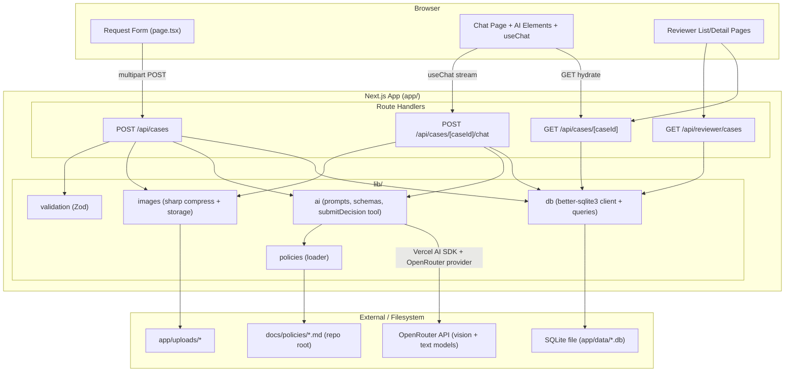
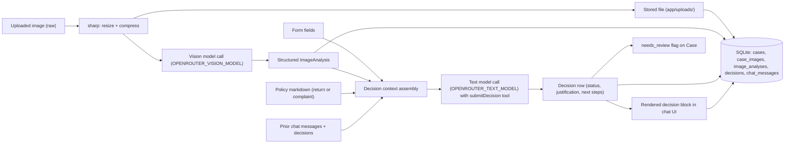
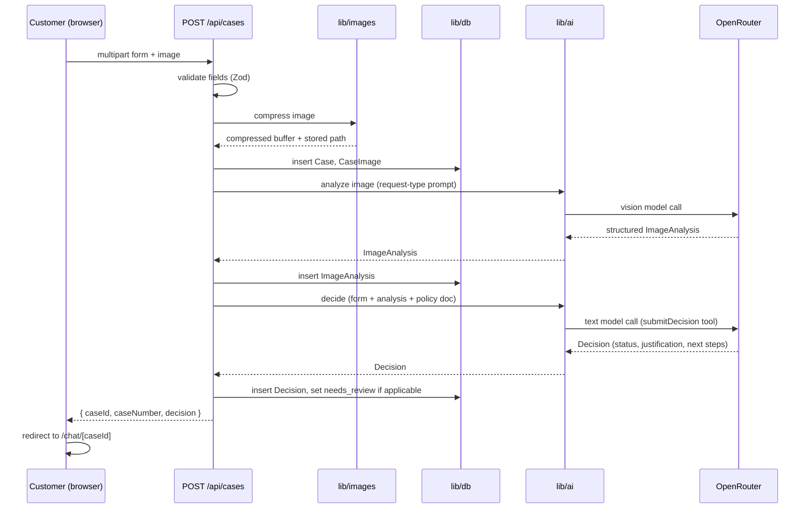
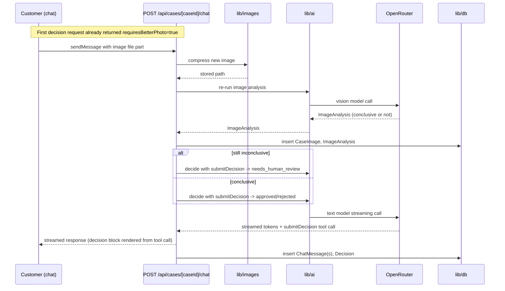
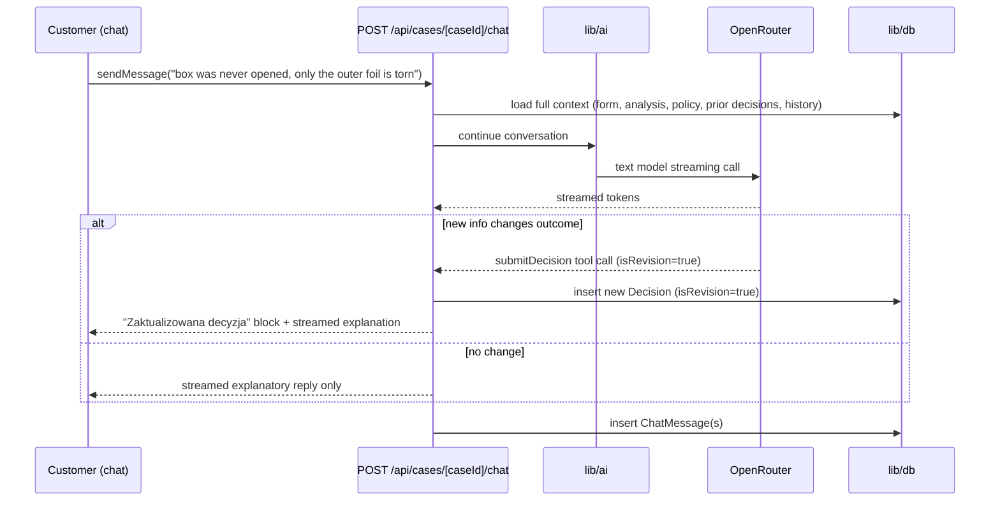
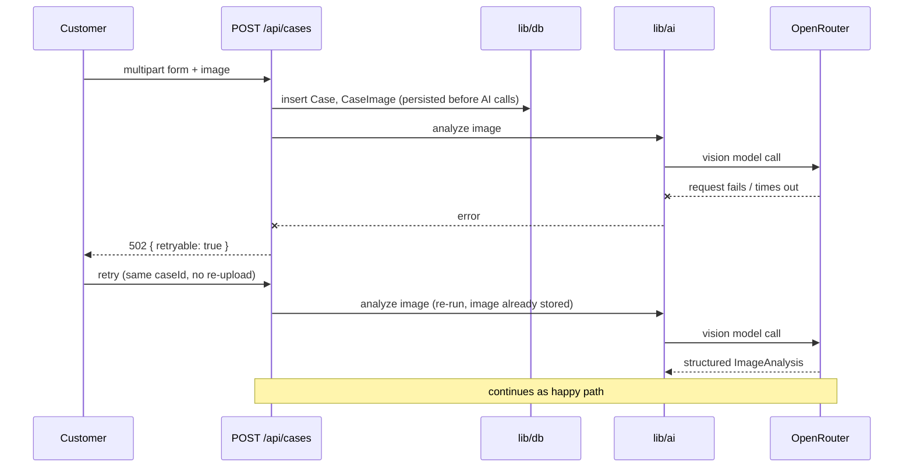

# ADR: Hardware Service Decision Copilot — Main Architecture

**Date:** 2026-07-14
**Status:** Accepted
**PRD:** `docs/PRD.md`

---

## 1. Overview

Hardware Service Decision Copilot is implemented as a single full-stack Next.js (App Router, TypeScript strict) application. A customer submits a return/complaint form with one photo; the backend compresses the image and runs it through a two-stage AI pipeline (multimodal image analysis, then a policy-grounded decision agent) using the Vercel AI SDK against models served over OpenRouter. The customer is then handed to a streaming chat interface (AI Elements components + `useChat`) where the same decision agent continues the conversation, can request a better photo, and can revise its decision. All form data, images, AI analyses, decisions, and chat messages are persisted to a local SQLite database for audit and for the read-only reviewer view. This ADR covers system architecture, module structure, data models, API contracts, environment configuration, and testing strategy. Companion ADRs go deeper on project scaffolding (001), AI integration (002), persistence (003), and frontend (004).

---

## 2. Context7 Library References

| Library | Context7 Handle | Used for |
|---|---|---|
| Next.js | `/vercel/next.js` | App Router framework, Route Handlers, `create-next-app` scaffolding |
| Vercel AI SDK (`ai`) | `/vercel/ai` | `streamText`, `generateText` with structured `output`, `useChat`, UI message streaming, tool calling |
| OpenRouter AI SDK Provider (`@openrouter/ai-sdk-provider`) | `/openrouterteam/ai-sdk-provider` | `createOpenRouter` client, `.chat(modelId)` model factory |
| AI Elements | `/vercel/ai-elements` | Prebuilt `Conversation`, `Message`, `PromptInput` (with file attachments) components on top of shadcn/ui, wired to `useChat` |
| sharp | `/lovell/sharp` | Server-side image resize/compression before sending to the vision model |
| better-sqlite3 | `/wiselibs/better-sqlite3` | Synchronous SQLite driver for the session/persistence store |

Implementing agents: fetch docs directly with these handles via Context7 (CLI `ctx7 docs <handle> "<question>"` or the MCP `query-docs` tool) instead of searching again.

---

## 3. System Architecture

### Architecture pattern

Single Next.js application (monolith), App Router, TypeScript strict mode. No separate backend service — Next.js Route Handlers under `app/api/**` serve as the backend, sharing the same TypeScript codebase and types as the frontend. This matches the MVP scale (single course VM, no distributed deployment) and avoids cross-service contracts that would need their own ADR.

### Repository structure

The Next.js project root is the existing `app/` folder (per the repository's `app/README.md`). `docs/` (including `docs/policies/*.md`) stays at the repository root as the canonical, human-reviewable source of the PRD/ADR/policy documents.

```
app/
  src/
    app/
      page.tsx                        Request form (start screen)
      chat/[caseId]/page.tsx          Chat / decision screen
      reviewer/page.tsx               Reviewer list view
      reviewer/[caseId]/page.tsx      Reviewer case detail view
      api/
        cases/route.ts                POST create case (form + image -> first decision)
        cases/[caseId]/route.ts       GET full case state
        cases/[caseId]/chat/route.ts  POST streaming chat (useChat transport)
        reviewer/cases/route.ts       GET escalated cases list
    components/
      ai-elements/                   Installed via the AI Elements CLI (generated, not hand-written)
      request-form/                 Form fields, client-side zod validation, upload widget
      chat/                          Decision block, message list wrapper, re-upload control
      reviewer/                     List table, case detail sections
    lib/
      ai/
        providers.ts                 OpenRouter client + model resolution from env vars
        prompts/                     Image-analysis and decision system prompt builders (per request type)
        schemas.ts                   Zod schemas for structured image-analysis and decision output
        image-analysis.ts            Stage 1: multimodal call
        decision-agent.ts            Stage 2/3: first decision + ongoing chat with submitDecision tool
      images/
        compress.ts                  sharp-based compression pipeline
        storage.ts                   Save/read compressed images under app/uploads/
      db/
        client.ts                    better-sqlite3 connection + schema bootstrap
        schema.sql                   Table definitions (see ADR-003)
        cases.ts, chat-messages.ts   Typed query functions per table
      policies/
        loader.ts                    Reads ../../docs/policies/*.md (repo-root) at request time
      validation/
        case-form.schema.ts          Zod schema mirroring AC-01..AC-06, shared client/server
  uploads/                           Compressed images on disk (gitignored)
  tests/
    unit/, integration/, e2e/
```

### Technology stack

| Layer | Technology | Reason |
|---|---|---|
| Framework | Next.js (App Router), TypeScript strict | Single codebase for UI + API routes; official `create-next-app` scaffolding ships TS strict, ESLint, Tailwind by default |
| Backend | Next.js Route Handlers | No separate service needed at MVP scale; colocated with frontend types |
| Frontend UI | React + Tailwind CSS + AI Elements (shadcn/ui) | AI Elements ships streaming-ready chat primitives with file-attachment support out of the box, matching the chat + re-upload requirement with minimal custom code |
| AI orchestration | Vercel AI SDK (`ai`) | First-party streaming (`streamText`/`useChat`), structured output, and tool-calling primitives; official OpenRouter provider available |
| LLM access | OpenRouter (`@openrouter/ai-sdk-provider`) | Matches `.env.example`: `OPENROUTER_API_KEY`, `OPENROUTER_TEXT_MODEL`, `OPENROUTER_VISION_MODEL` |
| Image processing | sharp | Standard, high-performance Node image library for resize/compress before sending to the vision model |
| Database | SQLite via better-sqlite3 | File-based, zero external services, synchronous API is simple to reason about for a single-VM course MVP; satisfies AC-34 (survives restart) |
| Validation | Zod | Shared client/server form validation; also used as the schema for structured LLM output (`generateText` + `output: Output.object`) |
| Package manager | npm | Matches the verification commands already documented in the repository's root `AGENTS.md` (`npm test`, `npm run lint`, `npm run build`) |
| Unit/Integration tests | Vitest | Fast, ESM-first, standard pairing with Next.js/Vite-era tooling |
| E2E tests | Playwright | Already available as a skill/MCP in this environment; matches the "mock nothing" E2E rule in the root `AGENTS.md` |

---

## 4. Module Structure & Dependencies

| Module | Responsibility | Depends on | Depended on by |
|---|---|---|---|
| `lib/validation` | Form field/image constraint validation (shared shape client+server) | Zod | `app/page.tsx` (client), `api/cases/route.ts` |
| `lib/images` | Compress uploaded images, persist to disk, return stored paths | sharp, Node `fs` | `api/cases/route.ts`, `api/cases/[caseId]/chat/route.ts` |
| `lib/policies` | Load the correct policy markdown for a request type | Node `fs` (reads repo-root `docs/policies/`) | `lib/ai/decision-agent.ts` |
| `lib/ai` | Build prompts, call the vision/text models, define the `submitDecision` tool, run the two-stage pipeline and the ongoing chat | Vercel AI SDK, OpenRouter provider, `lib/policies`, `lib/ai/schemas.ts` | `api/cases/route.ts`, `api/cases/[caseId]/chat/route.ts` |
| `lib/db` | SQLite schema + typed CRUD for cases, images, analyses, decisions, chat messages | better-sqlite3 | All API routes, reviewer pages |
| `app/api/**` | HTTP boundary: parse requests, call `lib/ai` + `lib/db`, shape responses | `lib/validation`, `lib/images`, `lib/ai`, `lib/db` | Frontend pages (fetch/`useChat`) |
| `app/*` (pages) | Render form, chat, reviewer UI; client-side validation and streaming consumption | AI Elements components, `lib/validation` (client reuse) | — (top of the dependency graph) |

Dependency direction is strictly one-way: pages → API routes → `lib/*` → external services (OpenRouter, filesystem, SQLite file). No module in `lib/` imports from `app/`. No circular dependencies.

---

## 5. Data Models

Detailed schema (columns, types, indices) is in `docs/ADR/003-persistence.md`. Conceptual summary:

- **Case** — one return/complaint request. Holds form fields, a human-readable case number, and a `needs_review` flag for the reviewer list.
- **CaseImage** — one uploaded image (form submission or chat re-upload), stored on disk; row holds the file path and metadata.
- **ImageAnalysis** — one multimodal LLM call's structured result, linked to a `CaseImage`.
- **Decision** — one decision-agent output (initial or revised), linked to a `Case`.
- **ChatMessage** — one chat turn (customer or agent), linked to a `Case`, stored as ordered rows so the full transcript can be replayed.

All five tables live in one SQLite file and are always retained (there is no "non-escalated cases get deleted" path in the MVP — every case is audit data per AC-32/33).

---

## 6. API / Interface Contracts

### `POST /api/cases`
- **Input:** `multipart/form-data` — `requestType` (`zwrot`|`reklamacja`), `category` (enum, AC-02), `productName` (string), `purchaseDate` (ISO date, not in the future), `description` (string, required iff `reklamacja`), `image` (one file: JPG/PNG/WebP, ≤ 10 MB).
- **Output (200):** `{ caseId, caseNumber, decision: { status, justification, nextSteps[], disclaimer }, requiresBetterPhoto: boolean }`.
- **Errors:** `400` per-field validation errors (matches AC-06); `502` if the vision or decision LLM call fails, with `{ retryable: true }` so the client can show "Spróbuj ponownie" without re-submitting the form (the case row and image are already persisted before the LLM calls run, so retry re-runs only the AI pipeline).
- **Notes:** Not streamed — this is a single blocking request/response; the PRD's loading state (9.1) is a full-screen spinner, not incremental text, so streaming adds no UX value here and keeps the two-stage pipeline atomic.

### `GET /api/cases/[caseId]`
- **Input:** `caseId` path param.
- **Output (200):** Full case state — form data, all `CaseImage` rows, all `ImageAnalysis` results, ordered `Decision` history, ordered `ChatMessage` transcript.
- **Errors:** `404` if the case does not exist.
- **Notes:** Used to hydrate the chat page on load and by the reviewer detail page.

### `POST /api/cases/[caseId]/chat`
- **Input:** AI SDK `useChat` transport body — the current `UIMessage[]` array (customer's new message appended client-side before the call). A new message may include a `file` part (image re-upload).
- **Output:** Streamed UI message response (`toUIMessageStreamResponse`). The stream may include a `submitDecision` tool call/result part when the agent issues an initial or revised decision.
- **Errors:** On LLM failure, the stream ends with an error part; the client shows the retry action from AC-25. Conversation history up to that point remains valid and is persisted.
- **Notes:** Stateless per request — the route reconstructs full context (form data, latest image analysis, applicable policy document, decision history, prior messages) from SQLite on every call; it does not rely on in-memory server state. If the incoming message contains an image part, the route runs image compression + Stage-1 analysis synchronously before continuing to `streamText`, and folds the fresh analysis into context (implements the 4.3 re-upload flow).

### `GET /api/reviewer/cases`
- **Input:** none.
- **Output (200):** `{ cases: [{ caseId, caseNumber, createdAt, requestType, category, productName }] }` where `needs_review = true`, sorted newest first (AC-41).
- **Errors:** none expected (empty array if no escalations).
- **Notes:** No authentication in the MVP (matches PRD §7 Out of Scope). The reviewer detail page reuses `GET /api/cases/[caseId]`.

---

## 7. Environment Variables

Matches the existing `.env.example` at the repository root:

| Variable | Purpose | Required | Example value |
|---|---|---|---|
| `OPENROUTER_API_KEY` | OpenRouter authentication | Yes | `sk-or-v1-...` |
| `OPENROUTER_BASE_URL` | OpenRouter API base URL | Yes | `https://openrouter.ai/api/v1` |
| `OPENROUTER_TEXT_MODEL` | Model for the decision agent and chat | Yes | `openai/gpt-5.4-mini` |
| `OPENROUTER_VISION_MODEL` | Model for multimodal image analysis | Yes | `openai/gpt-5.4-mini` |
| `OPENROUTER_MODEL` | Fallback model when a split variable is missing (local dev only) | No | `openai/gpt-5.4-mini` |
| `PORT` | Dev server port | No | `3000` |
| `CONTEXT7_API_KEY` | Docs-aware coding for agents (not used by the running app) | No | `ctx7sk-...` |

The app reads `OPENAI_API_KEY` precedence only if the team later adds a direct OpenAI provider path (see ADR-002 §Rejected alternatives) — the MVP uses OpenRouter exclusively and does not implement that fallback.

---

## 8. Technical Decisions

### Monolith over separate backend service
**Status:** Accepted
**Context:** The PRD describes a single cohesive customer flow (form → analysis → chat) plus one internal reviewer view, with no other consumers.
**Decision:** One Next.js App Router project serves both UI and API routes.
**Rejected alternatives:**
- Separate Express/Fastify backend: adds a second deployable, a second dependency graph, and a network hop for no MVP benefit.
**Consequences:**
- (+) One `npm run build`/`npm test`, one deployment artifact, shared TypeScript types between API and UI.
- (-) Harder to scale the AI-heavy backend independently from the frontend later; acceptable at MVP scale.
**Review trigger:** If the reviewer view or AI pipeline needs to scale/deploy independently from the customer-facing UI.

### Non-streaming case creation, streaming chat
**Status:** Accepted
**Context:** Case creation (`POST /api/cases`) runs two sequential LLM calls (image analysis, then decision) behind a full-screen loading state (PRD §9.1); the chat, in contrast, is a back-and-forth conversation where perceived responsiveness matters.
**Decision:** `POST /api/cases` is a plain JSON request/response; only `POST /api/cases/[caseId]/chat` uses `streamText`/`useChat` streaming.
**Rejected alternatives:**
- Streaming the first decision token-by-token into the loading screen: adds client complexity for a state the PRD specifies as an opaque spinner, not a live transcript.
**Consequences:**
- (+) Case creation is a single atomic step to reason about and test.
- (-) The customer sees no incremental progress during the ~2 LLM-call wait.
**Review trigger:** If real-world latency of the two-stage pipeline makes the spinner wait feel too long, revisit with a status-polling or partial-stream UX.

### Structured decision output via a `submitDecision` tool, not free-text parsing
**Status:** Accepted
**Context:** AC-13, AC-20, and AC-23 require every decision (initial or revised) to carry an exact status enum, a justification, next steps, and — for revisions — an explicit "Zaktualizowana decyzja" label. Free-text parsing of a streamed chat response is fragile.
**Decision:** The decision agent is given one tool, `submitDecision` (schema: status enum, justification, next steps, isRevision flag), which it must call whenever it issues or revises a decision — during both the initial structured call (`generateText` + `output: Output.object`) and the ongoing `streamText` chat. The frontend renders `submitDecision` tool-call parts as the distinct decision block described in PRD §9.2; free-text parts render as normal chat prose.
**Rejected alternatives:**
- Parsing decision status from prose via regex/keywords: brittle, breaks under paraphrasing or language drift.
- `generateObject` for the first message: deprecated by the AI SDK in favor of `generateText` with an `output` setting (confirmed via Context7 docs for `/vercel/ai`).
**Consequences:**
- (+) Deterministic rendering of decision blocks regardless of the model's exact wording.
- (-) One more schema to keep in sync between the tool definition and the rendering component.
**Review trigger:** None expected at MVP scope.

### SQLite (better-sqlite3) for all session persistence
**Status:** Accepted
**Context:** AC-32..35 require every case, image, analysis, decision, and chat message to be durably persisted and to survive an app restart, with no external services assumed.
**Decision:** A single SQLite file via `better-sqlite3`'s synchronous API, bootstrapped from `lib/db/schema.sql` on first run.
**Rejected alternatives:**
- Prisma + SQLite: adds a schema/migration/codegen layer not justified at this scope; can be introduced later without changing the storage engine.
- In-memory/JSON file store: JSON-on-disk could satisfy "survives restart" but reimplements what SQLite already does safely (atomic writes, querying, indices).
**Consequences:**
- (+) Zero external services; trivial local dev setup; fast synchronous queries suit Route Handlers.
- (-) Single-writer file-based DB does not scale to concurrent multi-instance deployment.
**Review trigger:** If the app needs multi-instance/horizontal scaling or a managed DB for production.

### Images stored on the filesystem, path referenced from SQLite
**Status:** Accepted
**Context:** Compressed images must be retrievable for the reviewer view and re-sendable to the vision model.
**Decision:** Compressed images are written under `app/uploads/<caseId>/`; `CaseImage` rows store the relative path.
**Rejected alternatives:**
- Base64 blob column in SQLite: bloats the DB file and complicates streaming the image back to `` tags in the reviewer view.
**Consequences:**
- (+) Small DB rows; images served directly as static files in dev.
- (-) DB and filesystem must be backed up/moved together; not a problem for a single-VM course MVP.
**Review trigger:** If the app is deployed to a serverless platform with an ephemeral/read-only filesystem — switch to object storage (e.g., S3-compatible) at that point.

### Policy documents read from the repository-root `docs/policies/`
**Status:** Accepted
**Context:** The PRD (§8) names `docs/policies/zasady-zwrotow.md` and `docs/policies/zasady-reklamacji.md` at the repository root, outside the `app/` Next.js project root, as the canonical policy source.
**Decision:** `lib/policies/loader.ts` reads these two files via a filesystem path relative to the repository root at request time (not bundled at build time).
**Rejected alternatives:**
- Duplicating the policy files inside `app/` as the "real" runtime copy: creates two sources of truth that can drift.
**Consequences:**
- (+) One canonical, human-editable policy source, matching the PRD exactly.
- (-) Only works when the app's process has filesystem access to a path outside its own project root — true for local/VM dev and traditional Node hosting, **not** true for typical serverless bundling (e.g., Vercel functions only package files inside the project root).
**Review trigger:** Before any deployment to a serverless target, copy or bundle the policy files into `app/` as a build step.

---

## 9. Diagrams

### 9.1 Architecture / Component Diagram



### 9.2 Data Flow Diagram



### 9.3 Sequence Diagrams

#### Form submission and AI analysis (happy path, return or complaint)



#### Unclear image → re-upload in chat



#### Decision revision from new customer information



#### LLM error and retry (case creation)



---

## 10. Testing Strategy

### Philosophy

TDD per the repository's root `AGENTS.md`: write/extend tests before implementation, confirm they fail for the expected reason, implement the minimum to pass, then run the full verification suite for the changed scope. Tests are the implementing agent's primary self-validation mechanism, not an afterthought.

### Test layers

| Layer | Type | Scope | Tools |
|---|---|---|---|
| Unit | Vitest | Zod schemas, prompt builders, compression wrapper (sharp mocked), DB query functions against a temp SQLite file | Vitest |
| Integration | Vitest | Full API route behavior with a real temp SQLite file and real filesystem uploads dir; only the OpenRouter/AI SDK model call is mocked with deterministic fixtures | Vitest, AI SDK mock provider utilities |
| E2E | Playwright | Full customer and reviewer flows against a running dev server; nothing mocked, including real OpenRouter calls | Playwright (already available in this environment) |

### Key test scenarios

- **Happy path return:** valid form + clearly-undamaged image → decision `approved`, first chat message contains all AC-20 elements. Edge case: purchase date exactly 14 days ago (boundary).
- **Happy path complaint:** valid form + clearly-damaged image with a covered defect description → decision `approved` (repair/replace next steps). Edge case: purchase date exactly 2 years ago (boundary).
- **Rejected return:** image shows visible wear → decision `rejected` with a justification citing the specific policy rule.
- **Rejected complaint:** image/description indicates user-inflicted damage (e.g., cracked screen with impact point) → decision `rejected` citing §3 exclusions.
- **Inconclusive image, first attempt:** blurry/incomplete image → `requiresBetterPhoto: true`, no decision yet; chat re-upload control appears.
- **Inconclusive image, second attempt:** second re-upload still inconclusive → decision `needs_human_review`, no further re-upload offered (AC-14).
- **Decision revision:** customer supplies new relevant info in chat → `submitDecision` called again with `isRevision=true`; original decision message remains in history (AC-23).
- **Off-topic chat message:** agent gives the fixed short redirect, does not call `submitDecision`.
- **Invalid form submission:** missing required field, future purchase date, oversized/unsupported image → `400` with per-field errors; OpenRouter is never called (assert no model call happened).
- **LLM failure and retry:** vision or text model call rejected/times out → `502 { retryable: true }`; retry succeeds without re-uploading the image or resubmitting the form.
- **Escalation and reviewer view:** a `needs_human_review` case appears in `GET /api/reviewer/cases`, sorted newest first, and its detail view renders all stored data read-only.
- **Session persistence across restart:** create a case, restart the dev server process, confirm the case and its history are still retrievable (AC-34).
- **Persistence failure isolation:** simulate a DB write failure after a decision is generated → customer still receives the decision and can chat; failure is logged (AC-35).

### Technical acceptance criteria

- **TAC-01:** `npm run build` completes with zero TypeScript errors under `strict: true`.
- **TAC-02:** `npm run lint` completes with zero ESLint errors.
- **TAC-03:** `npm test` (Vitest unit + integration) passes.
- **TAC-04:** `npx playwright test` passes against a running dev server with real OpenRouter calls.
- **TAC-05:** A case created before a process restart is still fully retrievable via `GET /api/cases/[caseId]` after restart (validates AC-34).
- **TAC-06:** `POST /api/cases/[caseId]/chat` responses arrive as more than one stream chunk before completion (verifies real streaming, not a buffered single response).
- **TAC-07:** Submitting a file over 10 MB or an unsupported MIME type returns `400` with a field-specific Polish message, and the OpenRouter client is never invoked (assert via spy/mock call count of zero).
- **TAC-08:** The compressed image buffer sent to the vision model is verified (integration test) to be at or under the compression ceiling defined in ADR-002, regardless of original upload size.
