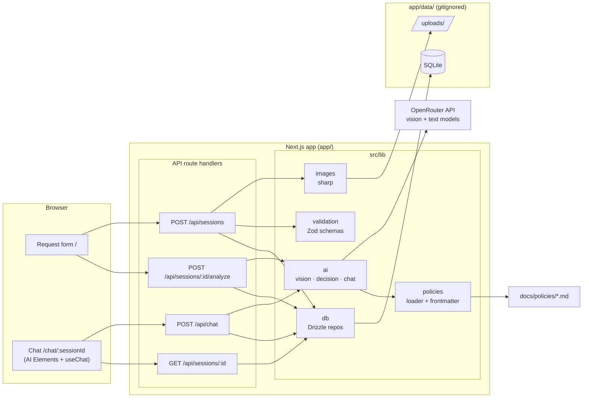
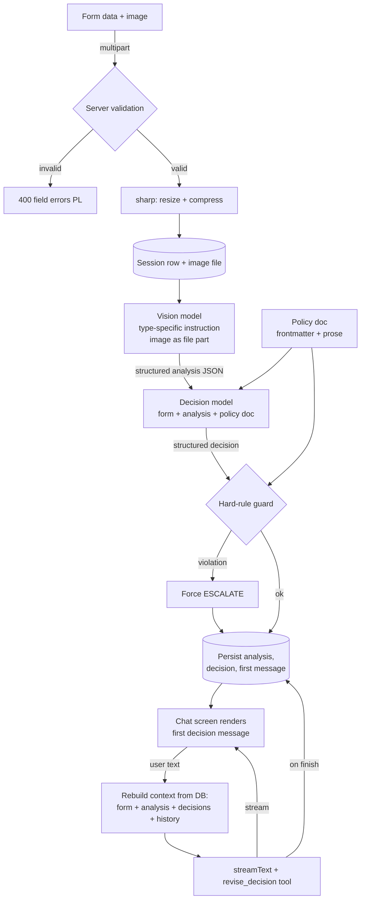
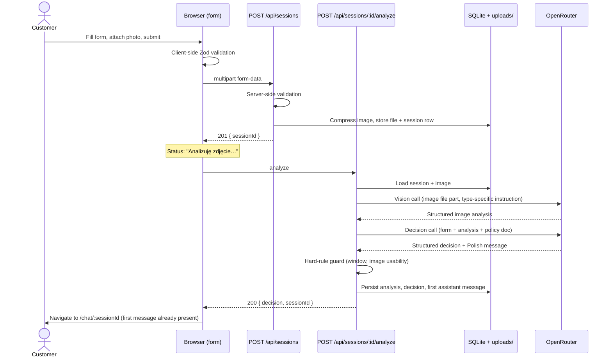
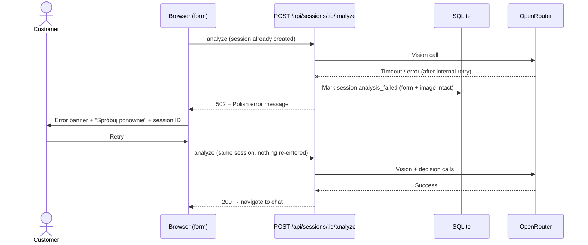
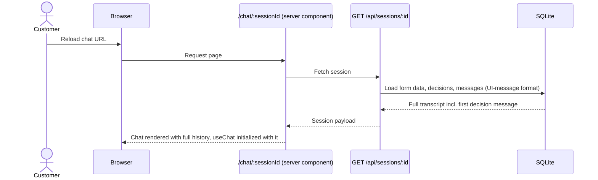

# ADR: Hardware Service Decision Copilot — Main Architecture

**Date:** 2026-07-14
**Status:** Accepted
**PRD:** [docs/PRD.md](../PRD.md)

---

## 1. Overview

This ADR defines the technical architecture for the Hardware Service Decision Copilot MVP described in the PRD: a self-service web application where a customer submits a return/complaint form with a photo, a multimodal LLM analyzes the photo, a reasoning agent issues a preliminary decision grounded in company policy documents, and the customer continues the conversation in a streaming chat.

The PRD deliberately leaves prompt wording, model choice, compression parameters, storage technology, and testing strategy to this ADR set. This file covers the overall system; detailed areas are split into:

| ADR | Area |
|---|---|
| `000-main-architecture.md` (this file) | System architecture, stack, modules, data models, API contracts, env vars, main decisions, testing strategy |
| [`001-ai-integration.md`](001-ai-integration.md) | Vision analysis, decision agent, chat streaming, prompts, policy injection, AI guardrails |
| [`002-frontend.md`](002-frontend.md) | Request form, chat UI (AI Elements), validation, loading/error states, session restore |
| [`003-persistence.md`](003-persistence.md) | SQLite + Drizzle schema, image storage, session lifecycle |

---

## 2. Context7 Library References

Implementing agents must use these handles to fetch current docs — do not search for them again. **Do not rely on training data for AI SDK API shapes** (they changed across major versions; see Decision D3).

| Library | Context7 Handle | Used for |
|---|---|---|
| Vercel AI SDK | `/vercel/ai` | `streamText`, `generateObject`/structured output, `useChat`, multimodal file parts, chat transport |
| AI Elements | `/vercel/ai-elements` | Chat UI components (Conversation, Message, Response, PromptInput) |
| OpenRouter | `/websites/openrouter_ai` | `@openrouter/ai-sdk-provider` usage, model routing, API reference |
| Next.js | `/vercel/next.js` | App Router, route handlers, `create-next-app` flags |
| React | `/reactjs/react.dev` | Client components, hooks |
| Tailwind CSS | `/tailwindlabs/tailwindcss.com` | Styling |
| shadcn/ui | `/shadcn-ui/ui` | Base UI components (form controls), CLI used by AI Elements |
| Drizzle ORM | `/drizzle-team/drizzle-orm-docs` | SQLite schema, queries, drizzle-kit |
| sharp | `/lovell/sharp` | Image compression/resizing |
| Zod | `/colinhacks/zod` | Shared validation schemas, structured-output schemas |
| Vitest | `/vitest-dev/vitest` | Unit/integration tests |
| Playwright | `/microsoft/playwright` | E2E tests |

---

## 3. System Architecture

### Architecture pattern

Single **Next.js (App Router) full-stack monolith**: React frontend (server + client components) and backend (route handlers) in one deployable app. No separate backend service. All AI calls happen server-side in route handlers; the browser never talks to OpenRouter directly and never sees the API key.

### Repository structure

The application lives in the existing `app/` directory of this repo (currently an empty scaffold with a README). Inside it, a standard `create-next-app` layout with `src/`:

```
app/
  src/
    app/                    # App Router: pages + API route handlers
      page.tsx              # Screen 1: request form (route: /)
      chat/[sessionId]/     # Screen 2: chat (route: /chat/:sessionId)
      api/sessions/         # POST create session (multipart)
      api/sessions/[id]/analyze/   # POST run vision + decision
      api/sessions/[id]/           # GET restore session
      api/chat/             # POST streaming chat
    components/             # Form + chat components (incl. ai-elements/)
    lib/                    # Domain logic: validation, ai/, db/, images, policies
  data/                     # Runtime artifacts, gitignored: SQLite file + uploads/
  drizzle/                  # Generated migrations
docs/policies/              # Policy documents (content, not code) — already exist
```

Domain logic (validation, AI orchestration, persistence, image processing) lives in `src/lib/` as plain TypeScript modules so it is unit-testable without HTTP or React. Route handlers stay thin: parse/validate → call lib → shape response.

### Technology stack

| Layer | Technology | Reason |
|---|---|---|
| Framework | Next.js (latest stable, App Router) + TypeScript **strict** | One codebase for UI + API; required by course brief |
| AI orchestration | Vercel AI SDK (latest stable major) | Streaming, structured output, multimodal parts, `useChat` — all needed flows covered natively |
| LLM gateway | OpenRouter via `@openrouter/ai-sdk-provider` | Single API key, model choice per env var, provider-agnostic |
| Chat UI | AI Elements (on shadcn/ui + Tailwind) | Code-owned streaming chat components; trivial to localize to Polish (see D5) |
| Validation | Zod | One schema reused client-side, server-side, and as LLM output schema |
| Database | SQLite via better-sqlite3 + Drizzle ORM | Zero-config file DB for local-dev-only MVP; typed schema (see ADR-003) |
| Image processing | sharp | De-facto standard for server-side resize/compress in Node |
| Unit/integration tests | Vitest | Fast, TS-native, first-class in Vite/Next ecosystems |
| E2E tests | Playwright | Real-stack E2E per repo test strategy |

### Deployment constraints

**Local development only** (course MVP): `npm run dev` / `npm run build && npm start` on a participant machine. SQLite file + local `data/uploads/` filesystem are therefore acceptable. No serverless constraints apply. Review trigger: any move to hosted deployment (see D7).

---

## 4. Module Structure & Dependencies

| Module | Responsibility | Depends on | Depended on by |
|---|---|---|---|
| `lib/validation` | Zod schemas for form fields, chat messages, file constraints (AC-01…AC-07); Polish error messages | Zod | Form UI, route handlers |
| `lib/images` | Compress/resize uploaded image, persist to `data/uploads/`, return stored path + media type | sharp, Node fs | `api/sessions` handler |
| `lib/policies` | Load policy markdown by request type; parse machine-readable hard-rule values from policy frontmatter | Node fs | `lib/ai`, hard-rule guard |
| `lib/ai` | Vision analysis, decision generation, chat streaming; prompt assembly; OpenRouter provider setup (ADR-001) | AI SDK, OpenRouter provider, `lib/policies` | `analyze` + `chat` handlers |
| `lib/db` | Drizzle schema + typed repository functions for sessions, decisions, messages (ADR-003) | Drizzle, better-sqlite3 | All route handlers |
| `app/api/*` route handlers | HTTP boundary: parse, validate, orchestrate lib calls, shape responses/streams | all `lib/*` | Frontend |
| `components/*` | Form screen, chat screen (AI Elements), shared UI states (ADR-002) | AI SDK React (`useChat`), `lib/validation` | Pages |

Dependency direction: `components → lib/validation` (schemas only); `route handlers → lib/*`; `lib/ai → lib/policies`; nothing depends on route handlers or components. No circular dependencies.

---

## 5. Data Models

Conceptual; exact column definitions in ADR-003.

### Session
One customer request. Fields: unique ID (URL-safe random string, visible to customer per AC-25), request type (`complaint` | `return`), equipment category (enum from PRD §8), product name/model, purchase date, reason text (nullable), stored image path + media type + original filename, vision analysis result (JSON), status (`created` → `analyzed` | `analysis_failed`), created-at. Persisted forever (MVP has no retention policy). Has many Decisions and Messages.

### Decision
One decision event, append-only (AC-26: revisions never overwrite). Fields: session FK, category (`APPROVE` | `REJECT` | `MORE_INFO` | `ESCALATE`), previous category (nullable; set on revisions), justification text, source (`initial` | `chat_revision`), created-at, ordered by timestamp.

### Message
One chat message, append-only. Fields: session FK, role (`user` | `assistant`), content stored as the AI SDK UI-message parts structure (JSON) so restore reproduces exactly what was rendered (AC-27), created-at. The first assistant message is the rendered decision message.

### Policy document (not in DB)
Markdown files `docs/policies/return-policy.md` / `complaint-policy.md`, loaded at request time (never cached across requests, so content edits apply immediately — PRD §8). Extended with a small machine-readable frontmatter block for hard-rule values (see D6).

---

## 6. API / Interface Contracts

All request/response bodies are JSON unless noted. All user-facing strings produced by these endpoints are Polish (AC-29).

### POST `/api/sessions`
Creates a session from the form. Input: `multipart/form-data` — requestType, category, productName, purchaseDate, reason (optional unless complaint), image (exactly one file).
Processing: server-side Zod validation (mirrors client rules AC-01…AC-05, incl. file type/size), image compression + storage, session row insert.
Output: `201` with `{ sessionId }`.
Errors: `400` with field-keyed Polish error messages; `413`-equivalent handled as a field error on the image.
Notes: no AI call happens here — separation enables retry (AC-28).

### POST `/api/sessions/{id}/analyze`
Runs the AI pipeline for an existing session: vision analysis (request-type-specific instruction) → decision agent (form data + vision result + matching policy doc) → persists vision result, initial Decision, and the first assistant Message.
Output: `200` with `{ decision, sessionId }` (the client then navigates to the chat).
Errors: `404` unknown session; `502` with Polish message when the LLM call fails after internal retry — session and image remain persisted, endpoint is safely re-invocable for the same session (AC-28, flow 4.5). Re-invocation after success returns the existing result instead of re-running (idempotent), preventing duplicate first decisions.
Notes: synchronous, non-streaming (see D4). Server timeout budget must exceed the two chained LLM calls.

### GET `/api/sessions/{id}`
Restores a session for the chat screen (AC-27). Output: `200` with form data summary, all decisions (ordered), and all messages in UI-message format ready for chat initialization. Errors: `404`.

### POST `/api/chat`
Streaming chat turn. Input: session ID + messages per the AI SDK chat transport convention (client sends only the latest user message; server reloads full history from DB — see D8).
Processing: load session + decisions + messages, assemble system prompt (form data, vision analysis, policy document, decision history), stream the reply; a `revise_decision` tool lets the model record decision changes, guarded server-side against hard-rule violations (ADR-001). On finish, persist the assistant message.
Output: AI SDK UI-message stream (SSE-style streaming response consumed by `useChat`).
Errors: mid-stream failures surface through the stream's error part; client renders retry for that reply (AC-24). `400` for messages over 2000 characters.

### Pages (frontend routes)
- `/` — request form (screen 9.1)
- `/chat/{sessionId}` — chat (screen 9.2); server component fetches session for initial render; unknown ID renders a Polish "not found" state with a link to a new form.

---

## 7. Environment Variables

Matches the existing `.env.example` at repo root (the app must load the repo-root env file or `app/.env` copied from it).

| Variable | Purpose | Required | Example value |
|---|---|---|---|
| `OPENROUTER_API_KEY` | Auth for all LLM calls | Yes | `sk-or-v1-…` |
| `OPENROUTER_BASE_URL` | OpenRouter endpoint override | No (default `https://openrouter.ai/api/v1`) | `https://openrouter.ai/api/v1` |
| `OPENROUTER_TEXT_MODEL` | Decision agent + chat model | No (falls back to `OPENROUTER_MODEL`) | `openai/gpt-5.4-mini` |
| `OPENROUTER_VISION_MODEL` | Multimodal image analysis model | No (falls back to `OPENROUTER_MODEL`) | `openai/gpt-5.4-mini` |
| `OPENROUTER_MODEL` | Fallback model when a split variable is missing | No | `openai/gpt-5.4-mini` |
| `PORT` | Dev server port | No (default 3000) | `3000` |

Startup must fail fast with a clear message when `OPENROUTER_API_KEY` is missing.

---

## 8. Technical Decisions

### D1 — Single Next.js full-stack app (no separate backend)
**Status:** Accepted · **Date:** 2026-07-14
**Context:** PRD needs a form, file upload, two server-side AI calls, streaming chat, and persistence. Course brief fixes Next.js + Vercel AI SDK.
**Decision:** One Next.js App Router application; route handlers are the entire backend. AI SDK is designed around this exact topology (route handler streaming → `useChat`).
**Rejected alternatives:**
- Separate Node/Express API: second process, CORS, duplicated validation — no benefit at MVP scale.
- Server actions instead of route handlers: chat streaming with `useChat` expects an HTTP endpoint; mixing both models adds confusion.
**Consequences:** (+) one dev server, one deploy, shared types end-to-end; (−) backend scaling coupled to frontend (irrelevant for local-only MVP).
**Review trigger:** Hosted multi-instance deployment or a non-browser client appears.

### D2 — Project initialization: `create-next-app` scaffold inside `app/`
**Status:** Accepted · **Date:** 2026-07-14
**Context:** The repo starts with an empty `app/` (only a README). The implementing agent bootstraps the template itself; the process must be non-interactive and reproducible.
**Decision:** Scaffold with the official `create-next-app` CLI in non-interactive mode with flags: TypeScript, ESLint, Tailwind, App Router, `src/` directory, `@/*` import alias, npm. Verify exact current flags via Context7 (`/vercel/next.js`) before running. Then: confirm `strict: true` in `tsconfig.json` (default, but it is a hard requirement), initialize shadcn/ui, install AI Elements components via its CLI, add AI SDK + OpenRouter provider + Drizzle + sharp + Zod + Vitest + Playwright. If the CLI refuses the non-empty directory because of the existing `app/README.md`, move the README aside, scaffold, and restore it merged.
**Rejected alternatives:**
- Hand-rolled file-by-file setup: slower, error-prone, diverges from ecosystem defaults that AI Elements/shadcn assume (Tailwind config, alias).
- Community starter templates (e.g. chatbot templates): bring auth/postgres/deployment baggage that contradicts this PRD's scope.
**Consequences:** (+) standard layout every tool assumes, minutes to working baseline; (−) scaffold includes demo assets that must be cleaned up in the same commit.
**Review trigger:** Course group changes package manager or repo layout conventions.

### D3 — Vercel AI SDK, latest stable major, APIs verified via Context7
**Status:** Accepted · **Date:** 2026-07-14
**Context:** The AI SDK changed significantly between major versions (streaming response helpers, message shape moved to typed "parts", chat transport configuration). Training-data knowledge is unreliable here.
**Decision:** Use the latest stable `ai` + `@ai-sdk/react` at implementation time. Implementing agents MUST fetch current API shapes from `/vercel/ai` for: route-handler streaming responses, UI-message ↔ model-message conversion, structured output, file/image content parts, and chat transport request customization. Current docs show: server converts stored/incoming UI messages to model messages, streams via `streamText`, returns a UI-message stream response; client `useChat` renders typed message parts.
**Rejected alternatives:**
- Pinning an older major known from training data: forfeits current docs and AI Elements compatibility.
- Raw OpenRouter HTTP + hand-rolled SSE: reimplements streaming protocol, message state, and abort handling the SDK provides.
**Consequences:** (+) one SDK covers all four AI touchpoints (vision, decision, chat, UI hook); (−) hard dependency on Context7 lookups during implementation.
**Review trigger:** A new AI SDK major releases mid-course.

### D4 — Split decision pipeline (non-streaming) from chat (streaming)
**Status:** Accepted · **Date:** 2026-07-14
**Context:** Research covered both approaches. PRD 9.1 requires staged form-side progress and *no navigation until the first decision is ready*; the first message must contain a validated decision category (AC-12) — a structured, checkable artifact — while follow-up chat is conversational.
**Decision:** Two distinct AI interaction styles: (1) form submission triggers synchronous structured generation — vision analysis and the decision each produce a Zod-validated object (no streaming); (2) chat replies use `streamText` + `useChat` streaming. Recommended based on research: structured output guarantees the enum + justification the ACs demand, while streaming gives chat its perceived responsiveness; mixing one style for both would sacrifice one of these.
**Rejected alternatives:**
- Streaming the first decision message into the chat screen: cannot validate the decision enum before showing it; complicates retry (AC-28) and the "no navigation until ready" rule.
- Non-streaming chat replies: visibly worse UX for multi-sentence Polish replies; AC-23's typing indicator maps naturally to streaming.
**Consequences:** (+) each AC maps to a testable seam; retry = re-POST analyze; (−) two response paths to maintain.
**Review trigger:** Product wants progressive first-decision display or chat-driven re-analysis of images.

### D5 — Chat UI: AI Elements over assistant-ui or hand-rolled components
**Status:** Accepted · **Date:** 2026-07-14
**Context:** The chat needs streaming rendering, typing indicator, error-with-retry rows, a decision badge in the first bubble, Polish text everywhere, and mobile support — quickly.
**Decision:** AI Elements: components are installed **into the repo as source** (shadcn model) on top of shadcn/ui + Tailwind, and bind directly to `useChat` message parts. We own the code, so PRD-specific elements (decision badge, revision "old → new" marker, Polish labels, timestamps) are ordinary edits to local components.
**Rejected alternatives:**
- assistant-ui: capable, but introduces its own runtime-provider abstraction over the AI SDK; more indirection to customize for a one-thread, no-attachments chat, and a second mental model for the course group.
- Hand-rolled chat on raw `useChat`: reimplements scroll anchoring, streaming markdown rendering, status states — exactly what AI Elements ships.
**Consequences:** (+) streaming chat working in hours, fully restylable; (−) installed component source becomes our maintenance surface; unused installed components must be removed.
**Review trigger:** Requirements grow toward multi-thread, attachments-in-chat, or generative UI (assistant-ui's strengths).

### D6 — Hard policy rules enforced in code, values sourced from policy frontmatter
**Status:** Accepted · **Date:** 2026-07-14
**Context:** AC-15/AC-22 say APPROVE must **never** happen past the return/complaint window — "never" cannot be guaranteed by prompting alone. But PRD §8 requires that replacing policy *content* changes behavior *without code changes*, so windows must not be hardcoded.
**Decision:** Add a machine-readable frontmatter block to each policy document holding hard-rule values (e.g. window length in days). Code parses frontmatter for deterministic guards: (a) the analyze pipeline downgrades an LLM `APPROVE` to `ESCALATE` when the window is exceeded; (b) the chat `revise_decision` tool rejects APPROVE under the same condition and when the image was unusable (AC-10). The prose below the frontmatter remains the agent's reasoning source. Details in ADR-001.
**Rejected alternatives:**
- Hardcoded window constants: violates the PRD's content-not-code constraint.
- Prompt-only enforcement: LLMs cannot deliver "never"; a single E2E failure breaks AC-15/AC-22.
**Consequences:** (+) hard ACs become deterministic and unit-testable; policy edits stay content-only; (−) policy files carry a small structured header that authors must maintain.
**Review trigger:** Policies gain hard rules not expressible as simple frontmatter values.

### D7 — SQLite + Drizzle on local filesystem; images as files, paths in DB
**Status:** Accepted · **Date:** 2026-07-14
**Context:** AC-25…AC-28 require durable sessions; deployment is local-only; support staff read data directly (PRD §12).
**Decision:** better-sqlite3 + Drizzle ORM, DB file under `app/data/`; compressed images under `app/data/uploads/` with the path stored on the session row. Confirmed with the user. Details in ADR-003.
**Rejected alternatives:**
- Prisma: heavier toolchain (codegen, engine binaries) for the same outcome.
- JSON files per session: no query capability, race-prone appends for chat messages.
- Image BLOBs in SQLite: workable, but files are directly inspectable by staff (§12) and keep the DB small.
**Consequences:** (+) zero external services; one folder to inspect or delete; (−) not portable to serverless (accepted per deployment constraint).
**Review trigger:** Hosted deployment, staff UI, or concurrent-writer load.

### D8 — Server is the source of truth for chat history
**Status:** Accepted · **Date:** 2026-07-14
**Context:** AC-19 requires full context in every reply; AC-26/27 require persisted, restorable transcripts. Trusting client-sent history would let a tampered client alter context.
**Decision:** The chat transport sends only the session ID and the newest user message; the server reloads the full transcript, decisions, form data, and vision analysis from the DB for every turn, persists the incoming user message before generation and the assistant message after completion. (AI SDK's transport customization supports exactly this pattern.)
**Rejected alternatives:**
- Client sends full history each turn (SDK default): larger payloads, duplicates truth, tamperable.
**Consequences:** (+) restore and reply share one data path; guardrails see untampered history; (−) one DB round-trip per turn (negligible on SQLite).
**Review trigger:** Multi-device session continuation or authenticated users.

---

## 9. Diagrams

### 9.1 Architecture / Component Diagram



### 9.2 Data Flow Diagram



### 9.3 Sequence Diagrams

#### Form submission and first decision (happy path, flows 4.1/4.2)



#### AI failure and retry (flow 4.5, AC-28)



#### Chat turn with decision revision (flow 4.3, AC-21/22)

```mermaid
sequenceDiagram
    actor U as Customer
    participant CH as Chat UI (useChat)
    participant C as POST /api/chat
    participant D as SQLite
    participant O as OpenRouter

    U->>CH: Sends missing information (text)
    CH->>C: { sessionId, newest user message }
    C->>D: Persist user message; load form, analysis, decisions, full history
    C->>O: streamText (system prompt + history + revise_decision tool)
    O-->>C: Tool call: revise_decision(MORE_INFO → APPROVE, reason)
    C->>C: Guard: window OK? image usable?
    alt Guard passes
        C->>D: Append Decision (previous=MORE_INFO, new=APPROVE, chat_revision)
    else Guard fails
        C->>D: Append Decision ESCALATE instead
    end
    O-->>CH: Streamed reply: old → new decision, reason, next steps, disclaimer
    C->>D: Persist assistant message on finish
```

#### Session restore (AC-27)



---

## 10. Testing Strategy

### Philosophy

TDD per `AGENTS.md`: for every feature, write the failing test first, implement minimally, keep the suite green. Tests are the implementing agent's primary self-validation. The repo-wide mock policy applies:

| Layer | Type | Scope | Tools | Mocks |
|---|---|---|---|---|
| Unit | Vitest | `lib/*` modules: validation, policies/frontmatter, hard-rule guard, image params, db repos (in-memory SQLite) | Vitest | All external deps |
| Integration | Vitest | Route handlers end-to-end against real SQLite + real sharp | Vitest + handler invocation | **Only the OpenRouter LLM API** (AI SDK-level mock provider or HTTP mock) |
| E2E | Playwright | Full running app, real LLM calls via OpenRouter (cheap model from env) | Playwright | **Nothing** |

Vision/decision prompt quality is validated by E2E with fixture images (a clean product photo, a damaged product photo, an unusable/blurry photo) plus assertions on the structured decision, not on exact prose.

### Key test scenarios (system level — per-area scenarios live in ADR-001…003)

| Scenario | Tested | Input | Expected |
|---|---|---|---|
| Happy return approval | Full pipeline | Valid return form, clean-product fixture image, purchase date 5 days ago | Chat opens; first message contains APPROVE badge, justification, next steps, disclaimer (AC-17) |
| Complaint requires reason | Validation both sides | Complaint form without reason | Field-level Polish error, no session created (AC-03) |
| Return window hard rule | Guard determinism | Return, purchase date 40 days ago, clean image | Decision is REJECT or ESCALATE, never APPROVE (AC-15) — repeatable across runs |
| Unusable image | Vision → forced ESCALATE | Blurry fixture image | ESCALATE + "photo could not be assessed" first message (AC-10) |
| Analyze retry | Failure path | LLM mock fails once, then succeeds (integration) | Session persisted after failure; retry succeeds without re-upload (AC-28) |
| Revision guard | Chat guard | Chat dispute on out-of-window return; model attempts APPROVE revision | Stored decision is ESCALATE; message reflects it (AC-22) |
| Restore | Persistence | Submit, chat twice, reload page | Identical transcript incl. first decision message (AC-27) |

### Technical acceptance criteria

- TAC-01: `npm run lint`, `npm test`, `npm run build` all pass with zero errors; `tsc` runs in strict mode.
- TAC-02: `OPENROUTER_API_KEY` absent → server startup (or first AI call) fails with an explicit configuration error, not an opaque 500.
- TAC-03: The browser bundle contains no OpenRouter key and makes no direct requests to `openrouter.ai` (assert via Playwright network capture).
- TAC-04: Every decision stored in the DB is one of the four categories (DB-level CHECK or enum-validated insert path); invalid categories are unrepresentable (AC-12).
- TAC-05: Editing a policy document's frontmatter window value changes guard behavior on the next request without any code change or restart (integration test rewrites a temp policy file).
- TAC-06: The compressed stored image is strictly smaller in bytes and dimensions than a >2 MB fixture upload, and the original full-size upload is not retained (AC-08).
- TAC-07: All four sequence-diagram flows are covered by at least one automated test each (unit/integration/E2E combined).
