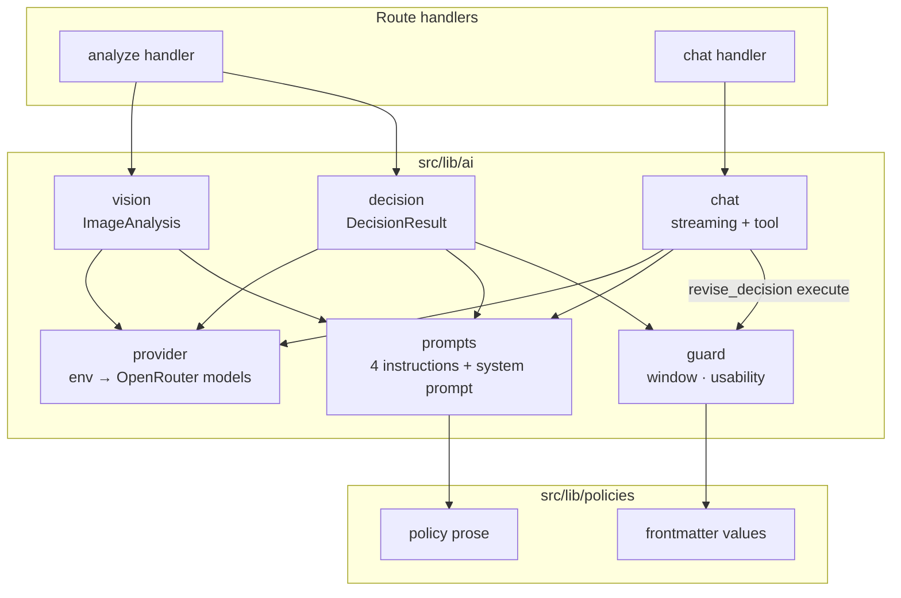
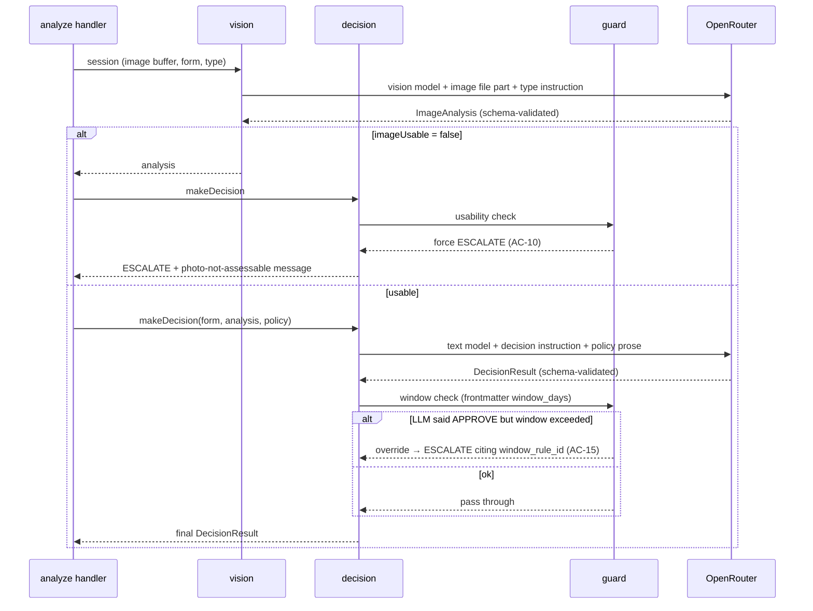
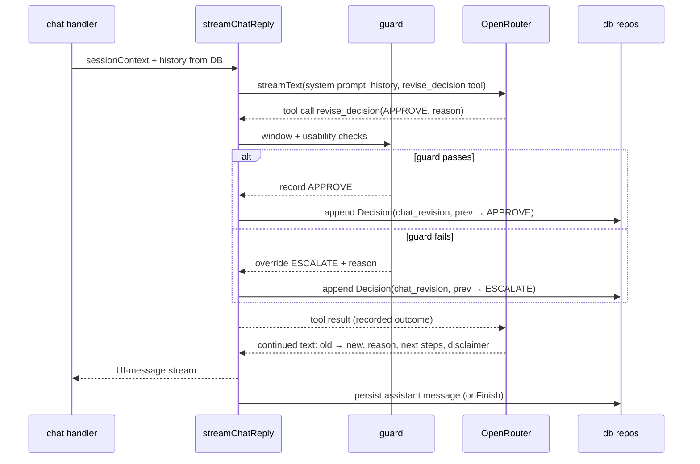

# ADR-001: AI Integration — Vision Analysis, Decision Agent, Streaming Chat

**Date:** 2026-07-14
**Status:** Accepted
**Relates to:** [`docs/ADR/000-main-architecture.md`](000-main-architecture.md)

---

## 1. Scope

Everything between the route handlers and OpenRouter: provider setup, the vision analysis call, the decision generation call, the streaming chat agent, prompt assembly, policy-document injection, structured output schemas, deterministic guardrails, and AI-failure handling. Does NOT cover: HTTP contracts (ADR-000 §6), UI rendering of messages (ADR-002), storage of results (ADR-003).

---

## 2. Context7 References

| Library | Context7 Handle | Used for |
|---|---|---|
| Vercel AI SDK | `/vercel/ai` | `streamText`, structured output (`generateObject` / object output on text generation), file/image content parts, tools, UI-message conversion & stream responses |
| OpenRouter | `/websites/openrouter_ai` | `@openrouter/ai-sdk-provider` (`createOpenRouter`), model naming, error semantics |
| Zod | `/colinhacks/zod` | Output schemas for vision analysis and decision |

Implementing agents must verify current API shapes against `/vercel/ai` before coding (ADR-000 D3).

---

## 3. Component Design

`src/lib/ai/` — server-only module. Internal parts:

| Part | Responsibility |
|---|---|
| `provider` | Creates the OpenRouter provider instance from env (`OPENROUTER_API_KEY`, optional `OPENROUTER_BASE_URL`); resolves model IDs: vision → `OPENROUTER_VISION_MODEL` ?? `OPENROUTER_MODEL`, text → `OPENROUTER_TEXT_MODEL` ?? `OPENROUTER_MODEL`; throws a configuration error when the key or both model variables are missing |
| `vision` | One function: (compressed image buffer + media type, request type, form data) → structured **ImageAnalysis**. Non-streaming, Zod-validated output |
| `decision` | One function: (form data, ImageAnalysis, policy document) → structured **DecisionResult**. Non-streaming, Zod-validated output; applies hard-rule guard before returning |
| `chat` | One function: (session context, message history) → streaming result convertible to a UI-message stream response. Registers the `revise_decision` tool |
| `prompts` | Pure functions assembling the four instruction texts (vision×2 types, decision×2 types) and the chat system prompt. No I/O — unit-testable as string builders |
| `guard` | Pure functions implementing hard rules from policy frontmatter: window check (purchase date vs. today vs. `window_days`), image-usability check. Used by `decision` and by the `revise_decision` tool |

`src/lib/policies/` — loads the policy markdown for a request type, splits frontmatter (machine-readable hard-rule values) from prose (injected into prompts). Read from disk on every request; no module-level caching (PRD §8: content changes must apply without code changes or restart).

### Policy frontmatter contract

Each policy file gains a YAML frontmatter block; prose below stays untouched. Required keys:

| Key | Type | return-policy.md | complaint-policy.md |
|---|---|---|---|
| `window_days` | integer | 14 | 730 |
| `window_rule_id` | string | `R-1` | `C-1` |

The guard cites `window_rule_id` in generated ESCALATE/REJECT justifications so AC-14's "cites the specific policy rule" holds even on the deterministic path. Missing/invalid frontmatter → startup-style configuration error on first use (fail fast, not silent model-only mode).

---

## 4. Data Structures

All LLM outputs are Zod-validated structured objects. Conceptual shapes:

### ImageAnalysis (vision output — same schema for both request types; instructions differ)
- `imageUsable`: boolean — photo is sharp enough, shows equipment, matches declared category/model (AC-10)
- `unusableReason`: string, nullable — why unusable (blurry / wrong object / equipment not visible / mismatch)
- `matchesDeclaredProduct`: boolean — item plausibly is the declared category/model
- `damageVisible`: boolean
- `damageDescription`: string, nullable — type and location of damage
- `plausibleCauses`: string, nullable — complaint runs: manufacturing defect vs. user-caused assessment; return runs: null
- `usageSigns`: string, nullable — return runs: visible signs of usage; complaint runs: null
- `resellableAssessment`: string, nullable — return runs only: appears complete and resellable as new
- `confidence`: `high` | `medium` | `low`

### DecisionResult (decision output)
- `decision`: enum `APPROVE` | `REJECT` | `MORE_INFO` | `ESCALATE` (AC-12)
- `justification`: string — must reference concrete inputs (AC-13); for REJECT must cite a policy rule ID (AC-14)
- `citedRuleIds`: array of strings — policy rule identifiers used (e.g. `R-4`, `C-6`)
- `missingInfo`: string, nullable — required when decision is MORE_INFO (what exactly is missing, per PRD §11 table)
- `messageMarkdown`: string — the complete first chat message in Polish: greeting, decision statement, justification, numbered next steps, disclaimer (AC-17); rendered as the first assistant message and stored verbatim

### ChatSessionContext (assembled per chat turn, server-side)
- Form data (all fields), ImageAnalysis, ordered decision history (category, previous, justification, timestamp), policy prose + frontmatter values, session ID. Message history comes from the DB (ADR-000 D8).

### revise_decision tool input
- `newDecision`: the four-category enum
- `reason`: string — why the assessment changed
- Tool output back to the model: accepted/overridden flag, the decision actually recorded, and (on override) the guard's reason — so the model's subsequent text matches reality.

---

## 5. Interface Contracts

Exposed to route handlers (conceptual signatures):

- `analyzeImage(session) → ImageAnalysis` — throws typed `AiServiceError` on provider failure/timeout after one internal retry.
- `makeDecision(session, analysis) → DecisionResult` — same error contract; output already guard-adjusted (never returns an APPROVE that violates a hard rule; never APPROVE/REJECT when `imageUsable` is false — forced ESCALATE with an explanatory `messageMarkdown`).
- `streamChatReply(sessionContext, history) → streaming result` — the route handler converts it to the UI-message stream response; an `onFinish`-style callback receives the final assistant message for persistence; tool executions run server-side during streaming (multi-step enabled with a small step cap so the model can call the tool and then continue its text reply).

Consumed: OpenRouter chat completions via `@openrouter/ai-sdk-provider` only. No direct HTTP calls to OpenRouter anywhere else in the codebase.

Timeouts: each LLM call gets an abort deadline (suggested: 60 s vision / 90 s decision & chat) so the analyze endpoint fails fast into flow 4.5 instead of hanging the form.

---

## 6. Technical Decisions

### D1-01 — OpenRouter through the official AI SDK provider package
**Status:** Accepted · **Date:** 2026-07-14
**Context:** All models are consumed via OpenRouter (course constraint; `.env.example` already defines the key and model variables).
**Decision:** Use `@openrouter/ai-sdk-provider` (`createOpenRouter` with `apiKey`, optional base URL). It plugs into every AI SDK function used here and is OpenRouter's documented integration path for the AI SDK.
**Rejected alternatives:**
- OpenAI-compatible provider pointed at the OpenRouter base URL: works, but loses OpenRouter-specific options and its docs/support path.
- OpenRouter's own TypeScript SDK: separate call conventions; would bypass AI SDK streaming/structured-output machinery the rest of the design depends on.
**Consequences:** (+) model = env string, swappable per role without code; (−) one extra dependency to track against AI SDK majors (verify compatibility via Context7 at install time).
**Review trigger:** Provider package lags a new AI SDK major.

### D1-02 — Separate vision call and decision call (two-stage pipeline)
**Status:** Accepted · **Date:** 2026-07-14
**Context:** PRD §11 defines two AI roles: vision describes, decision agent decides. A single multimodal call could do both.
**Decision:** Keep two calls. Stage 1 (vision model) sees the image and outputs ImageAnalysis; stage 2 (text model) never sees the image — only the analysis, form data, and policy. This matches the PRD's role separation, lets each stage use a different model/env var (as `.env.example` anticipates), keeps the policy document out of the vision context, and produces a persistable analysis artifact (AC-26) the chat agent reuses on every turn.
**Rejected alternatives:**
- Single multimodal decision call: cheaper by one call, but couples model choice, bloats the vision prompt with policy text, and loses the reusable analysis artifact for chat context and staff review.
**Consequences:** (+) independently testable/promptable stages; analysis reused across all chat turns without re-sending the image; (−) two sequential LLM latencies before the first decision (mitigated by staged progress text, PRD 9.1).
**Review trigger:** Latency of the chained calls becomes unacceptable (> ~30 s p95 combined).

### D1-03 — Structured output with a shared analysis schema, type-specific instructions
**Status:** Accepted · **Date:** 2026-07-14
**Context:** AC-09 requires different analysis content per request type; AC-10 requires an explicit usability verdict; downstream code must branch on these reliably.
**Decision:** Both pipeline stages use the AI SDK's structured-output mode with Zod schemas (current docs support object output with file parts in messages — verified in research). One ImageAnalysis schema serves both request types (nullable type-specific fields); the *instruction text* differs per type (four prompt variants total). Schema validation failure counts as a service error → retry path, never a silently malformed decision.
**Rejected alternatives:**
- Free-text vision output: forces the decision stage to parse prose; usability verdict becomes unreliable (breaks the AC-10 "must ESCALATE" determinism).
- Two disjoint schemas per request type: doubles types, repositories, and prompts for marginal precision; nullable fields express the same distinction.
**Consequences:** (+) compile-time types end-to-end, deterministic branching on `imageUsable`; (−) schema descriptions become part of prompt engineering and need the same care as prose prompts.
**Review trigger:** Chosen vision model reliably fails structured output (fallback: text generation + separate extraction step).

### D1-04 — Chat decision revisions via a guarded tool call
**Status:** Accepted · **Date:** 2026-07-14
**Context:** AC-21 requires revision messages to state old → new + reason; AC-26 requires revisions persisted as data; AC-22 requires that APPROVE never contradicts a hard rule. Parsing streamed prose for decision changes is unreliable.
**Decision:** The chat agent gets one tool, `revise_decision`. When the model concludes the assessment changed, it calls the tool; the server-side execute function runs the hard-rule guard (window from policy frontmatter, image usability from stored analysis), records either the requested decision or an overriding ESCALATE, and returns the recorded outcome to the model, which then writes the visible old → new explanation in its streamed text. Multi-step generation (tool call → continued text) is capped at a small step count. The UI additionally renders the revision marker from the tool part in the message stream (ADR-002).
**Rejected alternatives:**
- Marker tokens in prose (e.g. a tagged line) parsed by regex: fragile against model phrasing, breaks silently.
- Post-hoc classification call on every reply: doubles chat cost/latency, and the classifier can disagree with what the user already read.
**Consequences:** (+) revisions are transactional data, guard runs before anything is stored, model is informed of overrides before writing text; (−) requires a tool-capable text model (all realistic `OPENROUTER_TEXT_MODEL` candidates are).
**Review trigger:** Selected model handles tool calls poorly in Polish conversations.

### D1-05 — Layered behavior control: deterministic guards over prompted rules
**Status:** Accepted · **Date:** 2026-07-14
**Context:** PRD §11 lists hard behavioral prohibitions ("never" rules) and soft conduct rules (tone, off-topic refusal, disclaimer).
**Decision:** Two layers. **Code layer (guarantees):** four-category enum enforced by schema; window guard and unusable-image guard enforced in `guard` (initial decision and every revision); disclaimer appended/verified server-side on every decision message so AC-16 cannot be forgotten by the model. **Prompt layer (behavior):** Polish-only replies, polite form, off-topic refusal + redirect, no legal advice, no invented policy rules, never claim to be human, no personal-data requests — expressed in the system prompt with the policy prose. E2E asserts prompt-layer behavior on samples; unit tests assert the code layer exhaustively.
**Rejected alternatives:**
- Everything in the prompt: "never" ACs unprovable; regressions invisible until an E2E happens to catch one.
- Separate moderation/critic model pass per reply: latency + cost, still probabilistic.
**Consequences:** (+) every "never" AC has a deterministic test; prompt iteration can't break hard guarantees; (−) guard code must stay in sync with what policy frontmatter can express (review trigger in ADR-000 D6).
**Review trigger:** New "never"-class rules appear that guards cannot check deterministically.

---

## 7. Diagrams

### Component Diagram — lib/ai internals

### Sequence — analyze pipeline with guard override

### Sequence — chat turn with tool-mediated revision (detail of ADR-000 §9.3)

---

## 8. Testing Strategy

Unit tests mock the model layer entirely (AI SDK mock providers or injected fakes); integration tests mock only the OpenRouter HTTP boundary; E2E uses real models (repo test strategy).

### Test scenarios for this area

| Scenario | Type | Input | Expected output | Edge cases |
|---|---|---|---|---|
| Model resolution from env | Unit | Various env permutations | Vision/text models resolve with documented fallback to `OPENROUTER_MODEL`; missing key → config error | Both split vars missing; empty strings |
| Prompt assembly per type | Unit | complaint vs. return, form data, policy prose | Instruction contains type-specific criteria (damage causes vs. resellability), policy prose, form values; Polish message requirement present | Reason field absent (return) |
| Window guard | Unit | Purchase dates around the boundary from frontmatter | Day `window_days` → allowed; day `window_days`+1 → APPROVE blocked, cites `window_rule_id` | Frontmatter missing → config error; purchase today; leap-day dates |
| Usability guard | Unit | analysis with `imageUsable=false` | Any decision forced to ESCALATE; APPROVE/REJECT unrepresentable in output | Usable but `matchesDeclaredProduct=false` |
| Disclaimer enforcement | Unit | DecisionResult whose message lacks disclaimer | Server appends/normalizes disclaimer (AC-16) | Disclaimer present → not duplicated |
| Schema-invalid model output | Integration | Mocked OpenRouter returns malformed object | Typed AiServiceError → analyze returns 502; nothing persisted as a decision | Valid JSON, wrong enum value |
| revise_decision guard override | Integration | Mocked model issues APPROVE revision for out-of-window session | Stored decision ESCALATE; tool result communicates override; assistant message persisted | Tool called twice in one turn (step cap) |
| Analyze idempotence | Integration | Second analyze call after success | Existing decision returned; no third/fourth LLM call (mock call count) | Concurrent double-submit |
| Real-model smoke: three fixtures | E2E | Clean / damaged / blurry fixture images | APPROVE-or-MORE_INFO / decision with damage justification / ESCALATE respectively; all messages Polish with disclaimer | — |

### Technical acceptance criteria

- TAC-001-01: With a mocked model layer, no code path can persist `APPROVE` when (submission date − purchase date) > `window_days` from the active policy frontmatter — proven by exhaustive unit tests on both guard call sites (initial + revision).
- TAC-001-02: With `imageUsable=false`, persisted decisions are ESCALATE only, across initial decision and all revision attempts.
- TAC-001-03: Every persisted decision message ends with the Polish preliminary-decision disclaimer, regardless of model output.
- TAC-001-04: The image is sent to the LLM exactly once per analyze run (vision stage only); chat turns send no image bytes (assert on mocked transport).
- TAC-001-05: Changing `OPENROUTER_TEXT_MODEL` / `OPENROUTER_VISION_MODEL` env values switches the model ID sent to OpenRouter without code changes (integration assertion on mocked HTTP).
- TAC-001-06: Policy file edits (prose or frontmatter) are reflected on the next request without process restart.
