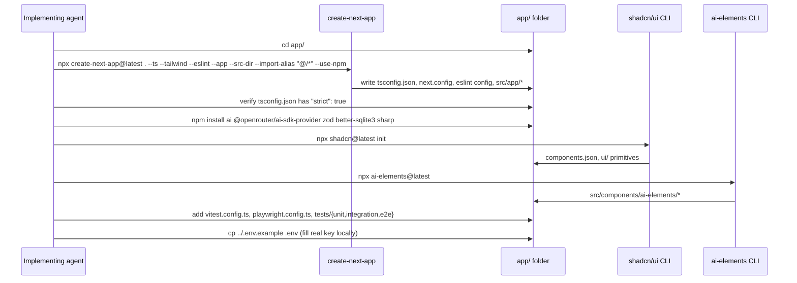

# ADR-001: Project Setup & Scaffolding

**Date:** 2026-07-14
**Status:** Accepted
**Relates to:** `docs/ADR/000-main-architecture.md`

---

## 1. Scope

How the (currently empty) `app/` folder is turned into a working Next.js project: scaffolding command, TypeScript configuration, linting/formatting, environment variable loading, and the npm scripts every other ADR assumes exist. Does **not** cover AI integration (ADR-002), database schema (ADR-003), or UI composition (ADR-004).

---

## 2. Context7 References

| Library | Context7 Handle | Used for |
|---|---|---|
| Next.js | `/vercel/next.js` | `create-next-app` CLI flags, project defaults |

No other libraries are specific to this area beyond what ADR-000 already lists.

---

## 3. Component Design

Not applicable in the class-design sense — this ADR is about tooling/config, not runtime components.

---

## 4. Initialization Procedure

The agent starts from an **empty** `app/` folder (currently containing only `README.md`) and must scaffold it in place rather than creating a new sibling folder.

1. Run `create-next-app` **inside** `app/` (not one level up), non-interactively, with: TypeScript enabled, App Router enabled, Tailwind CSS enabled, ESLint enabled, `src/` directory enabled, default import alias (`@/*`).
   - Verified via Context7 (`/vercel/next.js`): `create-next-app` supports a fully non-interactive flag set (`--ts --tailwind --eslint --app --src-dir --import-alias "@/*" --use-npm`), and `--yes` applies the tool's own recommended defaults (TypeScript, Tailwind, ESLint, App Router, Turbopack, `@/*` alias) if flags are omitted.
   - Because `app/` already contains a `README.md`, confirm the CLI's non-empty-directory handling before running it (current `create-next-app` versions prompt/allow scaffolding into a non-empty directory containing only a README/LICENSE/.git — verify this behavior at implementation time via `--help` since CLI defaults can change between versions).
2. Enable **TypeScript strict mode** explicitly: confirm `"strict": true` is present in the generated `tsconfig.json` (it is Next.js's own default; do not weaken it).
3. Install project dependencies beyond the scaffold default: `ai`, `@openrouter/ai-sdk-provider`, `zod`, `better-sqlite3`, `sharp`. Add `@types/better-sqlite3` as a dev dependency if the package does not ship its own types.
4. Initialize shadcn/ui (`npx shadcn@latest init`) and then AI Elements (`npx ai-elements@latest`) — both are prerequisites verified via Context7 (`/vercel/ai-elements`): AI Elements requires shadcn/ui initialized and Tailwind configured in **CSS Variables mode** (the create-next-app Tailwind default already uses CSS variables, so no extra config is expected, but confirm during setup).
5. Add Vitest and Playwright as dev dependencies; scaffold minimal config files (`vitest.config.ts`, `playwright.config.ts`) and the `tests/unit`, `tests/integration`, `tests/e2e` folders referenced in ADR-000.
6. Create `.env` locally (gitignored) from the repository-root `.env.example`; do not commit it.
7. Update `app/README.md` to reflect the chosen stack once scaffolding is complete (it currently describes the *process* of choosing a stack, not the chosen stack itself).

---

## 5. Interface Contracts

Not applicable — this ADR defines tooling, not runtime interfaces.

---

## 6. Technical Decisions

### Scaffold in place with `create-next-app`, not a manual setup
**Status:** Accepted
**Date:** 2026-07-14
**Context:** The team wants the standard, actively-maintained Next.js defaults (TypeScript strict, ESLint, Tailwind, App Router) rather than hand-assembling config files that the official CLI already produces correctly.
**Decision:** Use `create-next-app` non-interactively with explicit flags for TS/App Router/Tailwind/ESLint/`src/`/import-alias, run from inside `app/`.
**Rejected alternatives:**
- Hand-writing `tsconfig.json`/`next.config`/ESLint config from scratch: duplicates what the CLI already ships correctly and risks drift from Next.js's own recommended settings (per the project's own guidance in `app/README.md`: "Don't create config files manually if the boilerplate provides them").
**Consequences:**
- (+) Always matches current Next.js conventions (Turbopack, `AGENTS.md` generation, etc.) since the CLI is run at implementation time, not pinned to this ADR's writing date.
- (-) Exact CLI flag availability/behavior can shift between Next.js releases; the implementing agent must check `create-next-app --help` if a listed flag no longer exists.
**Review trigger:** If `create-next-app`'s non-interactive flags change shape in a future major version.

### npm as the package manager
**Status:** Accepted
**Context:** The course VM has npm, Bun, and Scoop/WinGet available; the repository's root `AGENTS.md` verification section already documents `npm test`, `npm run lint`, `npm run build` as the expected commands.
**Decision:** Standardize on npm for all scripts and lockfile.
**Rejected alternatives:**
- Bun: faster installs, but would require rewriting the already-documented verification commands and risks inconsistency with the rest of the course materials.
**Consequences:**
- (+) Matches existing documented workflow; no surprises for course participants following the root `AGENTS.md`.
- (-) Slower installs than Bun; acceptable for a course-scale project.
**Review trigger:** None expected at MVP scope.

---

## 7. Diagrams

### Scaffolding Sequence

---

## 8. Testing Strategy

### Test scenarios for this area

| Scenario | Type | Input | Expected output | Edge cases |
|---|---|---|---|---|
| Fresh scaffold builds | Integration (manual/CI check, not app logic) | Run `npm run build` right after scaffolding, before any feature code | Build succeeds with zero errors | Verify `strict: true` did not get silently disabled by the CLI defaults |
| Lint passes on scaffold | Integration | Run `npm run lint` right after scaffolding | Zero ESLint errors | AI Elements-generated components must also pass lint (they are committed source, not `node_modules`) |
| Env vars load | Unit | Read `process.env.OPENROUTER_API_KEY` etc. in a small config module | Values match `.env` | Missing required var should fail fast with a clear error at startup, not a silent `undefined` reaching OpenRouter |

### Technical acceptance criteria

- **TAC-001-01:** `app/tsconfig.json` contains `"strict": true` immediately after scaffolding.
- **TAC-001-02:** `npm run build`, `npm run lint`, and `npm test` (even with zero tests initially) all exit 0 immediately after scaffolding, before any feature work begins.
- **TAC-001-03:** Starting the app with a missing required environment variable (`OPENROUTER_API_KEY`, `OPENROUTER_TEXT_MODEL`, or `OPENROUTER_VISION_MODEL`) fails fast with a descriptive error rather than making a request to OpenRouter with an undefined key/model.
