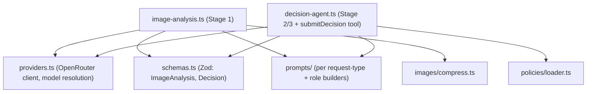
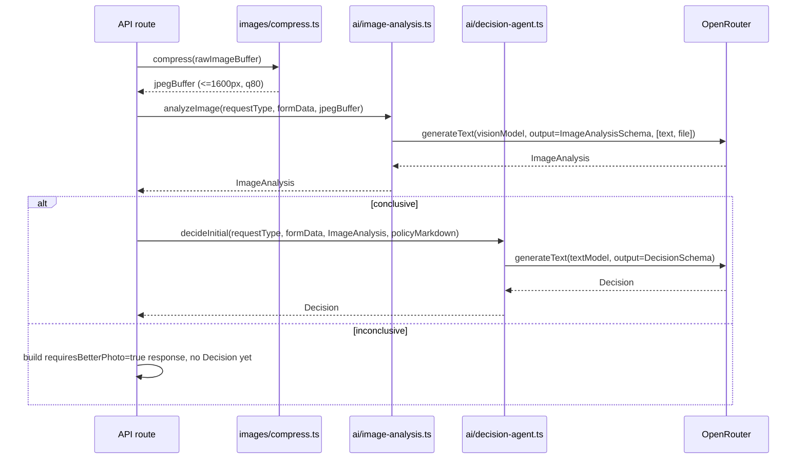

# ADR-002: AI Integration (Vercel AI SDK + OpenRouter)

**Date:** 2026-07-14
**Status:** Accepted
**Relates to:** `docs/ADR/000-main-architecture.md`

---

## 1. Scope

How the application talks to LLMs: provider configuration, model selection, the two-stage pipeline (multimodal image analysis → policy-grounded decision), prompt structure, structured output, the `submitDecision` tool used for both the first decision and in-chat revisions, streaming for the ongoing chat, and image compression before any model call. Does **not** cover HTTP route shape (see ADR-000 §6) or database schema (ADR-003).

---

## 2. Context7 References

| Library | Context7 Handle | Used for |
|---|---|---|
| Vercel AI SDK (`ai`) | `/vercel/ai` | `streamText`, `generateText` with `output: Output.object(...)`, `useChat` message/part shapes, tool calling |
| OpenRouter AI SDK Provider | `/openrouterteam/ai-sdk-provider` | `createOpenRouter`, `.chat(modelId, settings)` |
| sharp | `/lovell/sharp` | Image resize/compression prior to the vision model call |

---

## 3. Component Design

### `lib/ai/providers.ts`
Creates a single OpenRouter client via `createOpenRouter({ apiKey: process.env.OPENROUTER_API_KEY, baseURL: process.env.OPENROUTER_BASE_URL })` (verified via Context7: the OpenRouter AI SDK provider auto-loads `OPENROUTER_API_KEY` if omitted, but the base URL is passed explicitly here since it is already defined in `.env.example`). Exposes two resolved chat models: a **vision model** from `OPENROUTER_VISION_MODEL` and a **text model** from `OPENROUTER_TEXT_MODEL`, both falling back to `OPENROUTER_MODEL` only outside production, per the `.env.example` comments. Throws a startup error if a required variable is missing (ADR-001 TAC-001-03).

### `lib/ai/schemas.ts`
Zod schemas used both for structured LLM output and for typed persistence:
- `ImageAnalysisSchema` — `conclusive` (boolean), `damaged` (boolean, meaning depends on request type — see §4), `damageType` (string, nullable), `plausibleCause` (string, nullable — manufacturing vs. external/user-inflicted), `usageSigns` (boolean, nullable — return scenario only), `confidence` (`high`|`medium`|`low`), `customerFacingIssue` (string, nullable — what's wrong with the photo, populated only when `conclusive` is false), `internalNotes` (string — full internal reasoning, never shown verbatim to the customer, stored for the reviewer view).
- `DecisionSchema` — `status` (`approved`|`rejected`|`needs_human_review`), `justification` (string, must reference a policy rule), `nextSteps` (string array), `isRevision` (boolean), `requiresBetterPhoto` (boolean).

### `lib/ai/prompts/`
Four prompt builders, matching the PRD's explicit requirement for separate prompts per request type and per role:
- `imageAnalysisComplaintPrompt(formData)` — instructs the vision model to assess damage type and plausible cause (manufacturing defect vs. user-inflicted), per PRD §11 "Image analyzer" role for complaints.
- `imageAnalysisReturnPrompt(formData)` — instructs the vision model to assess absence of damage/usage signs and resellability.
- `decisionSystemPrompt(requestType, formData, imageAnalysis, policyMarkdown)` — the decision agent's system prompt: injects the full applicable policy document text (loaded via `lib/policies`), the form data, the image analysis result, the PRD §11 allowed/not-allowed rules, the mandatory Polish disclaimer text, the off-topic redirect rule, and the instruction to always call `submitDecision` rather than only writing prose. Two variants (complaint/return) differ only in which policy document and which decision-category framing (§11 table) is injected — implemented as one function parameterized by `requestType`, since the structural instructions are identical.

### `lib/ai/image-analysis.ts` (Stage 1)
Calls `generateText` with `model: visionModel`, `output: Output.object({ schema: ImageAnalysisSchema })`, and a `messages` array containing a `text` part (the role-specific prompt) and a `file` part (`mediaType: 'image/jpeg'`, `data: <compressed buffer>`) — matches the multimodal input shape confirmed via Context7 for `/vercel/ai`. Runs once per uploaded image (initial upload and any chat re-upload).

**Note:** `generateObject` is deprecated by the AI SDK in favor of `generateText` with an `output` setting (confirmed via Context7 docs) — do not use `generateObject` anywhere in this codebase.

### `lib/ai/decision-agent.ts` (Stage 2 — first decision, and Stage 3 — ongoing chat)
- **First decision:** `generateText` with `model: textModel`, `output: Output.object({ schema: DecisionSchema })`, system prompt = `decisionSystemPrompt(...)`. Called once, synchronously, right after Stage 1 succeeds, inside `POST /api/cases`. Its result is rendered directly into the first chat message (no LLM streaming needed for message #1 — see ADR-000's non-streaming decision).
- **Ongoing chat:** `streamText` with the same system prompt (rebuilt fresh from current DB state on every call — see ADR-000 §6 `POST /api/cases/[caseId]/chat`), the full prior `UIMessage[]` history via `convertToModelMessages`, and one tool available: `submitDecision` (parameters = `DecisionSchema`). The model is instructed to call this tool whenever it issues the initial decision restatement or a revision; plain conversational replies (answering questions, asking for clarification) do not call the tool. Response is returned via `toUIMessageStreamResponse`; an `onFinish` callback persists the assistant's final message (and, if the tool was called, a new `Decision` row) to SQLite.

### `lib/images/compress.ts`
Uses `sharp` to resize the uploaded image to a maximum longest-edge dimension and re-encode as JPEG at a fixed quality, before any model call and before persisting to disk. See §6 for the concrete ceiling.

---

## 4. Data Structures

See ADR-000 §5 for persisted entities. LLM-facing structures (not persisted verbatim, only their validated results are):

- **Vision model input:** one `text` part (role+request-type-specific prompt, including the form's description field for complaints) + one `file` part (compressed image bytes, `mediaType: 'image/jpeg'`).
- **Vision model output:** `ImageAnalysisSchema` instance (§3).
- **Decision model input (first call):** system prompt with policy + form + image analysis; no user message needed (fully deterministic input from stored data).
- **Decision model input (chat calls):** system prompt (rebuilt) + full message history + optional new `file` part on the latest user message (re-upload).
- **Decision model output:** free-text chat parts (explanations, questions, off-topic redirects) interleaved with zero or one `submitDecision` tool-call part per turn.

---

## 5. Interface Contracts

Internal module contracts (not HTTP — see ADR-000 §6 for HTTP contracts):

- `analyzeImage(requestType, formData, compressedImageBuffer): Promise<ImageAnalysis>` — throws a typed `AiProviderError` on failure (caught by the route handler and turned into the `502 { retryable: true }` response).
- `decideInitial(requestType, formData, imageAnalysis, policyMarkdown): Promise<Decision>` — same error contract as above.
- `streamChatTurn(caseId, messages): Response` — returns the AI SDK's streaming `Response` directly to the route handler; errors surface as a stream error part per the AI SDK's own error-in-stream handling, not a thrown exception (the HTTP response has already started streaming by the time a mid-conversation error can occur).

---

## 6. Technical Decisions

### Two specialized OpenRouter models via distinct env vars
**Status:** Accepted
**Context:** `.env.example` already defines `OPENROUTER_TEXT_MODEL` (decision/chat/policy reasoning) and `OPENROUTER_VISION_MODEL` (multimodal image analysis) as separate variables, both currently defaulting to the same cost-effective model but independently swappable.
**Decision:** `lib/ai/providers.ts` resolves two distinct model instances from these two variables; no code assumes they are the same model.
**Rejected alternatives:**
- Single shared model variable: contradicts the already-committed `.env.example` shape and removes the ability to use a cheaper/faster model for vision vs. a stronger one for policy reasoning.
**Consequences:**
- (+) Cost/quality can be tuned per role without code changes.
- (-) Two model configurations to validate at startup instead of one.
**Review trigger:** None — this matches the already-fixed environment contract.

### `submitDecision` tool instead of free-text decision parsing
See ADR-000 §8 for the full record (duplicated there because it is a cross-cutting decision affecting both AI integration and frontend rendering).

### Image compression ceiling: max 1600px longest edge, JPEG quality 80
**Status:** Accepted
**Context:** The PRD requires backend compression before any multimodal LLM call (AC-10) but leaves exact parameters to the ADR.
**Decision:** Resize so the longest edge is at most 1600px (no upscale if already smaller), re-encode as JPEG at quality 80. This keeps compressed images comfortably under ~1 MB for typical phone photos while preserving enough detail for damage assessment.
**Rejected alternatives:**
- Sending the original upload (up to 10 MB) directly: unnecessary token/bandwidth cost and slower model calls with no accuracy benefit at typical phone-camera resolutions.
- A fixed byte-size target (e.g., "compress until under 200 KB"): requires iterative re-encoding; a fixed dimension+quality pair is simpler and predictable.
**Consequences:**
- (+) Predictable, fast, single-pass compression.
- (-) Very high-detail damage (e.g., a hairline crack) could occasionally lose clarity at quality 80; acceptable trade-off for an MVP, revisit if analysis accuracy complaints arise.
**Review trigger:** If image-analysis accuracy issues are traced back to over-compression during implementation/testing.

### OpenRouter only — no direct OpenAI provider fallback
**Status:** Accepted
**Context:** `.env.example` documents an `OPENAI_API_KEY`-takes-precedence convention as a general project note, but the PRD and course instructions for this ADR explicitly require OpenRouter.
**Decision:** The MVP implements only the OpenRouter code path; the `OPENAI_API_KEY` precedence note is not implemented.
**Rejected alternatives:**
- Implementing both provider paths now: adds an abstraction layer with no current consumer, contradicting the "don't build for hypothetical requirements" principle.
**Consequences:**
- (+) Simpler provider setup, one client, one code path to test.
- (-) Switching to direct OpenAI later requires adding a small provider-selection layer.
**Review trigger:** If a future requirement needs direct OpenAI access (e.g., a model not available on OpenRouter).

---

## 7. Diagrams

### Component / Module Diagram

### Sequence: Stage 1 → Stage 2 pipeline (detail)

---

## 8. Testing Strategy

### Test scenarios for this area

| Scenario | Type | Input | Expected output | Edge cases |
|---|---|---|---|---|
| Vision prompt selection | Unit | `requestType='reklamacja'` vs `'zwrot'` | Correct prompt builder invoked with correct instructions | Missing description on a complaint (should not happen — form validation blocks it, but the prompt builder should not crash if called directly in a test) |
| Structured output parsing | Unit | Mocked AI SDK response matching `ImageAnalysisSchema` | Schema validates; malformed mock response fails validation | Vision model returns extra/unexpected fields — schema should ignore or reject per Zod config, decided consistently |
| `submitDecision` tool invocation | Integration | Mocked text-model stream that calls the tool with `isRevision=true` | A new `Decision` row is persisted with `isRevision=true`; existing decision rows untouched | Tool called twice in one turn — only the last call should be treated as authoritative |
| Compression ceiling | Integration | Images of varying original sizes/dimensions (150 KB phone photo, 9 MB high-res photo) | All outputs ≤ configured longest-edge/quality settings | Already-small image is not upscaled |
| Provider startup validation | Unit | Missing `OPENROUTER_TEXT_MODEL` | Throws a clear startup error, no request attempted | Both vision and text vars missing simultaneously |
| LLM failure propagation | Integration | Mocked OpenRouter call that rejects | `AiProviderError` surfaces to the route handler as `502 { retryable: true }` | Timeout vs. explicit 4xx/5xx from OpenRouter — both must be treated as retryable from the customer's perspective |

### Technical acceptance criteria

- **TAC-002-01:** `analyzeImage` and `decideInitial` never call `generateObject` (verified by a lint rule or a static grep-based test forbidding the import).
- **TAC-002-02:** The compressed image passed to the vision model is always ≤ 1600px on its longest edge (integration test asserts on the buffer actually sent, via a spy on the compression function's output).
- **TAC-002-03:** Every `submitDecision` tool call is persisted as exactly one new `Decision` row, and `isRevision=true` is only ever set on rows after the first decision for a given case.
- **TAC-002-04:** Missing any of `OPENROUTER_API_KEY`, `OPENROUTER_TEXT_MODEL`, `OPENROUTER_VISION_MODEL` at startup prevents the app from serving requests, per ADR-001 TAC-001-03.
