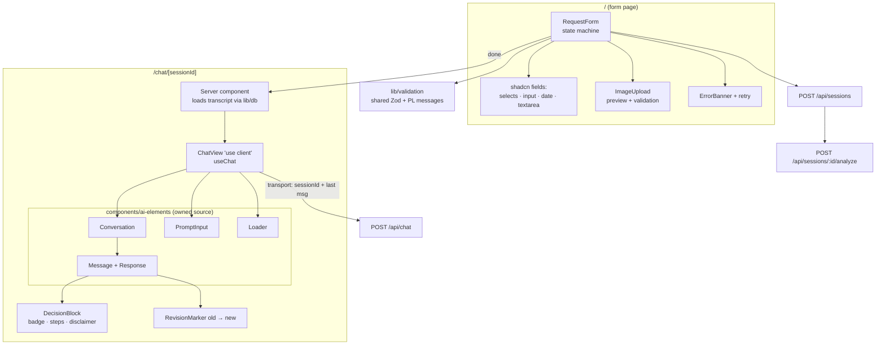
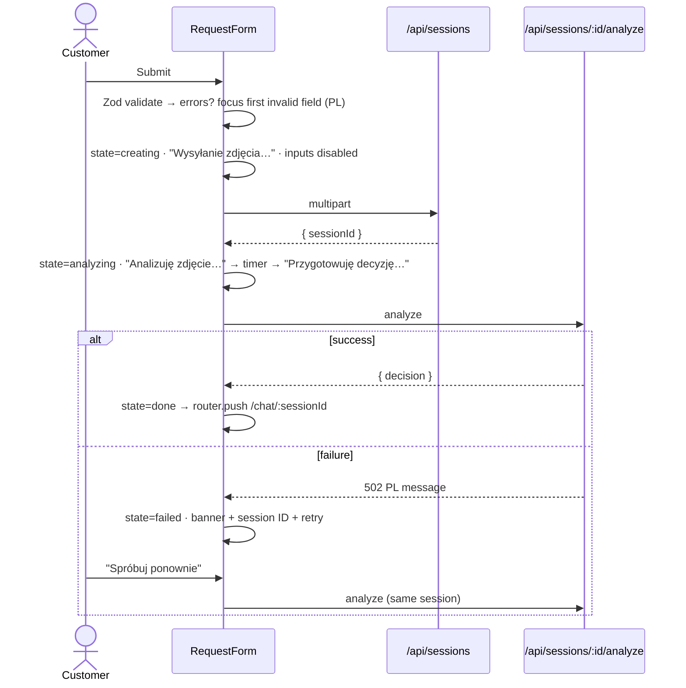

# ADR-002: Frontend — Request Form & Streaming Chat UI

**Date:** 2026-07-14
**Status:** Accepted
**Relates to:** [`docs/ADR/000-main-architecture.md`](000-main-architecture.md)

---

## 1. Scope

The two screens (request form, chat), client-side validation, upload preview, loading/error states, the AI Elements-based chat rendering, `useChat` wiring and session restore, responsiveness, and Polish UI text handling. Does NOT cover: server-side AI behavior (ADR-001), persistence (ADR-003), HTTP contracts (defined in ADR-000 §6 and consumed here).

---

## 2. Context7 References

| Library | Context7 Handle | Used for |
|---|---|---|
| AI Elements | `/vercel/ai-elements` | Conversation, Message, Response, PromptInput, loader components |
| Vercel AI SDK | `/vercel/ai` | `useChat`, chat transport configuration, UI message parts |
| shadcn/ui | `/shadcn-ui/ui` | Form controls: select, input, textarea, date picker (calendar/popover), button |
| Next.js | `/vercel/next.js` | App Router pages, client/server component split, route params |
| Tailwind CSS | `/tailwindlabs/tailwindcss.com` | Layout, responsive breakpoints |
| Zod | `/colinhacks/zod` | Client-side validation via the shared schemas from `lib/validation` |

---

## 3. Component Design

### Route/page structure

| Route | Kind | Content |
|---|---|---|
| `/` | Server component page hosting a client form component | Screen 9.1 — title, one-sentence explanation, `RequestForm` |
| `/chat/[sessionId]` | Server component page: fetches session server-side, passes initial data to a client chat component | Screen 9.2 — header (app name, session ID, "new request" link), `ChatView` |
| `/chat/[sessionId]` with unknown ID | Same page, not-found branch | Polish "session not found" state + link to `/` |

### Form area (`RequestForm` + children)

- Controlled form with the shared Zod schema from `lib/validation` (same rules as server — AC-02…AC-05). Validation triggers on submit, then per-field on change (standard React form pattern; a small form library is optional — decide at implementation, it is not architectural).
- Field components from shadcn/ui: request-type select (Reklamacja/Zwrot), category select (PRD §8 list), product name input, purchase-date picker (future dates disabled — AC-04), reason textarea with 0/2000 counter, image drop zone.
- Request-type change immediately toggles the reason "required" marker and the image helper text (AC-03, PRD 9.1) — pure client state.
- Image field: file picker + drag-and-drop; client-side type/size check (JPG/PNG/WebP, ≤ 10 MB — AC-05); on selection renders thumbnail preview (object URL), file name, size, remove button (AC-06). The original file is uploaded; compression is server-side only (AC-08).
- Submission state machine (client): `idle → creating (Wysyłanie zdjęcia…) → analyzing (Analizuję zdjęcie… → Przygotowuję decyzję…) → done | failed`. `creating` = POST `/api/sessions`; `analyzing` = POST `/api/sessions/{id}/analyze`; the two staged analysis texts rotate on a timer while awaiting the analyze response (the endpoint is synchronous — ADR-000 D4). All inputs + button disabled during `creating`/`analyzing`; duplicate submits prevented by the state machine (AC-07).
- `failed` state: error banner above the button with Polish message, session ID (once created), and a retry action that re-invokes only the analyze call — form values and file stay mounted (flow 4.5). A second failure switches the banner to the "temporarily unavailable + session ID" variant.
- On `done`: client-side navigation to `/chat/{sessionId}`.

### Chat area (`ChatView` + AI Elements components)

- Built from AI Elements components installed as local source under `components/ai-elements/` (ADR-000 D5): conversation container with auto-scroll + scroll-to-bottom button, message bubbles, streamed-markdown response renderer, prompt input with submit button, streaming loader. Unused installed components are deleted.
- `useChat` initialization: chat ID = session ID; initial messages = transcript passed from the server component (GET restore payload — AC-27); transport configured with the chat endpoint and a request-preparation hook that sends only `{ sessionId, newest user message }` (ADR-000 D8).
- First/decision messages: assistant messages whose parts include decision data render a **decision block**: category badge (four visual variants: APPROVE green, REJECT red, MORE_INFO amber, ESCALATE violet — final tokens from `docs/design-guidelines.md` when it exists), justification, numbered next steps, small-print disclaimer (AC-17). Revision messages render an "old → new" changed-decision element (AC-21) derived from the `revise_decision` tool part present in the message parts stream (ADR-001 D1-04).
- Message alignment/timestamps: customer right, agent left, timestamp per bubble (PRD 9.2) — timestamps come from persisted messages on restore and client clock during live streaming.
- Input: growing textarea, max 2000 chars with counter shown near the limit; Enter sends, Shift+Enter newline (PromptInput default behavior — verify against current AI Elements docs); send disabled while `useChat` status is streaming/submitted (AC-23) though typing stays possible; text-only — no attachment affordances rendered (AC-20).
- Reply failure: `useChat` error state renders an inline error row with "Spróbuj ponownie" wired to the SDK's regenerate/retry mechanism for the failed turn; history preserved (AC-24).

### Polish text handling

All UI strings live in one module (e.g. `lib/i18n/pl`) as a typed constant object — no i18n framework (single language, PRD out-of-scope). Zod schemas produce Polish messages via a shared error map so client and server emit identical wording (AC-29). E2E asserts key strings.

### State management

No global state library. Form state is local to `RequestForm`; chat state lives in `useChat`; session identity lives in the URL. Nothing else is shared.

---

## 4. Data Structures

- **Form values** (client): mirror of the session-creation schema — requestType, category, productName, purchaseDate, reason, imageFile. Submitted as `multipart/form-data`.
- **UI messages**: the AI SDK UI-message shape (id, role, parts[]) — used live (from `useChat`) and for restore (from GET session). Decision block data arrives inside message parts (tool part for revisions; the first message's decision metadata is included in the restore payload and rendered from the persisted Decision record).
- **Submission state**: discriminated union `idle | creating | analyzing | done | failed(errorKind, sessionId?)` — drives every AC-07/4.5 behavior; no booleans-soup.

---

## 5. Interface Contracts

Consumes (defined in ADR-000 §6): POST `/api/sessions` (multipart), POST `/api/sessions/{id}/analyze`, GET `/api/sessions/{id}`, POST `/api/chat` (UI-message stream). The chat page's server component calls the session lookup directly through `lib/db` (same process) rather than over HTTP; the GET endpoint remains for client-side refetch needs.

Exposes: none (leaf of the dependency graph).

---

## 6. Technical Decisions

### D2-01 — AI Elements as local source, shadcn/ui for the form
**Status:** Accepted · **Date:** 2026-07-14
**Context:** ADR-000 D5 chose AI Elements for chat. The form needs consistent-looking controls.
**Decision:** Install shadcn/ui primitives for form controls and AI Elements for chat; both install source into the repo, one design system (Tailwind tokens) across both screens. Polish labels and PRD-specific elements are direct edits to owned code.
**Rejected alternatives:**
- Native HTML controls only for the form: date picker and select UX at 375 px would need custom work anyway; inconsistent with chat styling.
- A component kit not based on shadcn (e.g. MUI): second styling system alongside the one AI Elements requires.
**Consequences:** (+) uniform look, zero runtime UI deps beyond what's copied in; (−) repo carries generated component source (reviewable, but verbose).
**Review trigger:** Design guidelines document mandates a different design system.

### D2-02 — Two-call submission orchestrated client-side with a typed state machine
**Status:** Accepted · **Date:** 2026-07-14
**Context:** ADR-000 split session creation from analysis (retry semantics, AC-28). The form must show staged progress (PRD 9.1) and survive analyze failures without losing anything.
**Decision:** The form performs the two POSTs sequentially and represents progress as an explicit discriminated-union state machine; retry re-enters `analyzing` with the stored session ID. Staged status texts are driven by the state (creating) and a rotation timer (analyzing) since the analyze call is a single awaited request.
**Rejected alternatives:**
- One combined endpoint with server-streamed progress events: real progress granularity, but adds a custom streaming protocol for a screen the user sees for seconds; retry semantics get murkier (was the session created?).
- Navigate to chat immediately and run analysis there: violates PRD 9.1 ("no navigation until the first decision is ready or an error occurs").
**Consequences:** (+) every PRD 9.1 state is a testable machine state; retry is trivially correct; (−) progress texts are approximate, not tied to actual pipeline stages.
**Review trigger:** Analysis latency grows enough that fake staging feels dishonest (> ~30 s) — then move to streamed progress.

### D2-03 — Server-rendered restore, client-hydrated live chat
**Status:** Accepted · **Date:** 2026-07-14
**Context:** AC-27 requires reload to restore the full conversation including the first decision message.
**Decision:** The chat page is a server component that loads the transcript from the DB and passes it as `useChat` initial messages to the client component. Live turns then append client-side via streaming. One rendering path (message parts → components) serves both restored and live messages because persistence stores UI-message parts verbatim (ADR-003).
**Rejected alternatives:**
- Client-only fetch-on-mount: blank-then-pop chat, no SSR of the transcript, extra loading state to design.
- Rebuilding restored messages from raw decision rows only: diverges from what was actually rendered live; revision markers would need re-derivation.
**Consequences:** (+) reload is pixel-equivalent to the live session; deep links work; (−) server component + client hydration hand-off must keep message shapes in sync (single shared type prevents drift).
**Review trigger:** Sessions grow beyond a size where full-transcript SSR is wasteful.

---

## 7. Diagrams

### Component Diagram



### Sequence — form submission states (client view)



### Sequence — live chat turn (client view)

```mermaid
sequenceDiagram
    actor U as Customer
    participant PI as PromptInput
    participant UC as useChat
    participant API as /api/chat

    U->>PI: Types (counter near 2000), Enter
    PI->>UC: sendMessage(text)
    UC->>API: { sessionId, newest message } (transport hook)
    UC-->>PI: status=streaming → send disabled, Loader bubble
    API-->>UC: streamed parts (text · tool revise_decision)
    UC-->>U: Response renders progressively; tool part → RevisionMarker
    alt stream error
        UC-->>U: inline error row + "Spróbuj ponownie" (regenerate)
    end
```

---

## 8. Testing Strategy

Unit (Vitest + Testing Library): pure logic and component behavior with mocked fetch/useChat. E2E (Playwright, real stack): the PRD flows at desktop and 375 px viewports.

### Test scenarios for this area

| Scenario | Type | Input | Expected output | Edge cases |
|---|---|---|---|---|
| Required-field errors | Unit + E2E | Submit empty form | Field-level Polish errors under each field; focus on first invalid; no request sent | Only image missing; only reason missing on complaint |
| Reason toggling | Unit | Switch Reklamacja ↔ Zwrot | Required marker + image helper text update immediately; stale reason error clears | Toggle repeatedly during typing |
| Future purchase date | Unit + E2E | Tomorrow's date | Picker disables it; manual entry rejected with PL error (AC-04) | Today = valid boundary |
| File validation + preview | Unit | GIF; 11 MB JPG; valid PNG | Rejections name allowed formats/limit; valid file → thumbnail, name, size, remove works (AC-05/06) | Re-select after remove; 10 MB boundary |
| Submission state machine | Unit | Mocked API success/failure sequences | Exact state transitions incl. staged texts, disabled inputs, no double submit (AC-07) | Failure in creating vs. analyzing; retry after both |
| Decision block rendering | Unit | Messages for each category + revision tool part | Badge variant per category; numbered steps; disclaimer small-print; old → new marker (AC-17/21) | Unknown part types ignored gracefully |
| Char limits in chat | Unit + E2E | 2000/2001 chars | Counter appears near limit; 2001st blocked (AC-18) | Paste over limit |
| Full happy path | E2E | Valid return + clean fixture image | Lands on chat, first message decision block visible, session ID in header (AC-25) | Mobile 375 px run of the same test |
| Restore on reload | E2E | Chat with 2 turns, reload | Identical transcript incl. decision block (AC-27) | Direct visit to unknown session ID → PL not-found |
| Streaming states | E2E | Send message | Loader bubble while streaming; send disabled; reply appears progressively (AC-23) | — |

### Technical acceptance criteria

- TAC-002-01: Client and server reject exactly the same invalid inputs with identical Polish messages (parameterized test runs the shared schema cases against both).
- TAC-002-02: No file bytes are uploaded before form validity passes; exactly one multipart upload per successful submission.
- TAC-002-03: Form and chat pass Playwright runs at 375 px and 1280 px widths with no horizontal scroll and functional controls (AC-30).
- TAC-002-04: The chat input never sends while `useChat` status is not ready (rapid Enter presses during streaming produce no request).
- TAC-002-05: All user-visible strings originate from the `pl` strings module or Zod PL error map — grep-level check finds no hardcoded user-facing literals in components (AC-29).
