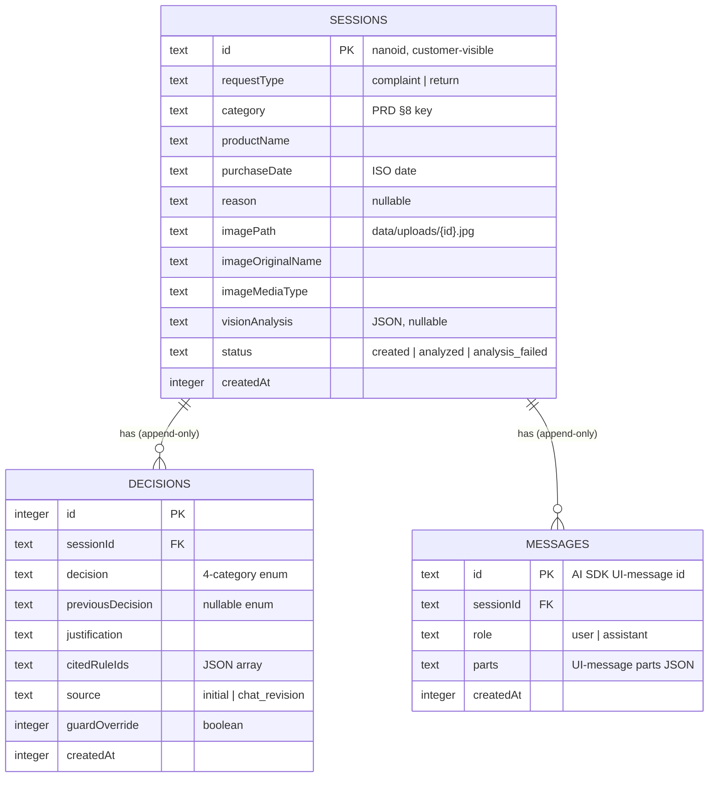
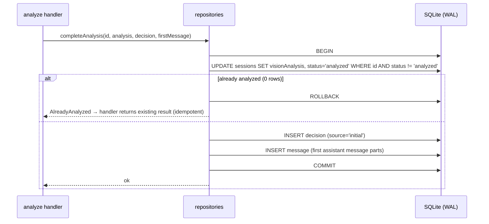
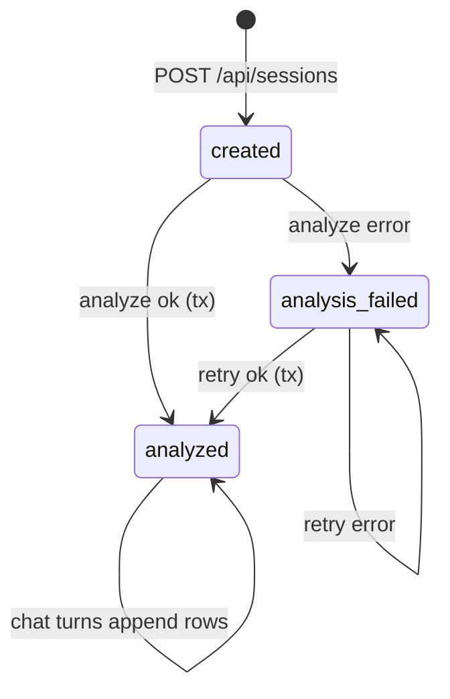

# ADR-003: Persistence — SQLite + Drizzle, Image Storage, Session Lifecycle

**Date:** 2026-07-14
**Status:** Accepted
**Relates to:** [`docs/ADR/000-main-architecture.md`](000-main-architecture.md)

---

## 1. Scope

Database engine and ORM, schema for sessions/decisions/messages, image compression and file storage, session lifecycle and status transitions, migrations, and data access patterns. Does NOT cover: what the AI does with the data (ADR-001), HTTP surface (ADR-000 §6), UI (ADR-002).

---

## 2. Context7 References

| Library | Context7 Handle | Used for |
|---|---|---|
| Drizzle ORM | `/drizzle-team/drizzle-orm-docs` | SQLite schema definition, queries, transactions, drizzle-kit migrations |
| sharp | `/lovell/sharp` | Resize, format conversion, quality settings, metadata stripping |

(better-sqlite3 is consumed through Drizzle's driver adapter; its own docs are rarely needed.)

---

## 3. Component Design

`src/lib/db/`:

| Part | Responsibility |
|---|---|
| `schema` | Drizzle table definitions + inferred TS types (single source of truth for entity shapes) |
| `client` | Singleton better-sqlite3 connection + Drizzle instance; DB file path resolution; runs pending migrations on startup in dev |
| `repositories` | Typed functions per aggregate: create session, get session with decisions+messages, set analysis result/status, append decision, append message. Route handlers and `lib/ai` tool executes use only these — no inline SQL/query-builder calls outside this module |

`src/lib/images/`:

| Part | Responsibility |
|---|---|
| `compress` | Buffer in → compressed buffer out (sharp): resize to fit within **1568 px** on the longest edge (no upscaling), re-encode as **JPEG quality 80**, strip EXIF/metadata. Rationale: comfortably within common vision-model input limits while preserving damage-relevant detail; PNG/WebP inputs converge to one storage format |
| `store` | Writes compressed buffer to `data/uploads/{sessionId}.jpg`; returns relative path. Reads back for the vision call |

Storage locations (both gitignored, both under `app/data/`): `data/copilot.sqlite`, `data/uploads/`.

### Schema (conceptual — exact Drizzle definitions derived from this)

**sessions**
- `id` TEXT PK — URL-safe random ID (~12+ chars, e.g. nanoid); customer-visible (AC-25), so no enumerable integers
- `requestType` TEXT CHECK in (`complaint`,`return`)
- `category` TEXT CHECK in the PRD §8 list (stored as stable keys, not Polish labels)
- `productName` TEXT (2–100 chars enforced at validation layer)
- `purchaseDate` TEXT ISO date
- `reason` TEXT NULL
- `imagePath` TEXT — relative path of the compressed image
- `imageOriginalName` TEXT, `imageMediaType` TEXT — as uploaded (metadata only; original bytes are discarded after compression, AC-08/TAC-06)
- `visionAnalysis` TEXT NULL — ImageAnalysis JSON (ADR-001 §4), set once analysis succeeds
- `status` TEXT CHECK in (`created`,`analyzed`,`analysis_failed`)
- `createdAt` INTEGER epoch ms

**decisions** — append-only (AC-26)
- `id` INTEGER PK autoincrement (ordering tiebreaker), `sessionId` FK → sessions
- `decision` TEXT CHECK in the four categories (TAC-04)
- `previousDecision` TEXT NULL CHECK same enum — set on revisions
- `justification` TEXT, `citedRuleIds` TEXT JSON array
- `source` TEXT CHECK in (`initial`,`chat_revision`), `guardOverride` INTEGER boolean — true when the guard replaced the model's requested category (audit trail for staff)
- `createdAt` INTEGER epoch ms

**messages** — append-only
- `id` TEXT PK — the UI-message ID from the AI SDK (stable across live render and restore)
- `sessionId` FK, `role` TEXT CHECK in (`user`,`assistant`)
- `parts` TEXT JSON — UI-message parts verbatim (text, tool parts), so restore replays exactly what was rendered (AC-27, ADR-002 D2-03)
- `createdAt` INTEGER epoch ms

Indexes: `decisions.sessionId`, `messages.sessionId` (+ `createdAt` for ordering). FKs enforced (`ON DELETE CASCADE`; deletion is out of MVP scope but keeps dev resets clean).

### Session lifecycle

```
created ──analyze ok──▶ analyzed (terminal; chat allowed)
   │                        ▲
   └──analyze fails──▶ analysis_failed ──retry ok──┘
```

- POST `/api/sessions` inserts with `created`.
- Analyze success persists, in **one transaction**: `visionAnalysis`, status → `analyzed`, the initial decision row, the first assistant message row. All-or-nothing prevents half-analyzed sessions (idempotence in ADR-000 §6 keys off `analyzed`).
- Analyze failure only flips status to `analysis_failed` — form data and image untouched (AC-28); retry allowed from `created` or `analysis_failed`.
- Chat turns require `analyzed`; each turn persists the user message before generation and the assistant message + any decision row after (ADR-000 D8). A mid-stream crash may lose only the assistant message of that turn — acceptable: the client shows the retry row (AC-24), and regeneration produces a new reply from the persisted user message.

---

## 4. Data Structures

Repository return types are inferred from the Drizzle schema — no hand-written duplicate interfaces. The composed read model `SessionWithHistory` (session + ordered decisions + ordered messages) feeds both GET restore and chat-context assembly (ADR-001 §4), guaranteeing the chat agent and the customer see the same history.

---

## 5. Interface Contracts

Repository functions (conceptual):

- `createSession(validatedForm, imageMeta) → Session` — generates ID, status `created`.
- `getSessionWithHistory(id) → SessionWithHistory | null`
- `completeAnalysis(id, analysis, initialDecision, firstMessage) → void` — transactional; rejects if already `analyzed`.
- `markAnalysisFailed(id) → void`
- `appendDecision(sessionId, decisionData) → Decision` — used by the `revise_decision` tool execute.
- `appendMessage(sessionId, uiMessage) → void` — upsert-by-ID semantics so a retried persist of the same UI message cannot duplicate rows.

Error contract: unknown session → null/typed not-found error (handlers map to 404); constraint violations are programming errors and may throw.

---

## 6. Technical Decisions

### D3-01 — better-sqlite3 (synchronous) via Drizzle
**Status:** Accepted · **Date:** 2026-07-14
**Context:** Local-only deployment (ADR-000 D7); Next.js route handlers run in Node.
**Decision:** better-sqlite3 with Drizzle's sqlite adapter, WAL mode enabled. Synchronous queries are microseconds-scale at this size and simplify transaction code (no async transaction pitfalls). Confirmed with the user (SQLite + Drizzle).
**Rejected alternatives:**
- libsql/Turso client: async and network-capable — capabilities this MVP doesn't need, plus an extra service dimension.
- Prisma, JSON files, BLOBs-in-DB: rejected in ADR-000 D7.
**Consequences:** (+) zero-latency queries, trivial transactions, single file; (−) native module — must be excluded from client bundles and marked external for the Next.js server build (verify current mechanism via `/vercel/next.js`); Windows/macOS/Linux prebuilds cover course machines.
**Review trigger:** Hosted/serverless deployment (switch driver, keep Drizzle schema).

### D3-02 — Migrations: drizzle-kit generated SQL, applied on dev startup
**Status:** Accepted · **Date:** 2026-07-14
**Context:** Schema will evolve during the course; participants must not hand-manage DB files.
**Decision:** Schema lives in code; drizzle-kit generates versioned SQL migrations committed to the repo; the app applies pending migrations at startup in development. A fresh clone with an empty `data/` reaches a working DB with zero manual steps.
**Rejected alternatives:**
- `drizzle-kit push` (schema sync without files): fine for solo prototyping, but destructive-change-prone and unreviewable in a multi-participant course repo.
- Hand-written DDL scripts: loses the schema-as-types single source of truth.
**Consequences:** (+) reproducible DBs, reviewable schema history; (−) migration files add repo noise.
**Review trigger:** None for MVP.

### D3-03 — Store UI-message parts verbatim; decisions as separate rows
**Status:** Accepted · **Date:** 2026-07-14
**Context:** AC-27 needs pixel-faithful restore; AC-26 needs queryable decision history; the two have different shapes.
**Decision:** Dual representation. Messages store the AI SDK UI-message parts JSON verbatim keyed by the SDK's message ID (restore = feed rows straight to `useChat`). Decisions additionally get first-class rows (category enums, rule citations, guard-override flag) written by the pipeline/tool — the queryable audit trail staff review depends on (PRD §12).
**Rejected alternatives:**
- Messages only, decisions derived by parsing stored parts: fragile against SDK part-shape evolution; staff queries become JSON spelunking.
- Decisions only, first message re-rendered from decision rows: restored chat would diverge from what was rendered live (ADR-002 D2-03).
**Consequences:** (+) each consumer reads its natural shape; (−) decision facts exist twice (message text + row) — the row is canonical; the pipeline writes both in one transaction so they cannot drift on the initial decision, and the tool result (recorded outcome) is what the model verbalizes on revisions (ADR-001 D1-04).
**Review trigger:** AI SDK major changes the UI-message part schema (migrate stored JSON or version the column).

### D3-04 — Compression profile: fit 1568 px, JPEG q80, strip metadata, discard original
**Status:** Accepted · **Date:** 2026-07-14
**Context:** AC-08 mandates server-side compression before the vision call and storing the compressed image. Uploads may be 10 MB phone photos; vision models downscale large inputs anyway, and EXIF may contain GPS data (privacy).
**Decision:** sharp pipeline: auto-rotate per EXIF orientation, resize to fit 1568 px longest edge without upscaling, encode JPEG quality 80, strip all metadata. Only the compressed file is written to disk; original bytes never persist. Parameters are constants in `lib/images` (not env) — they are implementation tuning, not configuration.
**Rejected alternatives:**
- Keep the original too: doubles storage, retains EXIF/GPS, no MVP consumer for it.
- WebP/AVIF storage: marginal size win, worse tooling ubiquity for staff opening files directly (PRD §12).
**Consequences:** (+) predictable LLM input size/cost, privacy-safe files, one format; (−) irreversible quality loss — accepted, staff can request escalated physical inspection per policy.
**Review trigger:** Chosen vision model documents a different optimal input size, or staff review needs full-resolution evidence.

---

## 7. Diagrams

### Entity-Relationship Diagram



### Sequence — transactional analyze completion



### State diagram — session status



---

## 8. Testing Strategy

Unit tests run against an in-memory/temp-file SQLite with migrations applied — real Drizzle, no mocks (per repo strategy, DB is not an external LLM API). Image tests use small fixture files.

### Test scenarios for this area

| Scenario | Type | Input | Expected output | Edge cases |
|---|---|---|---|---|
| Fresh-clone bootstrap | Unit | Empty temp data dir | Migrations create all tables; repositories usable immediately | Re-run startup → no-op |
| Session creation | Unit | Valid form data + image meta | Row with `created` status, non-enumerable ID | ID collision retry (astronomically rare, still handled) |
| completeAnalysis atomicity | Unit | Failure injected on message insert | Transaction rolls back: status stays `created`, no orphan decision | Double call → AlreadyAnalyzed, single decision row |
| Append-only decisions | Unit | Initial + two revisions | Three ordered rows; previousDecision chain correct; guardOverride recorded | Same-ms timestamps ordered by autoincrement id |
| Message upsert-by-ID | Unit | Same UI message persisted twice | One row (retry-safe) | Different parts, same id → last write wins |
| SessionWithHistory ordering | Unit | Interleaved inserts | Messages and decisions each strictly time-ordered | Empty chat (only first message) |
| Enum CHECK constraints | Unit | Raw insert with invalid decision category | Constraint violation — invalid categories unrepresentable (TAC-04) | Invalid status, role |
| Compression profile | Unit | 4000×3000 ~8 MB JPEG fixture; small PNG; WebP | Output ≤1568 px longest edge, JPEG, metadata stripped, smaller bytes; small image not upscaled | Portrait EXIF-rotated fixture keeps correct orientation |
| Original not retained | Unit | Any upload | Only `{sessionId}.jpg` exists under uploads after processing | Failed compression → session not created, no orphan file |
| Missing image file on read | Integration | Delete file, run analyze | Typed error → 502 path, session intact | — |

### Technical acceptance criteria

- TAC-003-01: `git clone` + install + start on a machine with no `data/` directory yields a working app with an initialized DB — no manual DB steps (verified by a clean-environment E2E job).
- TAC-003-02: After the full E2E happy path, the DB contains exactly: one session (`analyzed`), ≥1 decision with `source='initial'`, and messages whose first row is the assistant decision message — queried directly, not via the app (AC-26).
- TAC-003-03: Stored images contain no EXIF/GPS metadata (asserted by reading back metadata from the stored file).
- TAC-003-04: All repository writes for a single analyze completion are atomic — kill-in-the-middle test leaves the session retryable, never half-analyzed.
- TAC-003-05: `data/` is gitignored; no runtime artifact ever appears in `git status` after a full E2E run.
