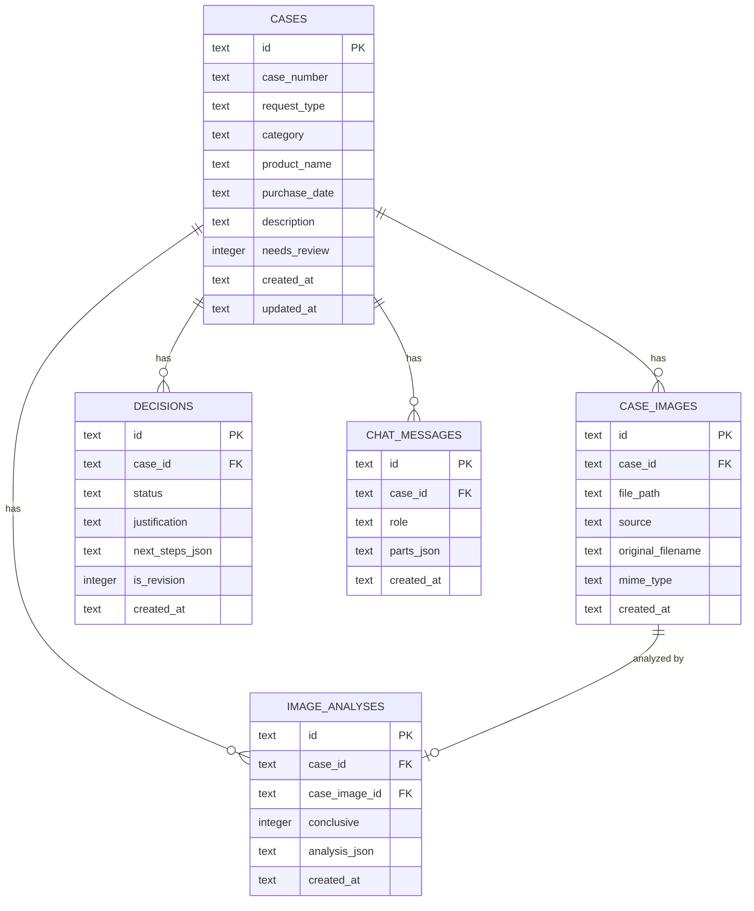
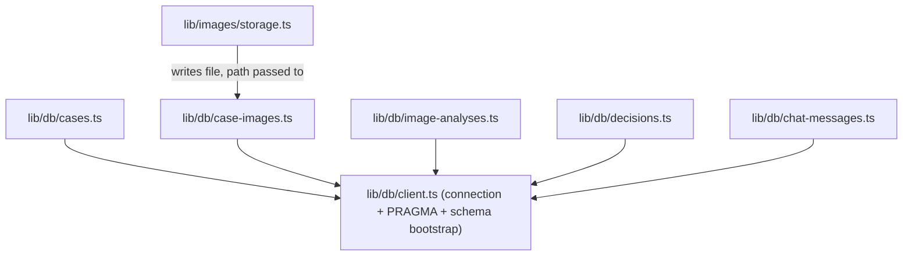
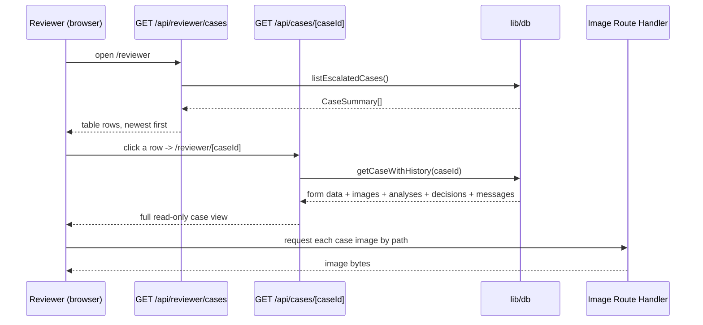

# ADR-003: Persistence (SQLite Schema & Image Storage)

**Date:** 2026-07-14
**Status:** Accepted
**Relates to:** `docs/ADR/000-main-architecture.md`

---

## 1. Scope

The SQLite schema backing session persistence (AC-32..35, AC-40..42), how images are stored on disk and referenced from the database, and how the reviewer view's "escalated cases" list is derived. Does **not** cover what triggers persistence (that's the API routes, ADR-000 §6) or AI output shapes (ADR-002).

---

## 2. Context7 References

| Library | Context7 Handle | Used for |
|---|---|---|
| better-sqlite3 | `/wiselibs/better-sqlite3` | Synchronous SQLite driver, prepared statements |

---

## 3. Component Design

### `lib/db/client.ts`
Opens (or creates) a single SQLite file at a fixed path (e.g. `app/data/copilot.db`, gitignored). On startup, applies `lib/db/schema.sql` idempotently (`CREATE TABLE IF NOT EXISTS ...`) — no migration framework at this scale; schema changes during development just edit `schema.sql` and delete the local dev DB file.

### `lib/db/cases.ts`, `lib/db/chat-messages.ts`, etc.
One module per table, exposing typed functions (`createCase`, `getCaseById`, `listEscalatedCases`, `appendChatMessage`, `insertDecision`, `insertImageAnalysis`, `insertCaseImage`) built on `better-sqlite3` prepared statements. No raw SQL string-building elsewhere in the codebase — all queries go through these modules.

### `lib/images/storage.ts`
Writes compressed image buffers to `app/uploads/<caseId>/<sequence>.jpg` and returns the relative path stored in `case_images.file_path`. Serves images back for the reviewer view via a small Route Handler or Next.js static file serving from a non-public directory (must not be served from `public/` directly, since `public/` is unauthenticated and images may be sensitive customer photos — see §6).

---

## 4. Data Structures

### `cases`
| Column | Type | Notes |
|---|---|---|
| `id` | TEXT (UUID v4) | Primary key |
| `case_number` | TEXT | Unique, human-readable, e.g. `HSC-20260714-0007`; shown to the customer |
| `request_type` | TEXT | `zwrot` \| `reklamacja` |
| `category` | TEXT | One of the AC-02 enum values |
| `product_name` | TEXT | |
| `purchase_date` | TEXT (ISO date) | |
| `description` | TEXT, nullable | Required at insert time for `reklamacja` (enforced by Zod before this layer) |
| `needs_review` | INTEGER (boolean) | `1` once any decision reaches `needs_human_review`; drives the reviewer list |
| `created_at` | TEXT (ISO datetime) | |
| `updated_at` | TEXT (ISO datetime) | Bumped on every new decision/chat message |

### `case_images`
| Column | Type | Notes |
|---|---|---|
| `id` | TEXT (UUID v4) | Primary key |
| `case_id` | TEXT | FK → `cases.id` |
| `file_path` | TEXT | Relative path under `app/uploads/` |
| `source` | TEXT | `form` \| `chat_reupload` |
| `original_filename` | TEXT | As uploaded, for reviewer display only |
| `mime_type` | TEXT | Post-compression (`image/jpeg`) |
| `created_at` | TEXT (ISO datetime) | |

### `image_analyses`
| Column | Type | Notes |
|---|---|---|
| `id` | TEXT (UUID v4) | Primary key |
| `case_id` | TEXT | FK → `cases.id` |
| `case_image_id` | TEXT | FK → `case_images.id` |
| `conclusive` | INTEGER (boolean) | |
| `analysis_json` | TEXT (JSON) | Full `ImageAnalysisSchema` result, including internal notes (reviewer-only) |
| `created_at` | TEXT (ISO datetime) | |

### `decisions`
| Column | Type | Notes |
|---|---|---|
| `id` | TEXT (UUID v4) | Primary key |
| `case_id` | TEXT | FK → `cases.id` |
| `status` | TEXT | `approved` \| `rejected` \| `needs_human_review` |
| `justification` | TEXT | |
| `next_steps_json` | TEXT (JSON array of strings) | |
| `is_revision` | INTEGER (boolean) | `0` for the first decision on a case |
| `created_at` | TEXT (ISO datetime) | |

### `chat_messages`
| Column | Type | Notes |
|---|---|---|
| `id` | TEXT (UUID v4) | Primary key |
| `case_id` | TEXT | FK → `cases.id` |
| `role` | TEXT | `user` \| `assistant` |
| `parts_json` | TEXT (JSON) | Full `UIMessage.parts` array (text, file, tool-call parts) so the transcript can be replayed exactly as rendered |
| `created_at` | TEXT (ISO datetime) | Defines ordering (no separate sequence column needed) |

### Indices
- `cases(case_number)` — unique index (customer-facing lookup).
- `cases(needs_review, created_at)` — supports the reviewer list query (AC-41: filter + sort newest first) without a full table scan.
- `case_images(case_id)`, `image_analyses(case_id)`, `decisions(case_id)`, `chat_messages(case_id, created_at)` — all case-scoped lookups.

### Relationships

---

## 5. Interface Contracts

Query module functions (internal, not HTTP):

- `createCase(input): Case` — generates `id` and `case_number`, inserts, returns the row.
- `getCaseWithHistory(caseId): CaseDetail | null` — joins in all related rows (images, analyses, decisions, messages) ordered by `created_at`; powers both `GET /api/cases/[caseId]` and the reviewer detail page.
- `listEscalatedCases(): CaseSummary[]` — `WHERE needs_review = 1 ORDER BY created_at DESC`.
- `insertDecision(caseId, decision): Decision` — also sets `cases.needs_review = 1` when `status = 'needs_human_review'` (never unsets it, even if a later revision changes the status — an escalation is a fact of history that stays visible for audit, per AC-32/33's "every event is persisted" requirement).
- `appendChatMessage(caseId, role, parts): ChatMessage`.
- `insertCaseImage(caseId, storedPath, source, meta): CaseImage`.
- `insertImageAnalysis(caseId, caseImageId, analysis): ImageAnalysis`.

Error cases: any insert on a nonexistent `case_id` throws (FK violation, if foreign keys are enabled — see §6); the calling route handler treats this as a `404`.

---

## 6. Technical Decisions

### `needs_review` is a one-way flag, not a status machine
**Status:** Accepted
**Context:** A case can be escalated (`needs_human_review`) and later revised in chat to `approved`/`rejected` if new information resolves it (PRD §4.4). The reviewer view must still be able to see that a case *was* escalated for audit purposes.
**Decision:** `cases.needs_review` is set to `1` the first time any decision reaches `needs_human_review` and is never reset to `0` automatically. The **current** outcome for a case is always "the latest row in `decisions` for that `case_id`", independent of the `needs_review` flag.
**Rejected alternatives:**
- Deriving "needs review" purely from "is the latest decision `needs_human_review`": would silently remove a case from the reviewer's list the moment the agent resolves it via chat, even though a human may still want to spot-check an AI-resolved escalation.
**Consequences:**
- (+) Reviewer list never loses a case that once needed attention.
- (-) The reviewer list may show cases that are technically already resolved by a later chat revision; the case detail view makes the current decision clear (latest `decisions` row is shown prominently).
**Review trigger:** If the reviewer workflow needs an explicit "resolved by reviewer" acknowledgment step (out of scope per PRD §7 "Case management in the reviewer view").

### Enable SQLite foreign key enforcement
**Status:** Accepted
**Context:** better-sqlite3 (like SQLite generally) does not enforce foreign keys unless `PRAGMA foreign_keys = ON` is set per connection.
**Decision:** Set this pragma immediately after opening the connection in `lib/db/client.ts`.
**Rejected alternatives:**
- Leaving FK enforcement off and relying on application code correctness only: risks orphaned rows if a bug ever inserts a `case_images` row for a nonexistent case.
**Consequences:**
- (+) Data integrity is enforced at the DB layer, not just in application code.
- (-) None significant at this scale.
**Review trigger:** None expected.

### Images served through a Route Handler, not `public/`
**Status:** Accepted
**Context:** `app/uploads/` contains customer photos (potentially of their home/belongings); anything under Next.js's `public/` directory is served to any visitor with no access control.
**Decision:** Images are stored outside `public/` and served via a small `GET` Route Handler that reads the file from disk and streams it back, giving a single place to add access control later if needed (even though the MVP itself has no auth, per PRD scope).
**Rejected alternatives:**
- Storing directly under `public/uploads/`: works but makes every uploaded photo guessable/accessible by anyone who knows or brute-forces the path, with zero ability to add protection later without moving files.
**Consequences:**
- (+) Keeps the door open for access control without a storage migration.
- (-) One extra small Route Handler instead of free static serving.
**Review trigger:** If reviewer-route access control (PRD's flagged open question) is added later — this design already supports it.

---

## 7. Diagrams

### Component / Class Diagram

### Sequence: Reviewer opens an escalated case

---

## 8. Testing Strategy

### Test scenarios for this area

| Scenario | Type | Input | Expected output | Edge cases |
|---|---|---|---|---|
| Case creation | Unit | Valid case input | Row inserted, `case_number` unique and correctly formatted | Two cases created in the same second/day (case number collision avoidance) |
| Escalation flag persistence | Unit | Insert a `needs_human_review` decision, then a later `approved` revision | `needs_review` stays `1`; `getCaseWithHistory` shows the latest decision as `approved` | Multiple escalations on the same case (flag stays `1`, both decision rows retained) |
| Reviewer list query | Integration | Mixed set of escalated and non-escalated cases | Only escalated cases returned, sorted newest first | Zero escalated cases → empty array, not an error |
| FK enforcement | Unit | Insert a `case_images` row with a nonexistent `case_id` | Throws (caught and surfaced as a clear application error) | — |
| Restart durability | Integration | Create a case, close and reopen the DB connection (simulating a restart) | Case and all related rows still present | Large `parts_json` chat history round-trips intact |
| Image serving | Integration | Request an existing vs. nonexistent image path via the Route Handler | 200 with correct bytes/mime; 404 for a missing file | Path traversal attempt in the requested path is rejected |

### Technical acceptance criteria

- **TAC-003-01:** `PRAGMA foreign_keys` reports `1` (on) for every opened connection.
- **TAC-003-02:** Inserting a `decisions` row with `status='needs_human_review'` sets `cases.needs_review=1`, and a subsequent `approved`/`rejected` decision on the same case does not reset it to `0`.
- **TAC-003-03:** `listEscalatedCases()` never returns a case where `needs_review=0`, and always returns escalated cases ordered by `created_at DESC`.
- **TAC-003-04:** All data inserted before a simulated process restart (fresh `better-sqlite3` connection to the same file) is fully readable afterward (validates AC-34 at the persistence layer).
- **TAC-003-05:** The image-serving Route Handler rejects any request path that resolves outside `app/uploads/` (path traversal protection).
