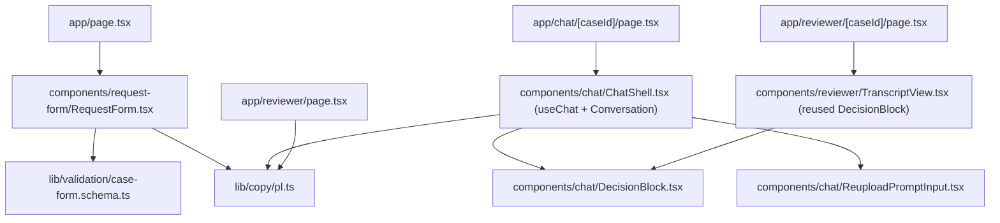
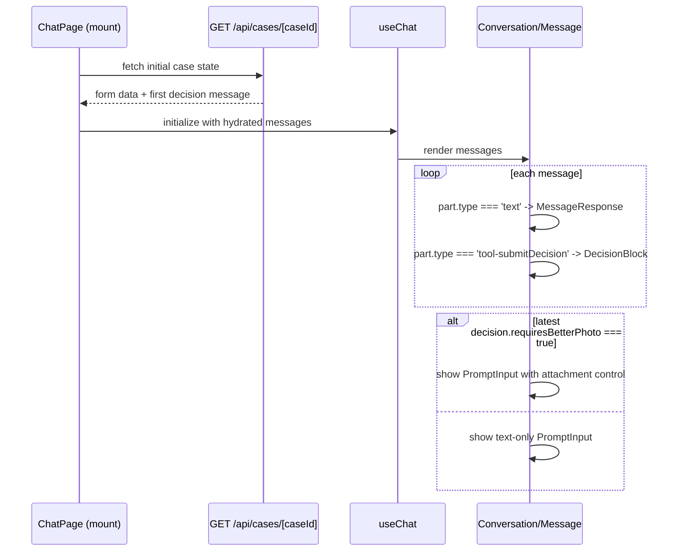

# ADR-004: Frontend (Form, Chat UI, Reviewer View)

**Date:** 2026-07-14
**Status:** Accepted
**Relates to:** `docs/ADR/000-main-architecture.md`

---

## 1. Scope

Page/route structure, the request form and its validation, the chat UI built on AI Elements + `useChat`, how the `submitDecision` tool call is rendered, the image re-upload control, and the reviewer list/detail pages. Does **not** cover API route internals (ADR-000/002) or the database (ADR-003).

---

## 2. Context7 References

| Library | Context7 Handle | Used for |
|---|---|---|
| AI Elements | `/vercel/ai-elements` | `Conversation`, `ConversationContent`, `ConversationScrollButton`, `Message`, `MessageContent`, `MessageResponse`, `PromptInput` (+ `PromptInputBody`, `PromptInputTextarea`, `PromptInputFooter`, attachment components), `usePromptInputAttachments` |
| Vercel AI SDK (`ai` / `@ai-sdk/react`) | `/vercel/ai` | `useChat`, `sendMessage`, `UIMessage` part types |
| Next.js | `/vercel/next.js` | App Router pages, layouts, Route Handlers for image serving |

---

## 3. Component Design

### Request form — `app/page.tsx` + `components/request-form/*`
A single client component form matching PRD §9.1 field order exactly (request type, category, product name/model, purchase date, description, image upload). Uses the same Zod schema as the server (`lib/validation/case-form.schema.ts`, imported directly since both run in the same Next.js project) for inline client-side validation before submit, so error messages match the server exactly and no double-validation logic drifts apart.

- Description field's required/optional state and helper text change reactively based on the selected request type (AC-03).
- Image upload: drag-and-drop + file picker, client-side pre-check of MIME type and size (AC-05) before ever hitting the network, thumbnail preview with remove.
- On submit: `fetch('/api/cases', { method: 'POST', body: formData })`; while awaiting, render the full-screen "Analizujemy Twoje zgłoszenie…" state (PRD §9.1) with all interaction disabled.
- On success: `router.push('/chat/' + caseId)`.
- On `502 { retryable: true }`: show the error panel with "Spróbuj ponownie", re-submitting the same already-built `FormData` object (kept in component state) without asking the user to refill anything.

### Chat page — `app/chat/[caseId]/page.tsx` + `components/chat/*`
Built on AI Elements' `Conversation`/`Message`/`PromptInput` primitives wired to `@ai-sdk/react`'s `useChat`, transport pointed at `POST /api/cases/[caseId]/chat`. On mount, hydrates initial messages from `GET /api/cases/[caseId]` (so a case created via `POST /api/cases` already has its first decision message present before `useChat` takes over for further turns).

- **Decision block rendering:** each `UIMessage` is rendered part-by-part (per the AI Elements pattern confirmed via Context7: `message.parts.map(...)` with a `switch` on `part.type`). A `text` part renders as normal prose via `MessageResponse`. A `submitDecision` tool-call/result part renders as a distinct, visually separated status block (per PRD §9.2): status label (`Zaakceptowane`/`Odrzucone`/`Do weryfikacji przez pracownika`), justification, numbered next steps, and the mandatory disclaimer in smaller text. If `isRevision` is true on that part, the block additionally shows a "Zaktualizowana decyzja" label above the status.
- **Case summary bar:** a small fixed header showing case number, request type, product name/model — fetched once from the hydration call, not re-fetched per message.
- **Re-upload control:** the `PromptInput` attachment affordance (AI Elements' `usePromptInputAttachments` + attachment components, confirmed via Context7 to support drag/drop and a `multiple`/`globalDrop` config) is conditionally shown only when the latest assistant message's decision block indicates `requiresBetterPhoto: true`; otherwise the input is text-only, matching AC-22 exactly (the constraint is "available only when the agent has requested a better photo").
- **Loading state:** `useChat`'s in-flight status disables the input and shows a typing indicator (AI Elements ships this pattern natively).
- **Error state:** a failed stream surfaces via `useChat`'s error state; render an inline error bubble with a "Spróbuj ponownie" action that re-sends the last user message.
- **"Nowe zgłoszenie":** header button that confirms ("current conversation will be lost" per PRD §9.2), then navigates to `/` (a fresh mount of the form page; no client-side session state is retained by design — AC-31).

### Reviewer pages — `app/reviewer/page.tsx`, `app/reviewer/[caseId]/page.tsx`
Server components that fetch directly from `lib/db` (no client-side fetch round-trip needed since these are simple, non-interactive read views) — the list page calls `listEscalatedCases()`, the detail page calls `getCaseWithHistory(caseId)`. Detail view renders: form data, all images (via the image-serving Route Handler from ADR-003), the full decision history (not just the latest), and the full chat transcript reusing the same message-part rendering component as the chat page (so tool-call decision blocks render identically for the reviewer). Entirely read-only: no buttons besides "back to list". Empty state: "Brak zgłoszeń do weryfikacji" (PRD §9.3).

### Shared Polish copy
All user-facing strings (labels, validation messages, decision labels, disclaimer, off-topic redirect, empty states) live in one `lib/copy/pl.ts` constants module, imported by both client and server components, so there is exactly one place to review/update Polish text (AC-50) and no risk of an English string slipping into a new component.

---

## 4. Data Structures

Frontend-only shapes (server shapes are in ADR-000/002/003):

- `CaseFormValues` — mirrors `lib/validation/case-form.schema.ts` exactly (shared, not duplicated).
- `CaseHydrationResponse` — the `GET /api/cases/[caseId]` response shape, used to seed `useChat`'s initial messages and the case summary bar.
- `ReviewerListRow` — `{ caseId, caseNumber, createdAt, requestType, category, productName }`, matching AC-41's minimum columns.

---

## 5. Interface Contracts

- Request form → `POST /api/cases` (ADR-000 §6).
- Chat page → `useChat` transport → `POST /api/cases/[caseId]/chat` (ADR-000 §6); hydration → `GET /api/cases/[caseId]`.
- Reviewer list page → `lib/db.listEscalatedCases()` directly (server component, no HTTP hop).
- Reviewer detail page → `lib/db.getCaseWithHistory(caseId)` directly.
- Image `` tags (form preview: local `URL.createObjectURL`; reviewer view: the image-serving Route Handler path from ADR-003).

---

## 6. Technical Decisions

### AI Elements over assistant-ui or a hand-built chat UI
**Status:** Accepted
**Context:** The chat screen needs streaming message rendering, a distinguishable decision-block message type, and a conditional file-attachment input (re-upload) — building all three by hand is significant, easy-to-get-subtly-wrong UI work.
**Decision:** Use AI Elements (`/vercel/ai-elements`), installed via its CLI on top of shadcn/ui + Tailwind (ADR-001). Confirmed via Context7 that its `PromptInput` already supports file attachments with drag-and-drop (`globalDrop`, `multiple`) and that `Conversation`/`Message` components are designed to consume `useChat`'s `messages`/`parts` directly.
**Rejected alternatives:**
- assistant-ui: introduces its own runtime/thread abstraction on top of the AI SDK, an extra layer to learn and integrate for no capability this project needs beyond what AI Elements already provides directly against `useChat`.
- Hand-built chat UI: full control, but reimplements streaming message rendering, typing indicators, and attachment handling that AI Elements already ships and that Context7's docs show working directly against our exact stack (`useChat` + Next.js App Router).
**Consequences:**
- (+) Much less custom UI code to write and test; components are shadcn/ui-based so they are copied into the repo (not an opaque npm dependency) and can be customized directly if the design system needs it.
- (-) Tied to shadcn/ui conventions and CSS-variables-mode Tailwind (already the create-next-app default, so no real friction).
**Review trigger:** If a future design-system requirement conflicts with shadcn/ui's component structure.

### Shared Zod schema between client and server form validation
**Status:** Accepted
**Context:** AC-06 requires inline field errors before any backend call; the backend must also validate independently (never trust the client).
**Decision:** One `case-form.schema.ts` module, imported by both the client form component and the `POST /api/cases` handler, since both run in the same Next.js project and can share TypeScript/Zod modules directly.
**Rejected alternatives:**
- Separate client/server validation logic: guarantees drift (e.g., a future field-length change updated on only one side).
**Consequences:**
- (+) One source of truth for validation rules and error messages.
- (-) None meaningful — this is the natural benefit of a single full-stack TypeScript project (ADR-000's monolith decision).
**Review trigger:** None expected.

### Reviewer pages as server components with direct DB access
**Status:** Accepted
**Context:** The reviewer view is read-only and has no interactivity beyond navigation (PRD §9.3).
**Decision:** `app/reviewer/**` pages call `lib/db` functions directly as React Server Components, skipping a client-fetch round trip through `GET /api/reviewer/cases`/`GET /api/cases/[caseId]` (those HTTP endpoints still exist for the chat page's client-side needs and for potential future consumers, e.g. a script or a different client).
**Rejected alternatives:**
- Client components fetching the same HTTP endpoints: adds a network hop and client-side loading/error state handling for a page with no interactivity to justify it.
**Consequences:**
- (+) Simpler, faster reviewer pages; less client-side JS shipped.
- (-) Two ways to reach the same data (server components direct, HTTP endpoints for the chat page) — acceptable since they serve genuinely different consumers.
**Review trigger:** If the reviewer view gains interactive features (e.g., a future non-MVP status-change action) that need client-side state.

---

## 7. Diagrams

### Component / Class Diagram

### Sequence: Chat page render with decision block + conditional re-upload

---

## 8. Testing Strategy

### Test scenarios for this area

| Scenario | Type | Input | Expected output | Edge cases |
|---|---|---|---|---|
| Form field validation (client) | Unit | Empty required field, future purchase date, oversized image | Inline error shown, submit blocked, no network call made | Description required/optional toggling when switching request type after typing |
| Decision block rendering | Unit | A `UIMessage` with a `submitDecision` tool part, `isRevision=true` | Renders "Zaktualizowana decyzja" label + status + justification + next steps + disclaimer | Tool part missing an optional field (should render gracefully, not crash) |
| Conditional re-upload input | Unit | Latest message has `requiresBetterPhoto: true` vs `false` | Attachment control shown vs. hidden | Toggles correctly across multiple turns (shown, then hidden after a conclusive re-analysis) |
| Reviewer list empty state | Unit | Zero escalated cases | Shows "Brak zgłoszeń do weryfikacji" | — |
| Full customer flow (E2E) | Playwright | Fill form, submit, view first decision, ask a follow-up, get a streamed reply | All PRD §9.1/§9.2 elements visible at each step | Mobile viewport layout (AC-51) |
| Re-upload flow (E2E) | Playwright | Submit an intentionally ambiguous image, then upload a clearer one in chat | Attachment control appears after first response, disappears after resolution | Second re-upload attempt also inconclusive → escalation message, no third attempt offered |
| Reviewer view (E2E) | Playwright | An existing escalated case | List shows it; detail view renders full transcript and images read-only | Navigating back to the list from detail |

### Technical acceptance criteria

- **TAC-004-01:** Every user-facing string rendered by any component under `app/` or `components/` originates from `lib/copy/pl.ts` (verified by a lint rule or a test scanning for hardcoded literal strings in JSX outside that module).
- **TAC-004-02:** The re-upload attachment control's visibility is derived solely from the latest message's decision data (`requiresBetterPhoto`), never from local component state that could desync from the actual conversation.
- **TAC-004-03:** The E2E suite covers, at minimum, one full run of each PRD §4 flow (4.1–4.6) end to end against a running dev server.
- **TAC-004-04:** The reviewer detail page renders with zero client-side JavaScript errors and zero interactive elements beyond back-navigation (verified via Playwright console-error assertions).
