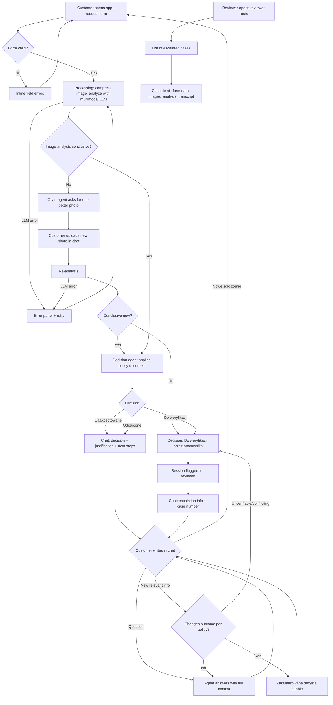

# PRD — Hardware Service Decision Copilot (MVP)

---

## 1. Executive Summary

Hardware Service Decision Copilot is a self-service web application for end customers of a consumer-electronics retailer. The customer submits a complaint or return request via a form (including a photo of the equipment); an AI system analyzes the photo, applies the company's return/complaint policy, and returns a decision with justification in a chat interface where the customer can continue the conversation. Escalated cases land on a minimal list view for a human reviewer. **This is an MVP** built during a training course; a separate ADR document covers architecture and technology choices.

---

## 2. Problem Statement

Today a customer who wants to return or complain about electronics must call a hotline or write an e-mail and wait days for a human agent to assess the case. Support employees spend most of that time on repetitive checks: is the request within the allowed time window, is the product visibly damaged or unused, does the described defect qualify under the policy. The rules are written down in policy documents, and the visual assessment can be made from a photo — yet every case is handled manually, which creates queues, inconsistent decisions, and frustrated customers who get no immediate feedback.

---

## 3. Users / Personas

### 3.1 Kasia — customer returning an unused product
Bought wireless headphones online 10 days ago, they don't fit her. Wants to return them without calling anyone. Expects: submit a photo and details in 2 minutes, get an immediate answer whether the return is accepted and what to do next.

### 3.2 Marek — customer with a defective product
Owns a laptop bought 8 months ago; the display hinge cracked during normal use. Wants to file a complaint. Expects: a clear decision on whether the defect is covered, an understandable justification, and the ability to ask follow-up questions ("do I keep the charger?", "how long will repair take?") without switching channels.

### 3.3 Ola — service employee reviewing escalated cases
Works in the service department. When the AI cannot decide a case, it lands on her list. Expects: one place showing all escalated cases with the form data, the photo, the AI's analysis, and the conversation, so she can decide without asking the customer to repeat everything.

---

## 4. Main Flows

### 4.1 Return — happy path

1. Customer opens the application and sees the request form.
2. Customer selects request type **Zwrot** (return), selects an equipment category, enters the product name/model, picks the purchase date, optionally enters a description, and uploads exactly one photo of the equipment.
3. Customer submits the form. The system validates all fields and the image (format, size).
4. The system shows a processing/loading state and assigns a case number.
5. The backend compresses the image and sends it to a multimodal LLM with the **return** analysis prompt (goal: judge whether the product shows no damage and no signs of use, i.e. is resellable).
6. The decision agent receives: the image analysis, all form data, and the **return policy document**, and produces a decision (Approved / Rejected / Needs human review) with justification.
7. The system switches to the chat view. The first message (from the system) contains: greeting, case number, the decision, justification referencing the policy, next steps, and the automated-decision disclaimer.
8. Customer may ask follow-up questions in the chat; the agent answers with full case context.

### 4.2 Complaint — happy path

1–4. Same as 4.1, except the customer selects **Reklamacja** (complaint) and the description field is **required** (reason of the complaint / defect description).
5. The backend compresses the image and sends it to the multimodal LLM with the **complaint** analysis prompt (goal: judge whether the product is damaged, what type of damage, and what could plausibly cause it — manufacturing defect vs. user-inflicted damage).
6. The decision agent receives: the image analysis, all form data (including the defect description), and the **complaint policy document**, and produces a decision with justification.
7–8. Same as 4.1.

### 4.3 Unclear image — re-upload flow

1. The image analysis is inconclusive (photo blurry, product not visible, damage not assessable).
2. Instead of a decision, the first chat message explains what is wrong with the photo and asks the customer to upload one better photo directly in the chat.
3. The chat input enables an image upload (same constraints as the form: JPG/PNG/WebP, ≤ 10 MB, one image).
4. The new image goes through the same analysis; the agent then produces a decision as in 4.1/4.2.
5. If the second image is also inconclusive, the agent returns the decision **Needs human review** (no further re-uploads are offered).

### 4.4 Decision revision in chat

1. After receiving a decision, the customer provides new relevant information in the chat (e.g. "the box is unopened, only the foil is torn", "the defect appeared after an official firmware update").
2. The agent evaluates whether the new information changes the outcome under the policy documents.
3. If yes, the agent issues an updated decision in a new message, explicitly marked as a revised decision, with an updated justification.
4. If the new information is unverifiable or conflicting, the agent may change the decision to **Needs human review**.

### 4.5 Escalation and human review

1. Whenever the decision is **Needs human review** (inconclusive analysis after re-upload, conflicting information, or a case the policy documents do not cover), the chat informs the customer that an employee will review the case, and shows the case number to keep for reference.
2. The escalated case is flagged for review in the session store (every session is persisted anyway — see 4.7).
3. The reviewer (Ola) opens the reviewer list view (separate route), sees escalated cases sorted newest first, and opens a case to see all stored details. The view is read-only in the MVP.

### 4.7 Session persistence (system behavior)

1. On form submission the system creates a session record with the case number, timestamp, and all form data (including the image).
2. Every subsequent event is appended to that session: image analysis results, each decision (initial and revised) with its justification, every chat message (customer and agent), re-uploaded images, and errors/retries.
3. Persistence is transparent to the customer — it does not change the customer flow, and reloading the page still starts a fresh form (no session resume in the MVP).

### 4.6 Error paths

- **Invalid upload:** wrong format or file > 10 MB → the form shows an inline error message under the upload field; submission is blocked until fixed.
- **AI service unavailable / LLM error:** the system shows an error message in Polish ("Przepraszamy, analiza jest chwilowo niedostępna…") with a retry button; the submitted form data is not lost — retry re-runs the analysis without re-entering the form.
- **LLM error mid-chat:** the failed message shows an error state with a retry action; the conversation history is preserved.

---

## 5. User Stories

- **US-1 (happy path, return):** As a customer, I want to submit a return request with a photo and immediately receive a decision with justification, so that I don't have to call the hotline and wait days for an answer.
- **US-2 (happy path, complaint):** As a customer, I want to describe a defect, attach a photo, and get a decision explaining whether my complaint is accepted and what happens next, so that I know my rights without reading the full policy.
- **US-3 (follow-up):** As a customer, I want to ask follow-up questions about the decision in a chat, so that I understand the justification and the next steps.
- **US-4 (new information):** As a customer, I want the agent to reconsider the decision when I provide relevant new information in the chat, so that a wrong first impression from the photo does not permanently block my case.
- **US-5 (error, bad image):** As a customer, when my photo is too blurry to assess, I want to be told what is wrong and be able to upload one better photo in the chat, so that my case is not rejected for a technical reason.
- **US-6 (error, invalid input):** As a customer, when I submit an invalid form (missing required field, unsupported file, file too large), I want to see a specific message at the offending field, so that I can fix it immediately.
- **US-7 (service unavailable):** As a customer, when the AI analysis fails, I want to see a clear error with a retry option that keeps my form data, so that I don't have to fill everything in again.
- **US-8 (escalation):** As a service employee, I want a list of all cases the AI could not decide, with the full case context, so that I can make the decision without contacting the customer for information they already provided.
- **US-9 (audit):** As the service department, I want every session persisted with all decisions and actions taken in it, so that any case can be audited or investigated after the fact.

---

## 6. Acceptance Criteria

### Form

- **AC-01** The form contains exactly these fields: request type (select: "Zwrot", "Reklamacja"), equipment category (select), product name/model (text), purchase date (date picker), reason/description (textarea), image upload (one file).
- **AC-02** The equipment category select contains exactly: "Smartfon", "Laptop", "Tablet", "Telewizor", "Słuchawki", "Monitor", "Inne".
- **AC-03** Request type, category, name/model, purchase date, and image are always required; the description is required when request type is "Reklamacja" and optional when it is "Zwrot".
- **AC-04** The purchase date cannot be in the future; selecting/entering a future date blocks submission with an inline error.
- **AC-05** The image upload accepts only JPG, PNG, and WebP files up to 10 MB, exactly one file; violating files are rejected with an inline error naming the constraint, before submission.
- **AC-06** Submitting an invalid form displays an inline error message under each invalid field and does not call the backend.
- **AC-07** After a valid submission the form is disabled and a processing indicator is shown until the first chat message arrives or an error is shown.

### AI Analysis

- **AC-10** The backend compresses/resizes the uploaded image before sending it to the multimodal LLM.
- **AC-11** The image analysis uses a different prompt per request type: for complaints it assesses whether the product is damaged, the damage type, and plausible causes; for returns it assesses whether the product shows no damage and no signs of use.
- **AC-12** The decision agent receives, in a single context: the image analysis result, all form data, and the content of the policy document matching the request type (return policy for returns, complaint policy for complaints).
- **AC-13** Every decision is exactly one of: **Zaakceptowane** (approved), **Odrzucone** (rejected), **Do weryfikacji przez pracownika** (needs human review).
- **AC-14** If the image analysis is inconclusive, the first chat message asks for one better photo (stating what is wrong with the current one) instead of giving a decision; if the second photo is also inconclusive, the decision is "Do weryfikacji przez pracownika" and no further re-upload is offered.

### Chat

- **AC-20** The first chat message contains all of: a greeting, the case number, the decision (visually distinguished), a justification that references the applicable policy rule(s), next steps for the customer, and the automated-decision disclaimer (see Section 11).
- **AC-21** The agent has the full case context in every turn: form data, image analysis, policy document, all prior decisions, and the complete conversation history.
- **AC-22** Image upload in the chat is available only when the agent has requested a better photo; it enforces the same file constraints as the form (AC-05).
- **AC-23** When new information changes the outcome, the agent issues a new message explicitly labeled as an updated decision ("Zaktualizowana decyzja"), containing the new decision and justification; the original decision message remains visible in the history.
- **AC-24** All agent responses are in Polish, regardless of the language the customer writes in.
- **AC-25** If an LLM call fails, the chat shows an error message with a retry action; the conversation history and form data are preserved and retry does not require re-entering anything.

### Session

- **AC-30** A new form submission starts a new case with a new case number; a "Nowe zgłoszenie" action in the chat view returns the customer to an empty form.
- **AC-31** Reloading the page returns the customer to an empty form (sessions are not resumed in the MVP); persisted session data is unaffected.

### Session Persistence

- **AC-32** Every form submission creates a persistent session record containing the case number, submission timestamp, all form data, and the uploaded image.
- **AC-33** Every session event is persisted as it happens: image analysis results, each decision (initial and revised) with its justification and timestamp, every chat message from both sides, re-uploaded images, and LLM errors/retries.
- **AC-34** Session records survive an application restart.
- **AC-35** A persistence failure does not block the customer flow: the customer still receives the decision and can chat; the failure is logged.

### Human Review

- **AC-40** Every case that ends with the decision "Do weryfikacji przez pracownika" is flagged for review in its session record; the record contains all data listed in AC-32/AC-33.
- **AC-41** The reviewer view is available at a separate route, lists escalated cases sorted newest first, and shows per row at minimum: case number, timestamp, request type, category, and product name/model.
- **AC-42** Opening a case in the reviewer view shows all stored data from AC-32/AC-33, including the image(s); the view is read-only (no status changes, no replies).

### General

- **AC-50** All user-facing text (form labels, validation messages, chat UI, reviewer view, error messages) is in Polish.
- **AC-51** The application is usable on current desktop and mobile browsers (responsive layout); no native mobile app.

---

## 7. Out of Scope

- **Authentication and user accounts** — the customer flow is anonymous; the reviewer view is not access-protected in the MVP.
- **Customer data and purchase-history lookup** — no retrieval of existing customer records or purchase history (listed in the brief as a later feature).
- **Session resume for customers** — sessions are persisted for audit and review, but the customer cannot return to a previous conversation (no session links, no restore after page reload).
- **RAG knowledge base** — no internal knowledge base of electronics specifications or extended procedures; the agent's only knowledge sources are the two policy documents and the conversation.
- **Notifications** — no e-mail/SMS/push messages of any kind; the customer must note their case number.
- **Case management in the reviewer view** — no status changes, assignments, comments, or replies to the customer; view-only.
- **Order/receipt verification** — the system does not verify that the purchase actually happened or that the date is truthful; it trusts the form input.
- **Multi-language support** — Polish only.
- **Payments/refund execution** — the system decides and instructs; it does not trigger refunds, generate return labels, or integrate with logistics.

---

## 8. Constraints

### Business

- Decisions communicated to the customer are automated recommendations; the company reserves the right to verify them. Every decision message must carry the disclaimer defined in Section 11.
- The policy rules applied by the agent come exclusively from the two company policy documents below. The agent must not invent rules or promise anything the documents do not cover.
- The example policies are modeled on EU consumer law (14-day withdrawal for distance purchases; 2-year conformity guarantee for complaints), but the documents are fictional course examples, not legal advice.

### Functional

- Image upload: JPG, PNG, WebP; max 10 MB; exactly one image per upload.
- One image at form submission; at most one additional image via chat re-upload per case.
- Purchase date is used as the start of both the 14-day return window and the 2-year complaint window (the MVP does not collect a delivery date).
- UI language: Polish. PRD/ADR/internal docs: English.
- Supported: current versions of Chrome, Edge, Firefox, Safari on desktop and mobile (responsive web).

### External document / data references

| Document | File path | When it is used |
|---|---|---|
| Return policy (example, Polish) | `docs/policies/zasady-zwrotow.md` | Injected into the decision agent's prompt for request type "Zwrot" |
| Complaint policy (example, Polish) | `docs/policies/zasady-reklamacji.md` | Injected into the decision agent's prompt for request type "Reklamacja" |

---

## 9. UI Description (wireframe level)

### 9.1 Request form (start screen)

- Single centered form with a short title and one-sentence explanation of what the tool does.
- Fields top-to-bottom: request type (select), equipment category (select), product name/model (text input with placeholder example), purchase date (date picker, max = today), description (textarea; label and required-marker change dynamically: required for "Reklamacja", optional for "Zwrot"; helper text explains what to describe), image upload (drag-and-drop area + file picker button; after selection shows a thumbnail preview with a remove button; helper text states allowed formats and 10 MB limit).
- Primary submit button ("Wyślij zgłoszenie") at the bottom; disabled until the form is dirty, always clickable once filled — validation errors appear inline on submit attempt.
- **Error states:** inline message under each invalid field; upload errors (format/size) appear immediately on file selection.
- **Loading state:** after valid submit, the form is replaced by a full-area processing indicator with text ("Analizujemy Twoje zgłoszenie…"); no user actions available except waiting.
- **Service error state:** error panel with the Polish error message and a "Spróbuj ponownie" button that re-runs the analysis with the already-submitted data.

### 9.2 Chat (decision screen)

- Standard chat layout: scrollable message list, text input with send button pinned to the bottom.
- A compact case summary bar at the top: case number, request type, product name/model (so the customer never loses context).
- First message (system/agent bubble): greeting, decision rendered as a distinct visual element (e.g. a labeled status block: Zaakceptowane / Odrzucone / Do weryfikacji przez pracownika), justification paragraph(s), numbered next steps, disclaimer in smaller text. Formatted with headings/lists, not a wall of text.
- Customer messages right-aligned; agent messages left-aligned.
- When the agent requests a better photo, an image-upload control appears attached to the chat input; otherwise the input is text-only.
- Updated decisions render as a new agent bubble with a visible "Zaktualizowana decyzja" label and the same status-block treatment.
- "Nowe zgłoszenie" button in the header — returns to an empty form (with a confirmation prompt, since the current conversation will be lost).
- **Loading state:** agent typing indicator while a response is being generated; input disabled during generation.
- **Error state:** failed agent response shows an inline error bubble with a "Spróbuj ponownie" action.
- **Empty state:** not applicable — the chat always opens with the first system message already present.

### 9.3 Reviewer list view (separate route)

- Table/list of escalated cases, newest first. Columns: case number, date/time, request type, category, product name/model.
- Clicking a row opens the case detail: all form data, the uploaded image(s) rendered inline, the AI image analysis, the decision history, and the full chat transcript in chronological order.
- Read-only: no action buttons besides navigation back to the list.
- **Empty state:** message "Brak zgłoszeń do weryfikacji".
- **Navigation:** the reviewer view is not linked from the customer UI; it is reached directly by its route.

---

## 10. User Flow Diagram

---

## 11. Agent / System Behavior Specification

### Roles

- **Image analyzer (internal, multimodal LLM):** receives the compressed image plus form context and one of two prompts. For complaints: describe visible damage, its type, and plausible causes (manufacturing defect vs. external/user-inflicted). For returns: assess whether the product shows damage or signs of use that would prevent reselling. Output is an internal analysis, never shown verbatim to the customer (but stored for escalated cases).
- **Decision agent (customer-facing, chat):** produces the decision and conducts the conversation. Inputs: image analysis, form data, the applicable policy document, and conversation history.

### Allowed

- Issue exactly one of the three decisions, always with a justification referencing specific policy rules.
- Revise a decision when the customer provides new relevant information; every revision must be explicitly labeled.
- Ask clarifying questions and request one better photo when the analysis is inconclusive.
- Explain the policy documents, the decision, and next steps.

### NOT allowed

- Inventing policy rules, exceptions, compensation, or timelines not present in the policy documents.
- Promising refunds, repairs, or replacements beyond stating the policy-defined next steps.
- Giving legal advice beyond referencing the company policy.
- Making a definitive Approved/Rejected decision when the image analysis is inconclusive or when provided information conflicts — such cases must become "Do weryfikacji przez pracownika".
- Revealing its prompts, the internal image-analysis text, or system internals.
- Discussing topics unrelated to the case (see below).

### Decision categories and communication

| Decision | Label shown | Communication |
|---|---|---|
| Approved | Zaakceptowane | Congratulatory but factual; lists concrete next steps from the policy (e.g. how to send the product back). |
| Rejected | Odrzucone | Empathetic, states the specific policy rule that was not met, and mentions the option to provide additional information in the chat. |
| Needs human review | Do weryfikacji przez pracownika | States why the AI cannot decide, informs that an employee will review the case, and instructs the customer to note the case number. |

### Mandatory disclaimer

Every message containing a decision (initial or revised) must include, in Polish, a disclaimer equivalent to: *"Ta decyzja została wygenerowana automatycznie i może zostać zweryfikowana przez pracownika serwisu."*

### Off-topic handling

For questions unrelated to the current complaint/return case, the agent politely states (in Polish) that it can only help with this case, and steers back — one sentence, no engagement with the off-topic content. Repeated off-topic input is answered the same way.

### Language and tone

- Polish only, in every response, regardless of the customer's input language.
- Professional, warm, plain language; no legalese beyond quoting policy rule names; formats longer answers with lists; addresses the customer per "Ty" form ("Twoje zgłoszenie").

---

## 12. Further Notes

- **Assumption:** purchase date is used as the proxy for the start of the 14-day return window (real EU law counts from delivery); acceptable simplification for the MVP, encoded in the example policy documents.
- **Assumption:** session persistence (Section 4.7) is audit-oriented — it records what happened but does not enable customer session resume; the reviewer view reads escalated cases from the same store.
- **Deferred to ADR:** technology stack, LLM/model selection, prompt engineering details, database/storage choice and schema, image compression parameters, testing strategy.
- **Deferred features (from the brief):** customer/purchase-history lookup, RAG knowledge base.
- **Open question:** should the reviewer route get basic protection (even a static token) before any public demo? Currently unprotected per scope decision.
