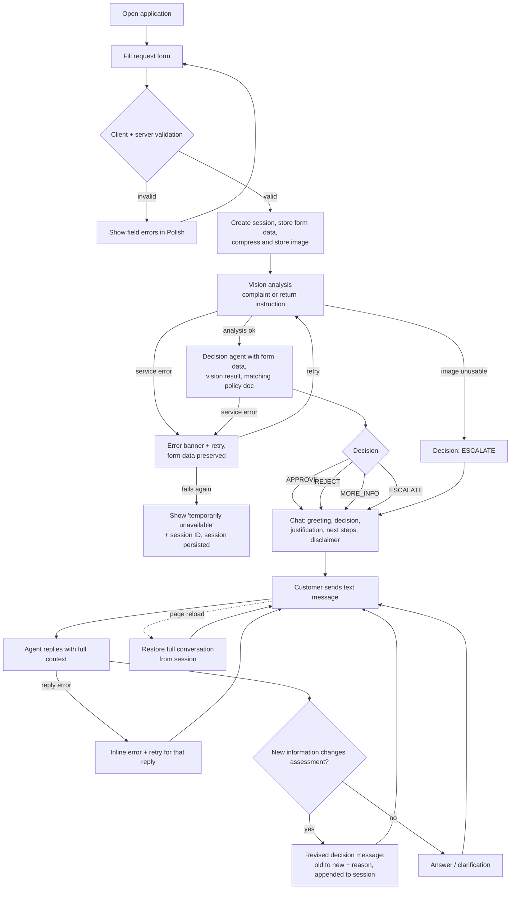

# PRD — Hardware Service Decision Copilot (MVP)

---

## 1. Executive Summary

Hardware Service Decision Copilot is a self-service web application for end customers of an electronics retailer. The customer submits a return or complaint request through a form (including a photo of the equipment), an AI system analyzes the photo and the request against company policy documents, and returns a preliminary decision with justification in a chat interface where the customer can continue the conversation. This is an MVP; the AI decision is a recommendation — the final decision is always confirmed by a human employee.

---

## 2. Problem Statement

Today, return and complaint requests for electronics are handled manually: a customer emails or calls support, an employee asks for photos and purchase details over several exchanges, checks the case against return/complaint policies, and only then gives an answer. This takes days per case, produces inconsistent decisions between employees, and generates repetitive workload for support staff. Customers have no immediate feedback on whether their request is likely to be accepted, so they submit incomplete or ineligible requests, which increases the back-and-forth further.

---

## 3. Users / Personas

### P1 — Retail customer with a defective product (complaint)
Bought a laptop 8 months ago; the hinge cracked. Wants to know quickly whether the damage is covered, what to do next, and not to retype their story to three different people. Expects a clear decision with a reason, in Polish, on their phone or desktop.

### P2 — Retail customer returning an unwanted product (return)
Bought headphones 5 days ago, unopened box no longer available but the product is unused. Wants to confirm the product qualifies for return before shipping it back. Expects a fast yes/no with instructions.

### P3 — Customer support employee (indirect user)
Does not use the application UI in the MVP. Receives the persisted sessions (form data, photo, AI analysis, decision, chat transcript) as case material and confirms or overrides the AI recommendation through existing internal channels. Expects each session to contain everything needed to review the case without contacting the customer again.

---

## 4. Main Flows

### 4.1 Happy path — return request approved

1. Customer opens the application and sees the request form.
2. Customer selects request type "Return" (Zwrot), selects an equipment category, enters the product name/model, picks the purchase date, optionally enters a reason, and uploads one photo of the equipment.
3. Customer submits the form. The system validates all fields client-side and server-side.
4. The system creates a session, stores the form data, compresses the uploaded image, and stores the compressed image with the session.
5. The system sends the compressed image to the multimodal vision analysis with the **return** analysis instruction: judge whether the equipment shows any damage or signs of usage and whether it appears resellable.
6. The system passes the vision analysis result, the form data, and the return policy document to the decision agent with the **return** decision instruction.
7. The agent returns decision `APPROVE` with justification (e.g. purchase within the return window, no visible signs of usage).
8. The system displays the chat screen. The first message from the agent contains: greeting, the decision, the justification, next steps, and the disclaimer that the decision is preliminary and will be confirmed by an employee.
9. The customer may ask follow-up questions in the chat; the agent answers with full context (form data, vision analysis, decision, chat history).
10. Every decision, revision, and chat message is appended to the persisted session.

### 4.2 Happy path — complaint request

1. Customer selects request type "Complaint" (Reklamacja). The reason field becomes required.
2. Customer fills in all fields, uploads a photo showing the damage, and submits.
3. Steps 3–4 as in 4.1.
4. The system sends the compressed image to vision analysis with the **complaint** analysis instruction: judge whether the equipment is damaged, describe the damage type, and assess plausible causes (manufacturing defect vs. mechanical damage caused by the user).
5. The decision agent receives the vision analysis, form data, and the complaint policy document with the **complaint** decision instruction, and returns one of: `APPROVE`, `REJECT`, `MORE_INFO`, `ESCALATE`, with justification.
6. Chat screen opens with the first agent message as in 4.1 step 8.

### 4.3 Decision revised during chat

1. The agent's first decision is `MORE_INFO` (e.g. the reason description does not explain when the damage appeared).
2. The first chat message states what information is missing and asks the customer to provide it as text.
3. The customer answers in the chat.
4. The agent re-evaluates using the new information and the same policy document, and posts a new message that explicitly states the decision changed (e.g. `MORE_INFO` → `APPROVE`), why, and the next steps.
5. The revised decision is appended to the session (previous decisions are kept, not overwritten).

### 4.4 Unusable image

1. Vision analysis reports the image is unusable (blurry, wrong object, equipment not visible, or does not match the declared category/model).
2. The decision agent returns `ESCALATE`.
3. The first chat message explains that the photo could not be assessed, states that the case has been saved for review by an employee, and gives the session/case ID.
4. The customer can still ask questions in the chat; the agent must not produce an `APPROVE` or `REJECT` decision for this case without a usable image analysis.

### 4.5 AI service unavailable

1. Form submission succeeds, but the vision analysis or decision agent call fails (timeout or service error).
2. The system shows an error state in Polish with a "Try again" (Spróbuj ponownie) action.
3. The submitted form data and image are preserved; retry re-runs the analysis without the customer re-entering anything.
4. If retry fails again, the system displays a message that the service is temporarily unavailable and that the case has been saved under its session ID.

### 4.6 Ineligible request rejected

1. Customer submits a return for a product purchased 40 days ago (return window per policy: 14 days).
2. The agent returns `REJECT`, citing the specific policy rule (return window exceeded) in the justification.
3. The first chat message states the rejection, the exact policy reason, the disclaimer, and the available options: provide additional context in chat or request escalation to a human employee.
4. If the customer disputes the decision in chat, the agent may revise to `ESCALATE` but must not revise to `APPROVE` in direct contradiction of a policy rule (e.g. a hard date limit).

---

## 5. User Stories

- **US-1 (happy path, return):** As a customer returning an unused product, I want to submit the product details and a photo and immediately get a preliminary decision with a clear reason, so that I know whether to ship the product back.
- **US-2 (happy path, complaint):** As a customer with a damaged product, I want the system to assess my photo and description against the complaint policy, so that I get an immediate preliminary answer instead of waiting days for support.
- **US-3 (validation error):** As a customer, I want clear field-level error messages in Polish when I submit an incomplete form (e.g. missing photo, missing complaint reason, future purchase date), so that I can fix exactly what is wrong.
- **US-4 (unusable image):** As a customer who uploaded a blurry photo, I want to be told the photo could not be assessed and that a human will review my case, so that my request is not silently rejected.
- **US-5 (service failure):** As a customer, when the AI analysis fails, I want to retry without re-entering my data, so that a temporary outage does not cost me the whole submission.
- **US-6 (follow-up conversation):** As a customer, I want to ask follow-up questions after receiving the decision and have the agent remember everything I already submitted, so that I never have to repeat information.
- **US-7 (decision revision):** As a customer who provided additional information in the chat, I want the agent to re-evaluate and clearly state if and why its decision changed, so that the conversation actually affects the outcome.
- **US-8 (session persistence):** As a support employee, I want every session persisted with the form data, photo, AI analysis, all decisions, and the full chat transcript, so that I can review and confirm the case without contacting the customer.

---

## 6. Acceptance Criteria

### Form

- **AC-01** The form contains exactly these fields: request type (select: Complaint / Return), equipment category (select from the predefined list in §8), product name/model (text, 2–100 characters), purchase date (date picker), reason (textarea, max 2000 characters), image upload (exactly one file).
- **AC-02** Request type, equipment category, product name/model, purchase date, and image are required for every submission; submitting without any of them shows a field-level error in Polish and does not submit.
- **AC-03** The reason field is required when request type = Complaint and optional when request type = Return; the required marker updates immediately when the request type changes.
- **AC-04** The purchase date must not be in the future; a future date shows a field-level error and blocks submission.
- **AC-05** The image upload accepts only JPG, PNG, and WebP files up to 10 MB; a file of any other type or larger size is rejected client-side with an error message stating the allowed formats and size limit, and the same validation is enforced server-side (server returns an error response with a message on violation).
- **AC-06** After selecting a valid image, the form shows a preview thumbnail and the file name, with an option to remove and re-select the file.
- **AC-07** During submission the submit button is disabled and a processing indicator with a status text in Polish is shown; duplicate submissions of the same form are prevented.

### Image Processing & AI Analysis

- **AC-08** The backend produces a compressed/resized version of the uploaded image before sending it to the vision analysis; the compressed image is stored with the session.
- **AC-09** The vision analysis uses a different instruction depending on request type: for Complaint it must describe whether the equipment is damaged, the damage type, and plausible causes (manufacturing defect vs. user-caused); for Return it must describe whether the equipment shows damage or signs of usage and whether it appears resellable.
- **AC-10** The vision analysis result includes an explicit usability verdict; when the image is unusable (blurry, wrong object, equipment not visible or inconsistent with the declared category), the decision must be `ESCALATE` and the first chat message must state that the photo could not be assessed.
- **AC-11** The decision agent receives, for every decision: the full form data, the vision analysis result, and the policy document matching the request type (return policy for returns, complaint policy for complaints).

### AI Decision

- **AC-12** Every decision is exactly one of: `APPROVE`, `REJECT`, `MORE_INFO`, `ESCALATE`.
- **AC-13** Every decision message contains a justification that references at least one concrete input (photo finding, form field value, or a specific policy rule).
- **AC-14** A `REJECT` decision cites the specific policy rule it is based on.
- **AC-15** For a Return where the purchase date is more than the policy return window before the submission date, the decision is `REJECT` or `ESCALATE`, never `APPROVE`.
- **AC-16** Every decision message includes the disclaimer that the decision is preliminary and will be confirmed by an employee.
- **AC-17** The first chat message contains, in order: greeting, decision, justification, next steps, disclaimer — formatted with visible structure (the decision visually distinguished from body text).

### Chat

- **AC-18** After submission, the customer lands on a chat screen where the first message is the agent's decision message; the customer can send text messages (max 2000 characters each) and receives agent replies in the same conversation.
- **AC-19** The agent has access to the full conversation context in every reply: form data, vision analysis, all prior decisions, and all prior messages; the customer never has to repeat information already submitted.
- **AC-20** The chat input accepts text only; there is no file/image upload in the chat.
- **AC-21** When the agent revises its decision, the message explicitly states the previous decision, the new decision, and the reason for the change.
- **AC-22** The agent never revises a decision to `APPROVE` in contradiction of a hard policy rule (e.g. an exceeded return window); such disputes result in `ESCALATE`.
- **AC-23** While the agent is generating a reply, the chat shows a typing/loading indicator and the input is disabled for new sends.
- **AC-24** If an agent reply fails (service error), the chat shows an error state with a retry action for that message; the conversation history is not lost.

### Session

- **AC-25** Every submission creates a session with a unique ID; the session ID is visible to the customer on the chat screen.
- **AC-26** The session persists: form data, the compressed image, the vision analysis result, every decision (including revisions, in order, with timestamps), and every chat message with role and timestamp.
- **AC-27** Reloading the chat page in the same browser restores the full conversation for that session, including the first decision message.
- **AC-28** If the AI analysis fails after form submission, the session with the form data and image is still persisted, and the retry action re-runs the analysis for the same session (AC-05 data is not re-entered).

### General

- **AC-29** All user-facing text (form labels, validation messages, chat messages, error states) is in Polish.
- **AC-30** The application is usable on desktop and mobile browser viewports (form and chat render and function at 375 px wide and up).

---

## 7. Out of Scope

- **Authentication and customer accounts** — no login, no registration; sessions are anonymous.
- **Customer data and purchase-history lookup** — the system does not retrieve or verify customer or order data from any internal system; all inputs are self-declared (planned as a later feature).
- **RAG knowledge base** — no internal knowledge base of electronics specifications or extended procedures (planned as a later feature).
- **Notifications and real human handoff** — no email/SMS notifications and no ticketing integration; escalation ends with an in-chat message and the persisted session. Employees access sessions through means outside this product.
- **Staff/admin UI** — no interface for employees to browse, review, or override sessions.
- **Image upload in chat** — the chat is text-only; a request for a better photo results in escalation, not re-upload.
- **Multiple images per submission** — exactly one image per request.
- **Multilingual support** — Polish only.
- **Native mobile apps** — responsive web only.
- **Refund/logistics processing** — no integration with payments, shipping labels, or warehouse systems; next steps are communicated as text only.
- **Purchase verification / fraud detection** — the system does not validate that the purchase actually happened.

---

## 8. Constraints

### Business

- The AI decision is a **recommendation only**; the final decision belongs to a human employee, and every decision message must say so (AC-16).
- All decisions must be derived from the two company policy documents listed below; the agent must not invent policy rules or promise anything the documents do not cover.
- The agent must not provide legal advice or interpret consumer-protection law beyond what the policy documents state.

### Functional

- Image upload: exactly 1 file, JPG / PNG / WebP, max 10 MB.
- Text limits: product name/model 2–100 characters; reason and chat messages max 2000 characters.
- Equipment category — predefined list (select): Smartphone / Laptop / Tablet / TV or monitor / Audio (headphones, speakers) / Small home appliance / Computer peripherals & accessories / Other.
- Request type — predefined list (select): Complaint (Reklamacja) / Return (Zwrot).
- UI language: Polish. Repository documentation and this PRD: English.
- Supported browsers: current versions of Chrome, Edge, Firefox, Safari; viewports from 375 px width.

### External document / data references

| Document | File path | When it is used |
|---|---|---|
| Return policy (example) | `docs/policies/return-policy.md` | Injected into the decision agent context for every **Return** request |
| Complaint policy (example) | `docs/policies/complaint-policy.md` | Injected into the decision agent context for every **Complaint** request |

Both documents are example company policies created for the MVP; replacing their content must change agent behavior without code changes.

---

## 9. UI Description (wireframe level)

### 9.1 Screen: Request form

**Layout:** single centered column; application title and a one-sentence explanation of what the tool does on top, form fields below, submit button at the bottom.

**Elements (top to bottom):**
- Request type — select with two options: Reklamacja / Zwrot. Changing it toggles the required state of the reason field (AC-03) and updates helper text under the image field (complaint: "photo showing the damage"; return: "photo showing the product's condition").
- Equipment category — select with the predefined category list.
- Product name/model — single-line text input with placeholder example.
- Purchase date — date picker; dates after today disabled.
- Reason — textarea with character counter (0/2000); label shows "required" for complaints.
- Image upload — drop zone / file picker accepting one file; after selection shows a preview thumbnail, file name, size, and a remove button (AC-06).
- Submit button — full-width, labeled in Polish (e.g. "Wyślij zgłoszenie").

**Error states:** field-level messages directly under the invalid field, in Polish; on submit with errors, focus moves to the first invalid field. File errors (wrong type / too large) appear under the drop zone.

**Loading state:** on submit, all inputs and the button are disabled; the button shows a spinner and status text that progresses (e.g. "Wysyłanie zdjęcia…" → "Analizuję zdjęcie…" → "Przygotowuję decyzję…"). No navigation occurs until the first decision is ready or an error occurs.

**Failure state:** if analysis fails, an error banner appears above the button with a retry action (re-runs analysis for the already-created session) and the session ID; form values remain filled.

### 9.2 Screen: Chat

**Layout:** standard chat view; header with application name and the session ID; scrollable message list; text input with send button pinned to the bottom.

**Elements:**
- First message (agent): a visually distinguished decision bubble — greeting, decision label (one of the four categories, visually prominent, e.g. as a badge), justification paragraph(s), numbered next steps, and the preliminary-decision disclaimer in smaller text.
- Subsequent messages: customer messages right-aligned, agent messages left-aligned, each with a timestamp.
- Decision-revision messages: contain a visible "decision changed" element showing old → new category.
- Input: single-line growing textarea, max 2000 characters with counter near the limit, send button; Enter sends, Shift+Enter inserts a newline.

**Loading state:** typing indicator bubble while the agent generates; input disabled for sending (text can still be typed).

**Error state:** failed agent reply renders as an inline error row with a "Spróbuj ponownie" action; retrying regenerates only that reply.

**Empty state:** none — the chat always opens with the first decision message already present.

**Navigation:** form → chat happens automatically on successful analysis. Reloading the chat URL restores the session (AC-27). A "new request" link in the header returns to a fresh form (starts a new session; the old one stays persisted).

---

## 10. User Flow Diagram

---

## 11. Agent / System Behavior Specification

### Role and purpose

Two AI roles cooperate per request:

1. **Vision analysis** — describes the uploaded photo. It does not decide anything. Separate instructions per request type:
   - *Complaint:* is the equipment damaged; what kind of damage; plausible causes (manufacturing defect vs. mechanical/user-caused); does the item match the declared category/model; is the image usable.
   - *Return:* does the equipment show damage or signs of usage; does it appear complete and resellable; does the item match the declared category/model; is the image usable.
2. **Decision agent** — a reasoning agent that takes the form data, the vision analysis, and the matching policy document, produces the decision with justification, and then handles the ongoing chat conversation. Separate decision instructions per request type (return vs. complaint), each embedding the corresponding policy document.

### Allowed

- Issue and revise decisions in the four categories, always with justification grounded in the photo analysis, form data, or a cited policy rule.
- Ask the customer clarifying questions (text only).
- Explain the applicable policy rules in plain language.
- Escalate whenever evidence is ambiguous, the image is unusable, the customer disputes a decision, or the case falls outside the policy documents.

### Not allowed

- Present its decision as final or binding — every decision message carries the preliminary-decision disclaimer.
- Approve a request in contradiction of a hard policy rule (e.g. exceeded return window) — disputes go to `ESCALATE`.
- Invent policy rules, promise refunds/repairs/compensation amounts or dates not stated in the policy documents.
- Provide legal advice or interpret law beyond the policy documents.
- Request personal data beyond what the form collects.
- Claim to be a human.
- Produce `APPROVE`/`REJECT` for a case whose image was assessed as unusable.

### Decision categories and communication

| Category | Meaning | Message must contain |
|---|---|---|
| `APPROVE` | Request appears to meet policy | Justification + next steps (what the customer does now; confirmation by employee) |
| `REJECT` | Request violates a policy rule | The specific rule violated + options: add information in chat or request escalation |
| `MORE_INFO` | Cannot decide without more information | Exactly what information is missing and that it can be provided as text in this chat |
| `ESCALATE` | Human review required | Why escalated + that the case is saved under the visible session ID for employee review |

### Mandatory disclaimer

Every decision message (first and revised) includes, in Polish, a statement equivalent to: "This is a preliminary assessment. The final decision will be confirmed by our staff." (e.g. „To jest wstępna ocena — ostateczną decyzję potwierdzi nasz pracownik.")

### Off-topic handling

Questions unrelated to this return/complaint case (other products, general tech support, small talk beyond greetings, anything else) get a brief polite refusal in Polish and a redirect to the current case. The agent never answers on topics outside the case, regardless of phrasing.

### Language and tone

Polish only, including when the customer writes in another language (the agent may acknowledge it understood, but replies in Polish). Polite, warm, and plain — no legal jargon without explanation, no marketing language. Address the customer with the polite form ("Państwo"/"Pan/Pani"). Messages are structured: short paragraphs, numbered steps for instructions.

---

## 12. Further Notes

- Session persistence (form data, image, analysis, decisions, chat) is **in scope** for the MVP, but no UI reads it besides the customer's own chat restore (AC-27). Staff access to persisted sessions is out of scope and assumed to happen through direct data access until a staff UI exists.
- The policy documents are examples authored for this MVP (14-day return window, 24-month complaint window, consistent with common EU consumer practice). They are content, not law — the product must work purely from the documents' text.
- Deferred to later phases (per the product brief): customer/purchase-history lookup, RAG knowledge base, image upload in chat, staff review UI.
- Prompt wording, model choice, compression parameters, storage technology, and testing strategy are deliberately not specified here — they belong to the ADR.
