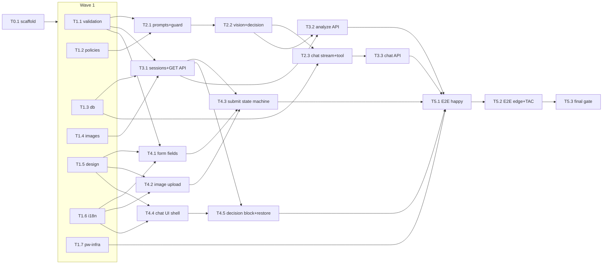

# Implementation Plan — Hardware Service Decision Copilot PoC

**Date:** 2026-07-15 · **Status:** In execution — Waves 0-5 merged (all of T0-T4 + T3.2/T3.3). Full happy path code-complete: form -> create -> analyze -> decision -> chat -> restore. Integrated green: 381/381 tests, 0 lint errors, build OK (routes: /, /api/chat, /api/sessions, /api/sessions/[id], /api/sessions/[id]/analyze, /chat/[sessionId]). Next: Wave 6 (T5.1 E2E happy/validation/mobile). Deferred fixes F-1 (validation superRefine) and F-5 (guardOverride audit) before/at T5.3.
**Sources:** [PRD](PRD.md) · [ADR-000](ADR/000-main-architecture.md) · [ADR-001](ADR/001-ai-integration.md) · [ADR-002](ADR/002-frontend.md) · [ADR-003](ADR/003-persistence.md) · [Design guidelines](design-guidelines.md)

The orchestrator (main session) delegates every task to a specialized subagent (`be-developer`, `fe-developer`, `qa-engineer`) with a task-scoped context packet. The orchestrator never implements code itself.

---

## 1. Ground Rules (apply to EVERY task)

These rules are injected verbatim into every agent prompt.

### Worktree & merge protocol
1. Create an isolated git worktree on branch `task/<ID>-<slug>` based on the latest `course-application-implementation`.
2. Work only inside the files listed under "Files owned" for the task. Do not touch `package.json` / lockfile (all dependencies are pre-installed in T0.1). If a new dependency is genuinely required, STOP and report back to the orchestrator instead of installing it.
3. Before merging: merge the latest `course-application-implementation` into the task branch, resolve conflicts, re-run the full verification for the task scope.
4. Merge the task branch into `course-application-implementation` (`--no-ff`), then remove the worktree and branch. **Merges are serialized by the orchestrator** — merge only when the orchestrator's task prompt or follow-up message says the merge slot is yours.
5. Never push to remote.

### TDD loop (mandatory, per AGENTS.md)
1. Derive expected behavior from the spec excerpts in the context packet — not from existing code.
2. Write the tests first; run them; confirm they fail for the expected reason.
3. Implement the minimum to pass; keep the suite green while refactoring.

### Verification before every commit
```bash
npm test          # scope-relevant tests pass (all green, none skipped silently)
npm run lint      # zero errors
npm run build     # succeeds (for tasks touching app code)
```
Commit format: `Area: short summary` (`Backend:`, `Frontend:`, `Tests:`, `Chore:`, `Docs:`). Small, focused commits — one logical change each.

### Manual QA validation (mandatory final step — per AGENTS.md "Manual QA")
Automated tests (especially E2E) can produce false passes. After the automated suite is green and **before committing/merging**, every task that affects the running app must be validated by hand using **Playwright MCP or the Playwright CLI**:
1. Start the app (`npm run dev`), open it in a real browser session.
2. Screenshot every screen the task touched.
3. Drive the real flow manually for the changed scope: fill the form, upload a fixture image, submit, follow navigation to the chat, send a message, reload for restore — whatever the task changed.
4. Check behavior (navigation, data, no console errors, Polish text) **and** visual conformance: compare screenshots against `assets/homepage.png` and `docs/design-guidelines.md` tokens (colors, Manrope typography, spacing, button styles, logo).
5. Include the validated steps + screenshots in the task completion report. Anything wrong → fix before commit.

Tasks with no runnable UI surface yet (pure lib code before any page exists) instead confirm `npm run dev` still starts cleanly and note that manual QA was not applicable.

### Context7 (mandatory for library APIs)
Do NOT rely on training data for AI SDK, AI Elements, Drizzle, Next.js, shadcn APIs — they changed across majors. Fetch current docs first using the handles given in the task packet (ADR-000 §2 table).

### Language rule
All user-facing strings: **Polish**. All code, comments, tests, commit messages, docs: **English**.

### E2E cadence (user decision)
From the moment the E2E suite exists (T5.1 merged), **qa-engineer re-runs the full real-LLM Playwright suite after every subsequent merged step**. Before that, every step runs unit + integration (LLM mocked) only.

---

## 2. Prerequisites (user)

- [ ] `.env` created at repo root from `.env.example` with a valid `OPENROUTER_API_KEY` (user committed to doing this before execution starts). Real-LLM E2E and manual verification are blocked without it.

---

## 3. Phase & Wave Overview

Waves group tasks that run **in parallel** (isolated worktrees, provably disjoint file sets). A wave starts only when all its dependencies are merged.

| Wave | Tasks (agent) | Theme |
|---|---|---|
| 0 | T0.1 (be) | Scaffold + full toolchain, all deps pre-installed |
| 1 | T1.1 (be), T1.2 (be), T1.3 (be), T1.4 (be), T1.5 (fe), T1.6 (fe), T1.7 (qa) | Core libs, design system, i18n, test infra — 7 parallel worktrees |
| 2 | T2.1 (be), T3.1 (be), T4.1 (fe), T4.2 (fe) | Prompts+guard, sessions API, form fields, upload widget |
| 3 | T2.2 (be), T4.3 (fe), T4.4 (fe) | Vision+decision pipeline, submission state machine, chat UI shell |
| 4 | T2.3 (be), T4.5 (fe) | Chat streaming + tool, decision block + restore page |
| 5 | T3.2 (be), T3.3 (be) | Analyze endpoint, chat endpoint |
| 6 | T5.1 (qa) | E2E: happy paths, validation, mobile |
| 7 | T5.2 (qa) | E2E: failure/retry, restore, hard rules, TAC audits |
| 8 | T5.3 (qa) + fix micro-tasks (be/fe) | Final gate: full suite, build, clean-clone bootstrap, manual run |



---

## 4. Dependency & File-Ownership Matrix

All paths relative to `app/` unless prefixed `docs/`. Disjointness within a wave is the conflict-prevention mechanism.

| ID | Agent | Depends on | Files owned (exclusive) |
|---|---|---|---|
| T0.1 | be | — | entire `app/` scaffold, `package.json`+lock, configs, `.gitignore` |
| T1.1 | be | T0.1 | `src/lib/validation/**` + its tests |
| T1.2 | be | T0.1 | `docs/policies/*.md` (frontmatter only), `src/lib/policies/**` + tests |
| T1.3 | be | T0.1 | `src/lib/db/**`, `drizzle/**`, `drizzle.config.*` + tests |
| T1.4 | be | T0.1 | `src/lib/images/**` + tests + image fixtures `src/test/fixtures/images-unit/**` |
| T1.5 | fe | T0.1 | `src/app/globals.css`, `src/app/layout.tsx`, `tailwind` theme config, `public/` (logo, favicon), font setup |
| T1.6 | fe | T0.1 | `src/lib/i18n/**` + tests |
| T1.7 | qa | T0.1 | `playwright.config.ts`, `e2e/**` (skeleton + fixtures `e2e/fixtures/*.jpg`) |
| T2.1 | be | T1.1, T1.2 | `src/lib/ai/prompts.ts`, `src/lib/ai/guard.ts`, `src/lib/ai/types.ts` + tests |
| T2.2 | be | T2.1 | `src/lib/ai/provider.ts`, `src/lib/ai/vision.ts`, `src/lib/ai/decision.ts` + tests |
| T2.3 | be | T2.2, T1.3 | `src/lib/ai/chat.ts` + tests |
| T3.1 | be | T1.1, T1.3, T1.4 | `src/app/api/sessions/route.ts`, `src/app/api/sessions/[id]/route.ts` + integration tests |
| T3.2 | be | T2.2, T3.1 | `src/app/api/sessions/[id]/analyze/route.ts` + integration tests |
| T3.3 | be | T2.3 | `src/app/api/chat/route.ts` + integration tests |
| T4.1 | fe | T1.1, T1.5, T1.6 | `src/components/form/RequestForm.tsx` + field components + tests |
| T4.2 | fe | T1.5, T1.6 | `src/components/form/ImageUpload.tsx` + tests |
| T4.3 | fe | T4.1, T4.2, T3.1 | `src/components/form/useSubmission.ts` (state machine), `ErrorBanner`, `src/app/page.tsx` wiring + tests |
| T4.4 | fe | T1.5, T1.6 | `src/components/ai-elements/**` (prune unused), `src/components/chat/ChatView.tsx`, transport config + tests |
| T4.5 | fe | T4.4, T3.1 | `src/components/chat/DecisionBlock.tsx`, `RevisionMarker.tsx`, `src/app/chat/[sessionId]/**` + tests |
| T5.1 | qa | T3.2, T3.3, T4.3, T4.5, T1.7 | `e2e/happy-*.spec.ts`, `e2e/validation.spec.ts`, `e2e/mobile.spec.ts` |
| T5.2 | qa | T5.1 | `e2e/failure-retry.spec.ts`, `e2e/restore.spec.ts`, `e2e/hard-rules.spec.ts`, `e2e/tac-audit.spec.ts` |
| T5.3 | qa | T5.2 | final report; fix tickets delegated to be/fe |

Shared-file rule: `package.json`, lockfile, `next.config.*`, `tsconfig.json`, `vitest.config.*` are **frozen after T0.1**. Only an orchestrator-scheduled solo task may change them.

### Model assignment (cost control)

Subagents run on the smallest model adequate for the task. Default: **Sonnet**. **Opus** only for tasks combining volatile library APIs with subtle correctness requirements:

| Model | Tasks | Rationale |
|---|---|---|
| Opus | T2.2, T2.3, T4.4, T5.3 | AI SDK structured output/mocks + guard integration (T2.2); streaming + tool-mediated revision, most intricate backend logic (T2.3); AI Elements + `useChat` transport, highest API-drift risk (T4.4); judgment-heavy final audit and fix triage (T5.3) |
| Sonnet | all remaining tasks | Precisely specified scopes (schemas, repos, routes, components, E2E scenarios) with exact scenario lists — well within Sonnet's range |

Wave 8 fix micro-tasks default to Sonnet; escalate to Opus when a defect is subtle or crosses AI-SDK internals.

---

## 5. Task Cards

Each card lists the **context packet** — the only project information given to the agent (plus the Ground Rules from §1). The orchestrator pastes referenced sections or instructs the agent to read exactly those file sections.

---

### T0.1 — Scaffold & toolchain (be-developer) — SOLO, no parallelism
**Branch:** `task/t0-1-scaffold`
**Goal:** Working Next.js baseline in `app/` with every dependency and config the whole project needs, so no later task touches `package.json`.
**Steps:**
1. Verify current `create-next-app` flags via Context7 `/vercel/next.js`; scaffold in `app/` (TypeScript, ESLint, Tailwind, App Router, `src/`, `@/*` alias, npm). Move `app/README.md` aside, restore merged after scaffold (ADR-000 D2).
2. Confirm `tsconfig.json` `strict: true`.
3. Init shadcn/ui; install shadcn components needed later: `button`, `input`, `select`, `textarea`, `calendar`, `popover`, `label`, `form` (verify names via `/shadcn-ui/ui`).
4. Install AI Elements components via its CLI (verify via `/vercel/ai-elements`): conversation, message, response, prompt-input, loader.
5. Install runtime deps: `ai`, `@ai-sdk/react`, `@openrouter/ai-sdk-provider`, `drizzle-orm`, `better-sqlite3`, `sharp`, `zod`, `nanoid`; dev deps: `drizzle-kit`, `vitest`, `@vitejs/plugin-react`, `@testing-library/react`, `@testing-library/user-event`, `jsdom` (or happy-dom), `@types/better-sqlite3`, `@playwright/test`. Verify better-sqlite3 must be marked external for the Next server build via `/vercel/next.js` (ADR-003 D3-01).
6. Configure Vitest (unit + integration projects), npm scripts (`test`, `lint`, `build`, `test:e2e`), env loading so the app reads repo-root `.env` (ADR-000 §7), fail-fast check for `OPENROUTER_API_KEY`.
7. Gitignore `app/data/`. Remove scaffold demo assets. Add one smoke test (e.g. renders layout) so `npm test` is green, not empty.
**Verify:** `npm test`, `npm run lint`, `npm run build`, `npm run dev` starts and serves a page.
**Context packet:** ADR-000 §3 (repo structure, stack), §7 (env vars), D2, D3; ADR-003 D3-01 note on native module; Context7 handles table (ADR-000 §2). No PRD needed.
**Commits:** `Chore: scaffold Next.js app with full toolchain` (may be split: scaffold / ui-kits / test-config).

---

### T1.1 — `lib/validation` (be-developer)
**Branch:** `task/t1-1-validation`
**Goal:** Shared Zod schemas with Polish messages for the form, chat message, and file constraints — single source used by client, server, and tests.
**TDD scope:** schema accepts/rejects cases for AC-01…AC-07: required fields; reason required only for complaint; purchase date not in future (today = valid); product name 2–100; reason/chat ≤ 2000; file type JPG/PNG/WebP; file ≤ 10 MB (boundary = valid); Polish message texts exact.
**Context packet:** PRD §6 AC-01…AC-07, PRD §8 functional constraints incl. the exact category list; ADR-000 §4 (`lib/validation` role); ADR-002 §3 note that Zod error map must emit Polish so client/server wording is identical (TAC-002-01). Category stored as stable keys, Polish labels separate (ADR-003 schema note). Context7: `/colinhacks/zod`.
**Commit:** `Backend: shared Zod validation schemas with Polish messages`

### T1.2 — Policy frontmatter + `lib/policies` (be-developer)
**Branch:** `task/t1-2-policies`
**Goal:** Add YAML frontmatter (`window_days`, `window_rule_id`) to `docs/policies/return-policy.md` (14 / `R-1`) and `complaint-policy.md` (730 / `C-1`) without altering prose; loader that reads the file per request (no caching), splits frontmatter from prose, throws config error on missing/invalid frontmatter.
**TDD scope:** parse both real files; temp-file test proves an edited `window_days` is picked up on next call without restart (TAC-001-06); malformed frontmatter → typed config error.
**Context packet:** ADR-001 §3 policy frontmatter contract; ADR-000 D6; PRD §8 external documents table + "replacing content must change behavior without code changes". Current content of both policy files.
**Commit:** `Backend: policy loader with machine-readable frontmatter`

### T1.3 — `lib/db` (be-developer)
**Branch:** `task/t1-3-db`
**Goal:** Drizzle schema (sessions/decisions/messages with CHECK constraints), better-sqlite3 client (WAL, migrations applied on startup in dev), typed repositories.
**TDD scope (in-memory/temp SQLite, real Drizzle, no mocks):** all ADR-003 §8 scenarios — fresh bootstrap, `createSession` (nanoid, `created`), `completeAnalysis` transactional + AlreadyAnalyzed idempotence, append-only decisions with `previousDecision` chain + `guardOverride`, `appendMessage` upsert-by-ID, `SessionWithHistory` ordering, enum CHECK violations unrepresentable (TAC-04).
**Context packet:** ADR-003 in full (it is the spec for this task); ADR-000 §5 data models. Context7: `/drizzle-team/drizzle-orm-docs`.
**Commits:** `Backend: Drizzle schema and migrations`, `Backend: session repositories with transactional analyze completion`

### T1.4 — `lib/images` (be-developer)
**Branch:** `task/t1-4-images`
**Goal:** sharp pipeline — auto-rotate, fit 1568 px longest edge (no upscale), JPEG q80, strip metadata; `store` writes `data/uploads/{sessionId}.jpg`; original bytes never persisted.
**TDD scope:** ADR-003 §8 compression scenarios — big JPEG shrunk, small PNG not upscaled, WebP converges to JPEG, EXIF-rotated portrait keeps orientation, metadata stripped (read back), failed compression leaves no orphan file. Create small fixture images programmatically (sharp can generate them) — no binary blobs in git except where unavoidable.
**Context packet:** ADR-003 D3-04 + `lib/images` component table; AC-08, TAC-06, TAC-003-03. Context7: `/lovell/sharp`.
**Commit:** `Backend: image compression and storage pipeline`

### T1.5 — Design system & app shell (fe-developer)
**Branch:** `task/t1-5-design`
**Goal:** Tailwind theme mapped to Play tokens; Manrope 500/600/700 from Google Fonts; root layout with header (logo left, ~28–36 px, links to `/`), favicon; base typography (body scaled to 14–16 px per guidelines note); decision-badge color tokens: APPROVE → green (accessible, ours), REJECT → `#E6144B`, MORE_INFO → amber (accessible, ours), ESCALATE → `#6C43BF`.
**TDD scope:** light — snapshot/unit test that layout renders header with logo and Polish app title; token values exposed as CSS vars/Tailwind theme entries asserted in one test.
**Context packet:** `docs/design-guidelines.md` in full + `assets/design-tokens.json`, `assets/logo.svg`, `assets/favicon.ico` paths; PRD §9.1 title line ("application title and a one-sentence explanation"). App title & sentence: propose Polish wording, e.g. "Zwroty i reklamacje — wstępna decyzja online".
**Commit:** `Frontend: Play design tokens, fonts, and app shell`

### T1.6 — `lib/i18n/pl` strings module (fe-developer)
**Branch:** `task/t1-6-i18n`
**Goal:** One typed constant object with every Polish UI string: form labels, placeholders, helper texts (complaint vs return image hints), buttons, staged progress texts (`Wysyłanie zdjęcia…`, `Analizuję zdjęcie…`, `Przygotowuję decyzję…`), error banners (retry + temporarily-unavailable variants), chat strings (input placeholder, send, retry `Spróbuj ponownie`, not-found state, "new request" link, decision badge labels for the four categories, "decision changed" marker), counters.
**TDD scope:** type-level completeness (no `any`), one test asserting no empty strings and key structure.
**Context packet:** PRD §9.1 + §9.2 (all named UI states and texts), AC-29; ADR-002 §3 "Polish text handling". Note: Zod validation messages live in T1.1, not here — do not duplicate.
**Commit:** `Frontend: Polish UI strings module`

### T1.7 — Playwright infrastructure (qa-engineer)
**Branch:** `task/t1-7-e2e-infra`
**Goal:** `playwright.config.ts` (starts the real app via webServer against real `.env`, desktop 1280 px + mobile 375 px projects), browsers installed, `e2e/fixtures/` with three fixture photos: clean product (e.g. headphones), visibly damaged product (e.g. cracked laptop), blurry/unusable image. Source/generate fixtures locally (may photograph-like generate with sharp or download license-free images — document provenance). One placeholder smoke spec (app root loads, form visible) marked to run once the form exists — keep the suite green by skipping gracefully until then.
**Context packet:** ADR-000 §10 (test table incl. fixture list), TAC-003-01/05; ADR-002 §8 responsive TAC-002-03. Skill: playwright-best-practices. Context7: `/microsoft/playwright`.
**Commit:** `Tests: Playwright E2E infrastructure and image fixtures`

---

### T2.1 — `lib/ai` prompts + guard + types (be-developer)
**Branch:** `task/t2-1-prompts-guard`
**Goal:** Pure functions: four instruction builders (vision×2, decision×2), chat system-prompt builder; `ImageAnalysis` + `DecisionResult` Zod schemas (ADR-001 §4 shapes); guard: window check (purchase date vs today vs `window_days`, cites `window_rule_id`), usability check (force ESCALATE when `imageUsable=false`), disclaimer enforcement (append Polish disclaimer if missing, never duplicate).
**TDD scope:** ADR-001 §8 — prompt assembly per type (complaint mentions damage causes, return mentions resellability; policy prose + form values embedded; Polish-output requirement present); window boundary (day `window_days` allowed, +1 blocked); leap dates; frontmatter missing → config error; usability guard makes APPROVE/REJECT unrepresentable; disclaimer idempotence. Exhaustive on both guard call-site paths (TAC-001-01/02/03).
**Context packet:** ADR-001 §3 (prompts, guard rows), §4 full data structures, D1-03, D1-05, §8 scenarios; PRD §11 in full (agent behavior spec — allowed/not-allowed/off-topic/tone/disclaimer wording example); AC-09…AC-17, AC-22. Depends-on interfaces: `lib/policies` loader signature (from merged T1.2), form types (from merged T1.1).
**Commits:** `Backend: AI output schemas and prompt builders`, `Backend: deterministic hard-rule guard`

### T2.2 — `lib/ai` provider + vision + decision (be-developer)
**Branch:** `task/t2-2-vision-decision`
**Goal:** `provider.ts` (createOpenRouter from env; model resolution vision→`OPENROUTER_VISION_MODEL`??`OPENROUTER_MODEL`, text→`OPENROUTER_TEXT_MODEL`??`OPENROUTER_MODEL`; config error when key/models missing); `analyzeImage` (structured output, image file part, 60 s abort, one internal retry, typed `AiServiceError`); `makeDecision` (structured output, 90 s abort, guard applied before returning — output can never violate hard rules).
**TDD scope (AI SDK mock provider — verify current mock utilities via `/vercel/ai`):** model resolution env permutations incl. empty strings; schema-invalid model output → `AiServiceError` (integration mock); guard integration (mock model returns APPROVE for out-of-window → ESCALATE citing rule id); unusable image short-circuit; image bytes sent exactly once (TAC-001-04); model ID switches with env (TAC-001-05).
**Context packet:** ADR-001 §3 (provider/vision/decision rows), §5 interface contracts, D1-01, D1-02, D1-03; ADR-000 §7 env table. Interfaces from merged T2.1 (schemas, prompts, guard). Context7: `/vercel/ai` (structured output + file parts + mock providers), `/websites/openrouter_ai` (provider pkg).
**Commits:** `Backend: OpenRouter provider with env model resolution`, `Backend: vision analysis and decision pipeline`

### T2.3 — `lib/ai` chat streaming + revise_decision tool (be-developer)
**Branch:** `task/t2-3-chat-stream`
**Goal:** `streamChatReply(sessionContext, history)` — `streamText` with system prompt (form data, ImageAnalysis, policy prose, decision history), `revise_decision` tool whose execute runs the guard and `appendDecision` (records requested decision or overriding ESCALATE with `guardOverride=true`), returns recorded outcome to the model; multi-step with small step cap; `onFinish` callback exposes final assistant message for persistence.
**TDD scope (mocked model):** ADR-001 §8 — tool call APPROVE on out-of-window session → stored ESCALATE + tool result communicates override; usable path stores requested revision with `previousDecision`; step cap respected (tool twice in one turn); no image bytes in chat calls; system prompt includes all context pieces.
**Context packet:** ADR-001 §3 chat row, §4 ChatSessionContext + tool input/output, §5 `streamChatReply` contract, D1-04, D1-05, sequence diagram "chat turn with tool-mediated revision"; PRD §4.3, AC-19, AC-21, AC-22. Repository signatures from merged T1.3. Context7: `/vercel/ai` (streamText, tools, multi-step, UI-message stream response, onFinish).
**Commit:** `Backend: streaming chat with guarded revise_decision tool`

---

### T3.1 — Sessions API: POST create + GET restore (be-developer)
**Branch:** `task/t3-1-sessions-api`
**Goal:** `POST /api/sessions` (multipart parse → Zod validation with field-keyed Polish errors → compress+store image → insert session → 201 `{sessionId}`; oversized/wrong-type file = field error; no AI call); `GET /api/sessions/{id}` (200 with form summary + ordered decisions + messages in UI-message format; 404 unknown).
**TDD scope (integration: real SQLite + real sharp, no LLM involved):** valid multipart → 201, row `created`, compressed file exists, original not retained; each AC-02…AC-05 violation → 400 with the exact Polish message from shared schemas; GET returns restore payload shape; GET 404.
**Context packet:** ADR-000 §6 (both endpoint contracts verbatim), AC-01…AC-08, AC-25…AC-27; signatures from merged T1.1/T1.3/T1.4. Context7: `/vercel/next.js` (route handlers, multipart/FormData handling).
**Commit:** `Backend: session creation and restore endpoints`

### T3.2 — Analyze API (be-developer)
**Branch:** `task/t3-2-analyze-api`
**Goal:** `POST /api/sessions/{id}/analyze` — load session+image → `analyzeImage` → `makeDecision` → `completeAnalysis` transaction (vision JSON, status `analyzed`, initial decision row, first assistant message built from `messageMarkdown`); idempotent re-invocation returns existing result without LLM calls; failure → `markAnalysisFailed`, 502 with Polish message, safely re-invocable; 404 unknown session. Timeout budget > both chained calls.
**TDD scope (integration, mocked OpenRouter):** happy path persists all three artifacts atomically; LLM fails once → 502, session `analysis_failed`, form+image intact, retry succeeds (AC-28); second call after success → same result, zero extra LLM calls (mock call count); unusable-image fixture analysis → ESCALATE + photo-not-assessable message (AC-10).
**Context packet:** ADR-000 §6 analyze contract + sequence diagrams (happy + failure/retry); ADR-001 §5, analyze-pipeline sequence; ADR-003 lifecycle + `completeAnalysis` semantics; PRD §4.4, §4.5, AC-10, AC-28.
**Commit:** `Backend: analyze endpoint with idempotence and retry`

### T3.3 — Chat API (be-developer)
**Branch:** `task/t3-3-chat-api`
**Goal:** `POST /api/chat` — input `{sessionId, newest user message}`; 400 over 2000 chars; requires status `analyzed`; persist user message before generation; rebuild full context from DB (D8); return UI-message stream via `streamChatReply`; persist assistant message onFinish; mid-stream errors surface through stream error part.
**TDD scope (integration, mocked model):** context rebuilt from DB not from client payload (tampered client history ignored); user message persisted even if generation fails; assistant message persisted on finish; 400/404/wrong-status paths; message > 2000 rejected with Polish error.
**Context packet:** ADR-000 §6 chat contract + D8; ADR-001 §5 streaming contract; AC-18, AC-19, AC-24; repository + `streamChatReply` signatures from merged tasks. Context7: `/vercel/ai` (UI-message stream response in route handler).
**Commit:** `Backend: streaming chat endpoint with server-side history`

---

### T4.1 — RequestForm fields + client validation (fe-developer)
**Branch:** `task/t4-1-form-fields`
**Goal:** `RequestForm` with shadcn controls: request-type select (Reklamacja/Zwrot), category select (8 PRD categories, Polish labels ↔ stable keys), product name input with placeholder, purchase-date picker (future disabled), reason textarea with 0/2000 counter + dynamic required marker, submit button (full-width, `Wyślij zgłoszenie`). Validation via shared Zod schema on submit then per-field; errors under fields; focus first invalid. Type toggle updates reason marker + image helper text instantly (AC-03). Image slot renders a placeholder prop (component arrives in T4.2, wired in T4.3).
**TDD scope (Vitest + Testing Library):** ADR-002 §8 — required-field errors + focus, reason toggling (repeat toggles, stale error clears), future date rejected/today valid, counter behavior, no request sent when invalid.
**Context packet:** PRD §9.1 full, AC-01…AC-04, AC-07 (visual part), §8 category list; ADR-002 §3 form area + §8 scenarios; strings from merged T1.6 (use module, no literals — TAC-002-05); schema from merged T1.1. Design: guidelines §6 buttons/forms, radius 6 px, purple primary. Context7: `/shadcn-ui/ui` (select, calendar/popover date picker), `/reactjs/react.dev`.
**Commit:** `Frontend: request form fields with shared validation`

### T4.2 — ImageUpload component (fe-developer)
**Branch:** `task/t4-2-image-upload`
**Goal:** Drop zone + file picker (single file); client type/size validation (JPG/PNG/WebP ≤ 10 MB) with Polish error naming allowed formats+limit; on valid selection: thumbnail (object URL, revoked on cleanup), file name, size, remove button; re-select after remove; helper text injected by parent (complaint vs return variant).
**TDD scope:** ADR-002 §8 file validation + preview scenarios — GIF rejected, 11 MB rejected, 10 MB boundary accepted, valid PNG previews, remove→re-select works.
**Context packet:** AC-05, AC-06, PRD §9.1 image element; ADR-002 §3 image field paragraph; strings from T1.6; file-constraint values from shared schema (T1.1).
**Commit:** `Frontend: image upload with preview and validation`

### T4.3 — Submission state machine + page wiring (fe-developer)
**Branch:** `task/t4-3-submit-flow`
**Goal:** Discriminated-union machine `idle | creating | analyzing | done | failed(errorKind, sessionId?)`; sequential POST `/api/sessions` → POST `.../analyze`; staged Polish status texts (creating fixed, analyzing rotates on timer); all inputs+button disabled while busy; duplicate submits impossible; `failed` banner above button with session ID + retry re-entering `analyzing` only (form values + file stay mounted); second failure → temporarily-unavailable variant; `done` → `router.push('/chat/'+sessionId)`. Wire form+upload into `src/app/page.tsx` with title + explainer sentence.
**TDD scope (mocked fetch):** ADR-002 §8 state machine scenarios — exact transition sequences for success, failure-in-creating, failure-in-analyzing, retry-after-failure, double-failure variant, no double submit (rapid clicks), staged texts appear.
**Context packet:** ADR-002 D2-02 + submission sequence diagram; PRD §9.1 loading/failure states, §4.5, AC-07, AC-28 (client side); endpoint contracts from ADR-000 §6 (POST sessions, POST analyze — real endpoints already merged in T3.1; analyze may still 404-stub until T3.2 merges, mock in unit tests).
**Commit:** `Frontend: submission state machine with staged progress and retry`

### T4.4 — Chat UI shell (fe-developer)
**Branch:** `task/t4-4-chat-shell`
**Goal:** `ChatView` ('use client') on AI Elements (already installed T0.1; delete unused installed components): conversation container with auto-scroll + scroll-to-bottom, message bubbles (customer right / agent left, timestamps), streamed markdown response, prompt input (growing textarea, Enter sends / Shift+Enter newline, counter near 2000 limit, block > 2000), streaming loader bubble, send disabled while streaming (typing allowed), inline error row with `Spróbuj ponownie` wired to regenerate; text-only — remove any attachment affordances (AC-20). `useChat`: chat ID = session ID, initial messages prop, transport sends only `{sessionId, newest message}`.
**TDD scope:** input limit behavior (2000/2001, paste over limit), Enter/Shift+Enter, send-blocked-while-streaming (TAC-002-04), error row renders + retry calls regenerate, alignment/timestamps, no attachment UI.
**Context packet:** PRD §9.2 full, AC-18, AC-20, AC-23, AC-24; ADR-002 §3 chat area + live-chat sequence diagram + D2-01; ADR-000 D8 (transport). Strings from T1.6; design tokens from T1.5. Context7: `/vercel/ai-elements` (current component APIs), `/vercel/ai` (`useChat`, transport request customization).
**Commit:** `Frontend: streaming chat view on AI Elements`

### T4.5 — Decision block, revision marker, restore page (fe-developer)
**Branch:** `task/t4-5-decision-restore`
**Goal:** `DecisionBlock` (category badge in the four token colors — Play promo-tag pattern, radius 3 px, weight 700; greeting/justification/numbered steps/small-print disclaimer per AC-17); `RevisionMarker` (old → new from `revise_decision` tool part, AC-21); `/chat/[sessionId]` server component loading transcript via `lib/db` directly (ADR-002 §5), passing initial messages to `ChatView`; header shows session ID + "new request" link; unknown ID → Polish not-found + link to `/`.
**TDD scope:** ADR-002 §8 decision-block scenarios — badge variant per category, numbered steps, disclaimer small-print, old→new marker, unknown part types ignored gracefully; not-found branch renders.
**Context packet:** AC-17, AC-21, AC-25, AC-27; PRD §9.2 first-message + revision elements; ADR-002 §3 first/decision messages + D2-03; design-guidelines §2 badge color mapping + §6 promo tag spec; restore payload shape from merged T3.1; tool-part shape from merged T2.3 types.
**Commit:** `Frontend: decision block, revision marker, and session restore`

---

### T5.1 — E2E: happy paths, validation, mobile (qa-engineer)
**Branch:** `task/t5-1-e2e-happy`
**Goal (real stack, real LLM via `.env`, NOTHING mocked):** (1) happy return: fill form, clean fixture, date 5 days ago → chat opens, decision badge visible (APPROVE or MORE_INFO tolerated per model variance — assert badge+justification+steps+disclaimer structure, AC-17), session ID in header; (2) happy complaint with damaged fixture → decision message references damage; (3) validation: empty submit → Polish field errors, focus first invalid, no session; complaint without reason blocked; (4) full happy path repeated at 375 px (TAC-002-03, no horizontal scroll); (5) follow-up chat message → streamed Polish reply, loader shown, input re-enabled.
**Flake policy:** assert structure/enums/Polish disclaimer, never exact LLM prose.
**Context packet:** PRD §4.1, §4.2, US-1/2/3/6, AC-17/25/29/30; ADR-000 §10 scenario table; ADR-002 §8 E2E rows; fixture paths from T1.7; app URLs and selectors: instruct to discover via accessibility roles/labels from T1.6 strings module. Skill: playwright-best-practices.
**Commit:** `Tests: E2E happy paths, validation, and mobile viewport`
**From this merge on: qa-engineer runs this suite after every subsequent merged step (user-mandated cadence).**

### T5.2 — E2E: failure/retry, restore, hard rules, TAC audits (qa-engineer)
**Branch:** `task/t5-2-e2e-edge`
**Goal:** (1) blurry fixture → ESCALATE + "photo could not be assessed" (AC-10); (2) return 40 days old + clean fixture → decision REJECT or ESCALATE, never APPROVE — run 3× for determinism (AC-15); (3) restore: submit, two chat turns, reload → identical transcript incl. decision block (AC-27); unknown session ID → Polish not-found; (4) TAC-03: Playwright network capture asserts zero browser requests to `openrouter.ai` and no key in bundle; (5) TAC-003-02: after happy path, query SQLite directly — one `analyzed` session, initial decision row, first message is assistant decision; (6) TAC-003-05: `git status` clean of runtime artifacts after run; (7) analyze-failure retry path if feasible at E2E level (e.g. temporarily invalid key env for one run) — otherwise document that integration tests in T3.2 cover it.
**Context packet:** PRD §4.4/4.5/4.6, AC-10/15/22/27; ADR-000 §10 table + TAC-01…07; ADR-003 TAC-003-01…05; DB path `app/data/copilot.sqlite`, schema from ADR-003 ERD.
**Commit:** `Tests: E2E edge cases and technical acceptance audits`

### T5.3 — Final gate (qa-engineer, then fix micro-tasks)
**Branch:** `task/t5-3-final-gate`
**Goal:** Full verification: `npm run lint`, `npm test`, `npm run build`, complete E2E suite (both viewports), clean-clone bootstrap check (fresh temp clone, install, `.env`, start — TAC-003-01), manual smoke of `npm run dev`. Produce a findings report mapped to AC/TAC numbers. Each defect goes back to the orchestrator, which delegates a micro-task (same card format, owning agent by area) and re-runs the gate after fixes merge.
**Exit criteria:** every AC-01…AC-30 and TAC list item either verified green or explicitly reported with a reason.
**Commit:** `Tests: final verification gate report`

---

## 6. Orchestration Protocol

1. **One wave at a time.** Launch all tasks of a wave as parallel subagents (worktree isolation). A wave's tasks never share files (matrix §4).
2. **Merge serialization.** Agents merge themselves, but only when the orchestrator grants the merge slot (initial prompt for solo tasks; SendMessage for parallel waves, in dependency-safe order). After each merge the next agent merges the updated base into its branch and re-verifies before merging.
3. **E2E cadence.** After T5.1 exists: following every merge, orchestrator triggers qa-engineer to run the full E2E suite; a red suite blocks the next wave until fixed via micro-task.
3a. **Manual QA gate after every major step.** In addition to each agent's own in-task manual QA (§1), the orchestrator triggers a manual Playwright-driven validation pass **after every merged wave** (from the first wave with a runnable UI onward): open the app, screenshot each screen, execute the full user flow by hand (form → upload → submit → chat → reload/restore), and compare the screenshots against `assets/homepage.png` + design-guidelines tokens for Play-brand conformance. Findings become micro-tasks before the next wave starts. Automated E2E passing does NOT waive this gate.
4. **Context discipline.** Each agent receives ONLY: Ground Rules (§1), its task card, the referenced spec excerpts, and the signatures of already-merged interfaces it consumes. Never the whole PRD/ADR set.
5. **Blocked agent rule.** Any agent needing an out-of-scope change (dependency, shared config, contract change) stops and reports; the orchestrator schedules a solo micro-task.
6. **Progress tracking.** Orchestrator ticks the checklist below and keeps this file updated (committed as `Docs:` changes).

## 7. Progress Checklist

- [x] T0.1 scaffold · - [x] T1.1 validation · - [x] T1.2 policies · - [x] T1.3 db · - [x] T1.4 images · - [x] T1.5 design · - [x] T1.6 i18n · - [x] T1.7 e2e-infra
- [x] T2.1 prompts+guard · - [x] T2.2 vision+decision · - [x] T2.3 chat-stream
- [x] T3.1 sessions-api · - [x] T3.2 analyze-api · - [x] T3.3 chat-api
- [x] T4.1 form-fields · - [x] T4.2 image-upload · - [x] T4.3 submit-flow · - [x] T4.4 chat-shell · - [x] T4.5 decision-restore
- [ ] T5.1 e2e-happy · - [ ] T5.2 e2e-edge · - [ ] T5.3 final-gate

## 8. Risks & Mitigations

| Risk | Mitigation |
|---|---|
| AI SDK / AI Elements API drift vs training data | Context7 mandatory before coding (ADR-000 D3); pre-installed in T0.1 so versions are fixed early |
| `package.json` merge conflicts across parallel worktrees | All deps installed in T0.1; file frozen afterwards (§4 shared-file rule) |
| Real-LLM E2E flakiness & cost (suite runs after every step post-T5.1) | Structure-only assertions; cheap model from `.env`; determinism-critical ACs (AC-15/22) also covered deterministically by unit tests on guards |
| better-sqlite3 native module vs Next build on Windows | T0.1 verifies external-package config and a passing build before anything else is built |
| Two fe agents in one wave editing neighbors | File-ownership matrix is exclusive per task; integration deferred to the dependent task (e.g. T4.3 wires T4.1+T4.2) |
| `.env` missing at execution start | Prerequisite gate §2 — orchestrator verifies file exists before Wave 0 |

---

## 9. Open Findings (consume in downstream tasks; non-blocking)

- **F-1 (from T4.1):** `requestFormSchema`'s AC-03 "reason required for complaint" rule is an object-level `.superRefine`, which Zod v4 skips while sibling fields have parse errors. Effect: on a complaint submit with multiple invalid fields, the reason error is deferred until other errors clear. The required *marker* (the literal AC-03 requirement) works; client and server behave identically (TAC-002-01 holds). Proper fix lives in `@/lib/validation` (re-express the cross-field check so it fires independently of sibling validity). Defer to a be-developer micro-task before or during T5.3.
- **F-2 (from T3.1):** the stored image filename uses a handler-generated nanoid, NOT `session.id` (forced by the frozen `createSession` signature). `session.imagePath` is the authoritative file location — T3.2 must read the image via `readImage(session.imagePath)`, never `getImagePath(session.id)`. Also: `session.imageMediaType` stores the **original uploaded MIME** per ADR-003 §3, but the stored file is always recompressed JPEG — so the vision call (T2.2/T3.2) must pass `image/jpeg` (the actual stored bytes' format), NOT `session.imageMediaType`.
- **F-3 (Manual QA gate, Wave 3):** the image field label "Zdjęcie sprzętu" renders twice — RequestForm draws `<Label htmlFor={imageId}>` (line ~415) AND the injected `ImageUpload` draws its own `<label>` (lines ~190-195). When `imageSlot` is provided, RequestForm's label is also orphaned (`imageId` is on no element). Fix: RequestForm omits its own image label when `imageSlot` is present; ImageUpload keeps the single properly-associated label. Files: `components/form/RequestForm.tsx`, `components/form/ImageUpload.tsx`. Fixed via Wave-3 micro-task (fe).
- **F-4 (Manual QA gate, Wave 3):** the submission `ErrorBanner` uses the generic `--destructive` (red) token; design-guidelines §status-colors specifies errors reuse Play magenta `#E6144B` for this project. Low severity (guidelines mark it a proposal). Align `ErrorBanner.tsx` to the magenta accent. Fixed via Wave-3 micro-task (fe).
- **Note (dev-only, no fix):** the floating "N" circle at bottom-left in dev screenshots is the Next.js dev-tools indicator; it is absent from `npm run build` output, so it is not a product defect.
- **F-5 (from T3.2):** the initial decision row always persists `guardOverride=false`. `makeDecision` (`lib/ai/decision.ts`) applies the guard internally and returns only the final guarded `DecisionResult`, never exposing the model's raw pre-guard category — so the analyze route cannot detect whether the guard actually overrode the model. (Chat's `revise_decision` tool CAN, because it holds both the raw tool input and the guarded result.) Proper fix: extend `decision.ts`'s return contract to also surface the pre-guard category (and/or an `overridden` flag), then have the analyze route persist the real `guardOverride`. Deferred to a be micro-task before/at T5.3; low impact (guardOverride is audit metadata, does not change the customer-visible decision).
